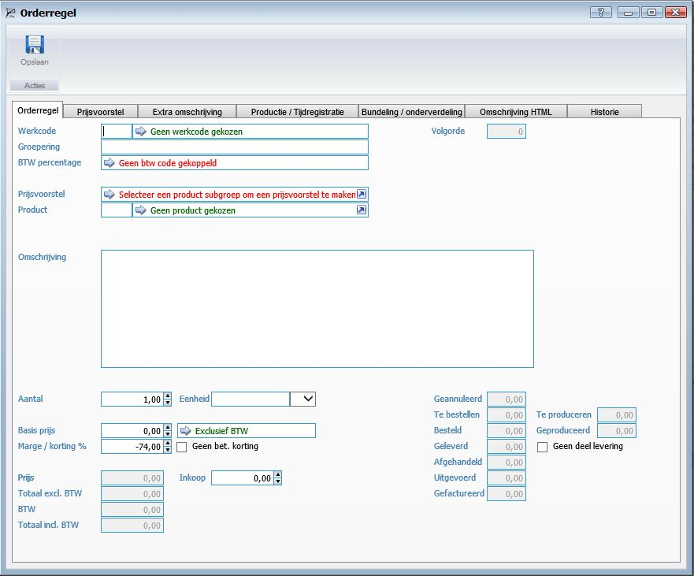
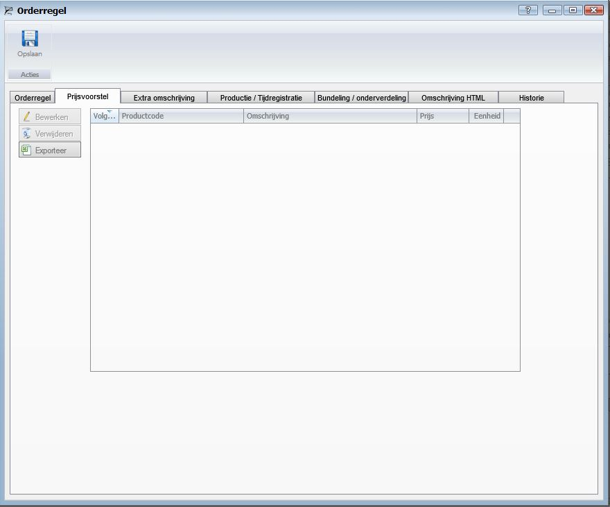
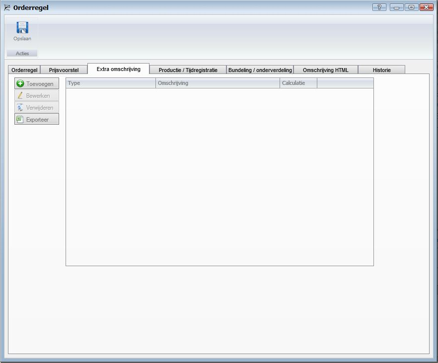
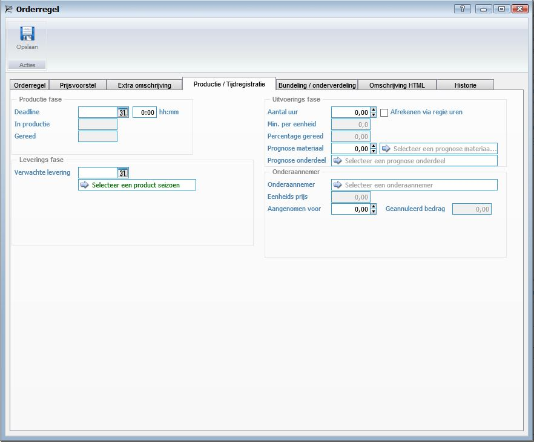
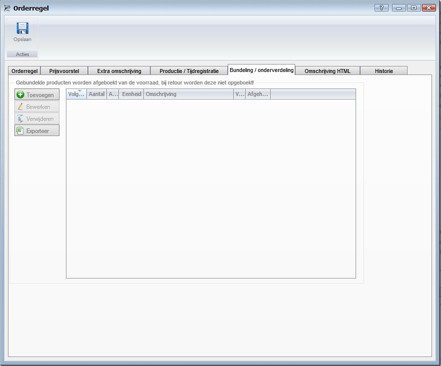
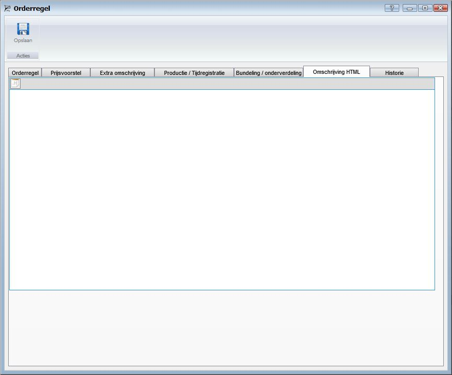
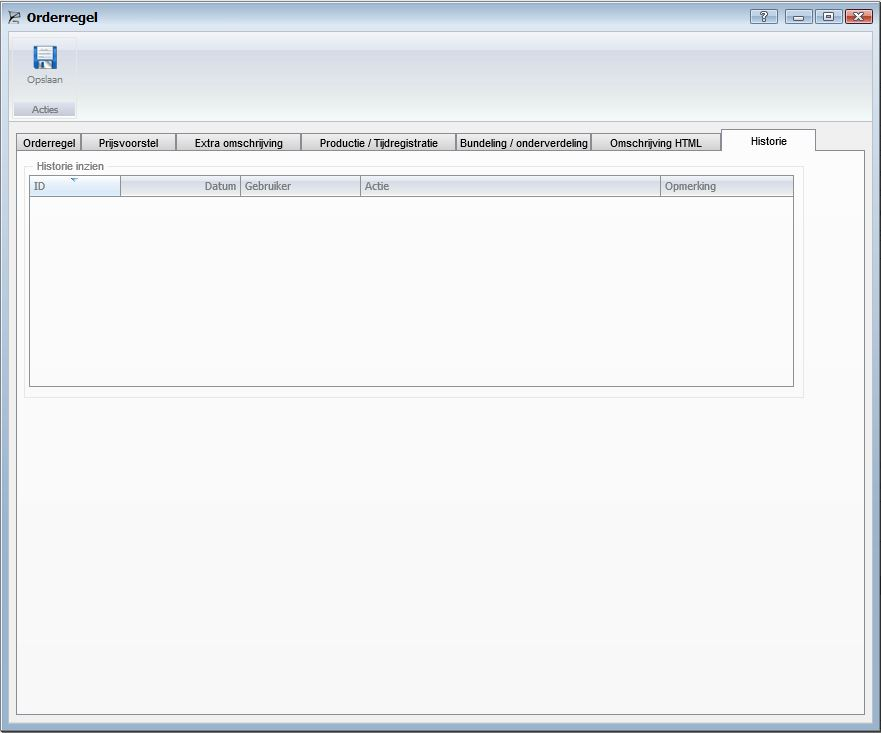

<properties>
	<page>
		<title>Orderegel</title>
		<description>Orderegel</description>
		<context>dlgorder*</context>
	</page>
	<menu>
		<position>Handleiding / Modules / F - O / Offertes en orders</position>
		<title>Orderegel</title>
	</menu>
</properties>

Terug naar een [offerte/orde aanmaken](http://hybridsaas.support/pages/handleiding/modules/F-O/offerte-en-orders/een-offerte-of-order-aanmaken)
#Orderegel#

De tabbladen en functies van het veld orderregel word in dit artikel behandeld.

**Tabblad Orderregel**
 

- Werkcode
- Groepering
- BTW Percentage
- Volgorde
- Prijsvoorstel
- Product
- Omschrijving
- Aantal
- Eenheid
- Basis prijs
- BTW
- Marge/korting %
- Geen bet. korting
- Prijs
- Inkoop
- Totaal excl. BTW
- BTW
- Totaal incl. BTW
- Geannuleerd
- Te bestellen
- Te produceren
- Besteld
- Gesproduceerd
- Geleverd
- Geen deel levering
- Afgehandeld
- Uitgevoerd
- Gefactureerd

**Tabblad Prijsvoorstel**
 

**Tabblad Extra omschrijving**
 

**Tabblad Productie/Tijdregistratie**
 
*productie fase*

- Deadline
- hh:mm
- In productie
- Gereed

*Leverings fase*

- Verwachte levering

*Uitvoerings fase*

- Aantal uur
- Afrekenen via regie uren
- Min. per eenheid
- Percentage gereed
- Prognose materiaal
- Prognose onderdeel

*Onderaannemer*

- Onderaannemer
- Eenheids prijs
- Aangenomen voor
- Geannuleerd bedrag

**Tabblad Bundeling/onderverdeling**
 
*Gebundelde producten worden afgeboekt van de voorraad, bij retour worden deze niet opgeboekt!*

**Tabblad Omschrijving HTML**
 

**Tabblad Historie**
 
*Historie inzien*

Terug naar een [offerte/orde aanmaken](http://hybridsaas.support/pages/handleiding/modules/F-O/offerte-en-orders/een-offerte-of-order-aanmaken)