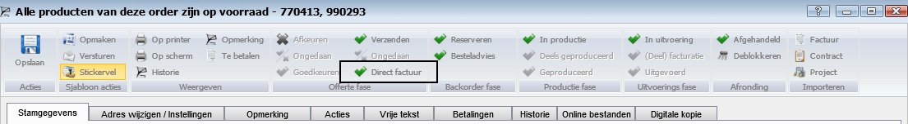

<properties>
	<page>
		<title>Offerte en Order</title>
	</page>
	<menu>
		<position>Handleiding / Modules / F - O / Offertes en orders</position> 
		<title>Zicht-Consignatie factuur aanmaken</title>
	<sort>B</sort>
	</menu>
</properties>

Terug naar {[Offerte en order](http://hybridsaas.support/pages/handleiding/modules/F-O/offerte-en-orders/offerte-en-order)}

#Zicht-Consignatie factuur#

Voor het aanmaken van een consignatie factuur zijn er wat standaard inrichtingen nodig. Zo is er een document schema nodig waarin je aangeeft dat de facturen op consignatie komen te staan. Vaak zit hier ook een andere factuur layout bij waarbij geen totaal prijzen en BTW worden getoond (Alleen aantallen en stuks prijzen)

Wat moet je instellen bij het document schema?
Het vinkje "Facturen op consignatie" moet aan staan.

 

Bij het maken van een consignatiefactuur begin je bij het invoeren van een order, voor de klant waarvoor dit bedoeld is.
Kies dan het juiste document schema. (dit kunnen er meerdere zijn, de gekozen moet wel het vinkje "Facturen op consignatie" aan hebben staan.)
Producten moeten op voorraad zijn. En kies dan voor de knop goedkeuren.

Omdat alles van de order op voorraad is, verschijnt de knop "Direct factuur" hiermee kan je de order in één keer verwerken tot factuur, de uitlevering, afboeking van de voorraad gaat automatisch. 

    

Doordat het vinkje "Facturen op consignatie" in het document schema aan staat wordt er geen normale factuur aangemaakt maar een consignatiefactuur. Deze kan je terugvinden onder de START knop:

 

Het doel van een consignatiefactuur is om goederen tijdelijk op een ander locatie (bij een klant) te plaatsen. De klant bepaald dan zelf of een product verkocht wordt of retour wordt gestuurd. Bij een verkoop ontvangt de klant daarvoor een factuur 

Zie ook {[Omzetten naar Retour/Factuur](http://hybridsaas.support/pages/handleiding/modules/F-O/offerte-en-orders/zicht-consignatie-factuur-omzetten)} 

Terug naar {[Offerte en order](http://hybridsaas.support/pages/handleiding/modules/F-O/offerte-en-orders/offerte-en-order)}
