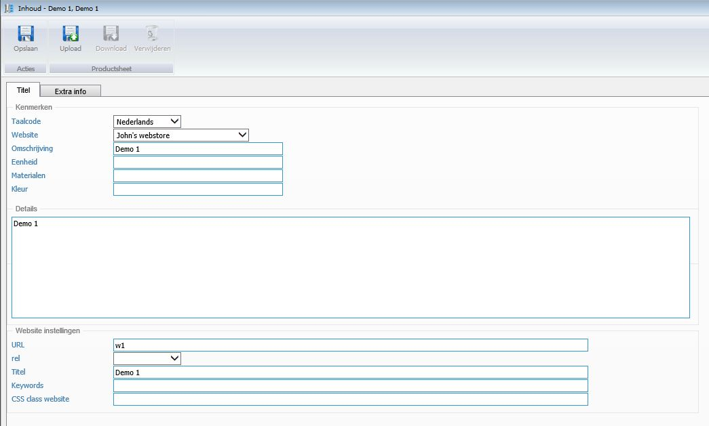

<properties>
	<page>
		<title>Product CMS</title>
		<description>Product CMS</description>
		<context></context>
	</page>
	<menu>
		<position>Handleiding / Webshop</position>
		<title>Product CMS</title>
		<sort>ga</sort>
	</menu>
</properties>

Ga terug <[Website](http://hybridsaas.support/pages/handleiding/modules/P-Z/website/Introductie)>
<[Website menu](http://hybridsaas.support/pages/handleiding/modules/P-Z/website/Website-menu)>

----------
# Product CMS #
De tabbladen en functies van het invoervenster Product aanmaken word in dit artikel behandeld.

**Tabblad Titel**

 

*Kenmerken*

- Taalcode
- Website
- Omschrijving
- Eenheid
- Materialen
- Kleur

*Details*

*Website instellingen*

- URL
- Rel
- Titel
- Keywords
- CSS class website

**Tabblad Extra info**

- Toevoegen
	- Om toe te voegen klikt u op de button Toevoegen.
- Bewerken
	- Om te bewerken selecteert u een regel en klikt op de button Bewerken.
- Verwijderen
	- Om te verwijderen selecteert u een regel en klikt op de button Verwijderen.
- Exporteren

----------

Ga terug <[Website](http://hybridsaas.support/pages/handleiding/modules/P-Z/website/Introductie)>
<[Website menu](http://hybridsaas.support/pages/handleiding/modules/P-Z/website/Website-menu)>