<properties>
	<page>
		<title>Producten</title>
		<description>Producten</description>
		<context>dlgproduct*</context>
	</page>
	<menu>
		<position>Handleiding /Modules /P - Z /Producten</position>
		<title>Producten</title>
		<sort>d</sort>
	</menu>
</properties>

#Producten#
De tabbladen en functies van het invoervenster Product aanmaken word in dit artikel behandeld.Om je producten zichtbaar te laten worden op de website zijn een aantal gegevens van toepassing als 1 van deze gegevens niet ingevuld zijn zal niet worden weergegeven. deze zal worden aangegeven in het ROOD dit is alleen nodig voor op de website

Als je nog geen bestaande producten heb kan een hoop producten tegelijk invoeren een aantal gegevens zullen dan al ingevuld zijn 
dit kan door middel van een excel import bestandje
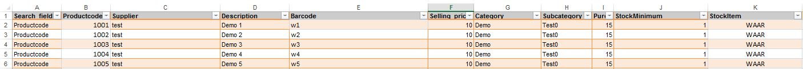
Voor meer informatie over import/export zie [Importeren](http://hybridsaas.support/pages/handleiding/modules/P-Z/producten/producten-importeren-cms)

----------
#Start#
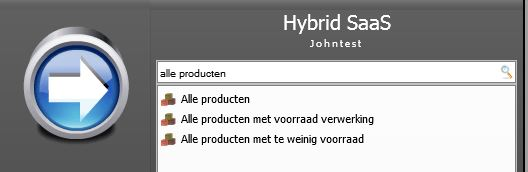
#Alle producten#

**Acties**

- Toevoegen
- Bewerken
- Verwijderen
- Vernieuwen
- Document opmaken
- Excel

**Acties**

- (de)activeer webshop
- (de)activeer artikel
- (de)activeer offerte
- Wijzig kenmerk
- Dupliceren
- Onderverdelen
- Gerelateerd artikel
- Op=op artikel
- Stickervel
- Voorraad artikel
- Wijzig collectie
- Wijzig seizoen

**Koppelingen**

- Facturen
- Orders
- Voorraadhistorie
- Inkoop orders
- Inkoop facturen

**Backorder regels**

- Backorder regels

**Overzichten**

- Omzet per maand

#Producten#

**Acties**

- Opslaan

**Productsheet**

- Upload
- Download
- Verwijderen

**Voorraad**

- Historie
- Inkoop orders
- Label wachtrij

**Koppelingen**

- Facturen
- Orders

**Backorders**
- Backorder regels
- Reserveringen

#Informatie#
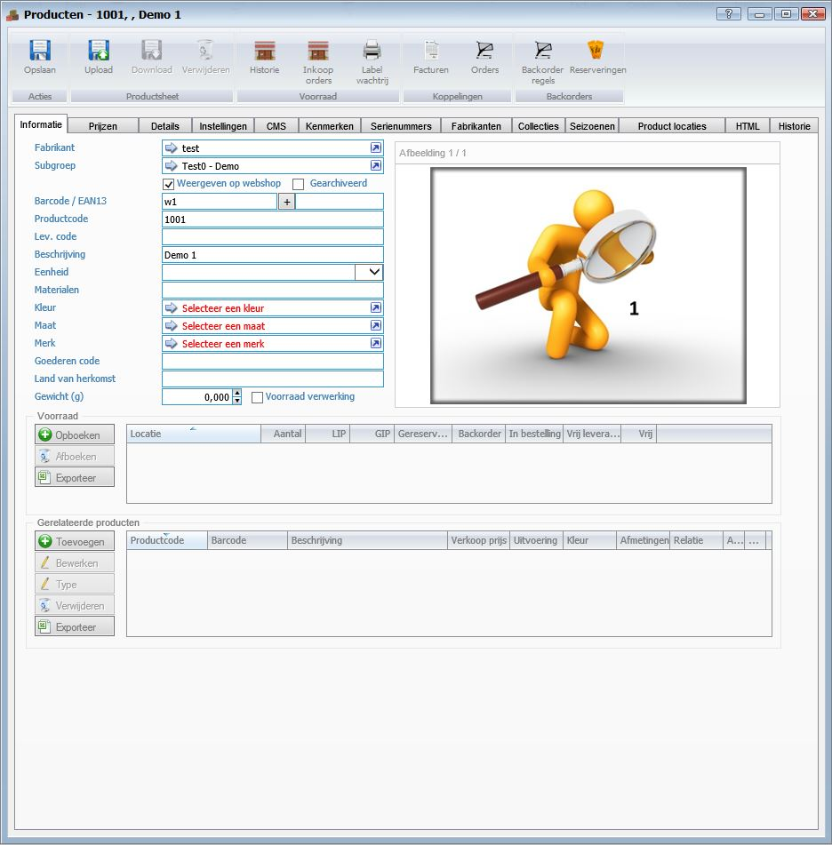 

- Fabrikant
  - Hier kan je de Fabrikant opzoeken
- Subgroep
  - Hier kan je de Subgroep opzoeken
- Weergeven op webshop
  - Hiermee geef je aan dat je hem wilt weergeven op de webshop
- Gearchiveerd
- Barcode/EAN13
  - Hier kan je de bar en EAN13 code invullen van het product
- Productcode
  - Hier kan je het product een productcode geven deze vind je op meerdere plekken weer terug en hier kan je ook op zoeken het makkelijkste voor dit zou zijn zo kort en duidelijk mogelijk
- Lev. code
- Beschrijving
  - Hier kan je een beschrijving geven over je product deze tekst kan je ook invullen bij je cms dan is het ook op de site zichtbaar
- Eenheid
- Afmeting
- Materialen
- Kleur
- Merk
- Goederen code
- Land van herkomst
- Gewicht
- Voorraad verwerking
  - Als je een voorraad verwerking bij wilt houden dien je dit vinkje aan te zetten
- Afbeelding
  - Hier kan je 1 of meerdere afbeeldingen toevoegen door middel van je rechter muisknop

**Voorraad**

**Gerelateerde producten**

#Prijzen#

**Inkoopprijs informatie**

- Inkoopprijs
- Advies inkoopprijs
- In vreemde valuta

**Verkoopprijs informatie**

- Verkoopprijs
  - Hier kan je de verkoopprijs van het product invullen
- BTW
  - Hier kan je de BTW percentage aangeven
- Bereken via factor op inkoopprijs
- Repeterende kosten
- Vaste korting
- Geen korting toepassen
- Advies verkoopprijs
- BTW percentage
- Bereken via factor op verkoopprijs
- Opstart kosten
- Voorgestelde verkoopprijs
- BTW percentage
- Bereken via factor op verkoopprijs
- Annuleringskosten

**Afwijkende prijsmodellen voor dit product**

- Toevoegen
  - Door op de knop toevoegen te klikken kan je een toevoegen zie [Prijsmodel](http://hybridsaas.support/pages/handleiding/modules/P-Z/Producten-website-gewoon/Producten-prijsmodel)
- Bewerken
	- Om te bewerken selecteert u een regel en klikt op de button Bewerken.
- Verwijderen
	- Om te verwijderen selecteert u een regel en klikt op de button Verwijderen.
- Exporteren

#Details#
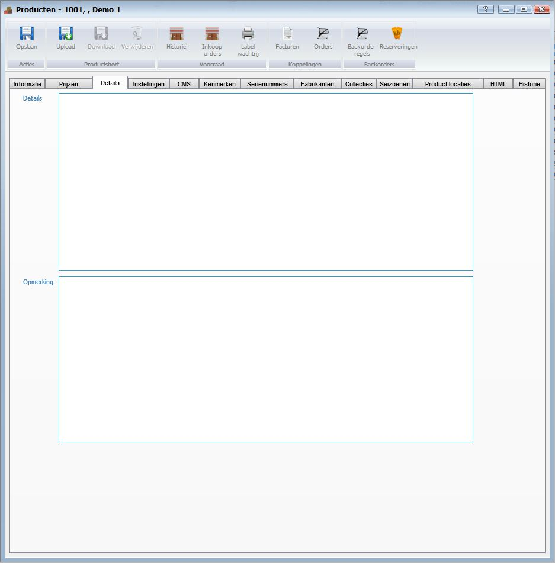

**Details**

**Opmerking**

#Instellingen#

**Product instellingen**

- Dit is een hoofdproduct
	- Dit vinkje moet aanstaan
- Dit is een onderdeel
- Dit zijn verzendkosten
- Speciaal voor klant
- Offerte product
- Pre sale product (alleen voor accountmanager beschikbaar)
- Introductiedatum
- Variable verkoop prijs uitschakelen voor dit product
- Variable inkoop prijs uitschakelen voor dit product
- Product onderdelen bundelen in orderegel (ivm afboeken voorraad)
- Dit product zal op voorraad komen door verweking van de gekoppelde producten (eigen productie)
- Dit product zal niet meer worden nabesteld (op=op)
- Individueel nabestellen vanuit de orderegel
- Verkoop calculatie
- Product label
- Inkoop calculatie
- Maat label
- Basis verkoop prijs
- Afronden verkoopprijs
- Basis inkoop prijs
- Minimale voorraad
- Nabestel hoeveelheid
- Nabestel dagen
- Verpakkings eenheid (aantal * verpakkings eenheid zal worden gefactureerd en/of afgeboekt)
- Drop shipment
- Productie dagen (aantal werkdagen nodig voor het produceren van dit product)
- Uitlever dagen (aantal werkdagen nodig voor het uitleveren van dit product)
- Lengte (cm)
- Breedte (cm)
- Hoogte (cm)

**Product bestaat uit de volgende onderdelen**

- Toevoegen
	- Om toe te voegen klikt u op de button Toevoegen.
- Downloaden
- Bewerken
	- Om te bewerken selecteert u een regel en klikt op de button Bewerken.
- Verwijderen
	- Om te verwijderen selecteert u een regel en klikt op de button Verwijderen.
- Exporteren

#CMS#
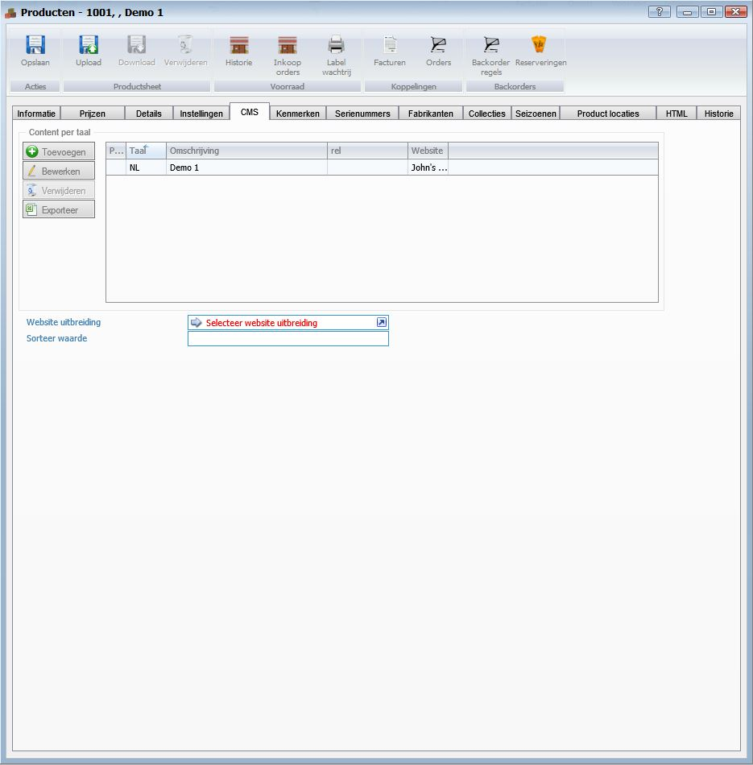

**content per taal**

- Toevoegen
	- Om toe te voegen klikt u op de button Toevoegen zie [CMS](http://hybridsaas.support/pages/handleiding/modules/P-Z/Producten-website-gewoon/Product-cms)
- Downloaden
- Bewerken
	- Om te bewerken selecteert u een regel en klikt op de button Bewerken.
- Verwijderen
	- Om te verwijderen selecteert u een regel en klikt op de button Verwijderen.
- Exporteren
- Website uitbreiding
- Sorteer waarde

#Kenmerken#
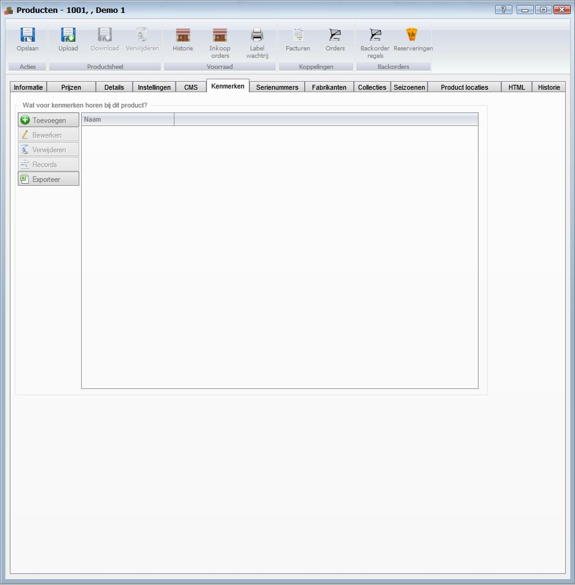

**Wat voor kenmerken horen bij dit product?**

- Toevoegen zie [kenmerken](http://hybridsaas.support/pages/handleiding/modules/P-Z/Producten-website-gewoon/kenmerken)
	- Om toe te voegen klikt u op de button Toevoegen.
- Bewerken
	- Om te bewerken selecteert u een regel en klikt op de button Bewerken.
- Verwijderen
	- Om te verwijderen selecteert u een regel en klikt op de button Verwijderen.
- Records
- Exporteren

#Serie nummers#

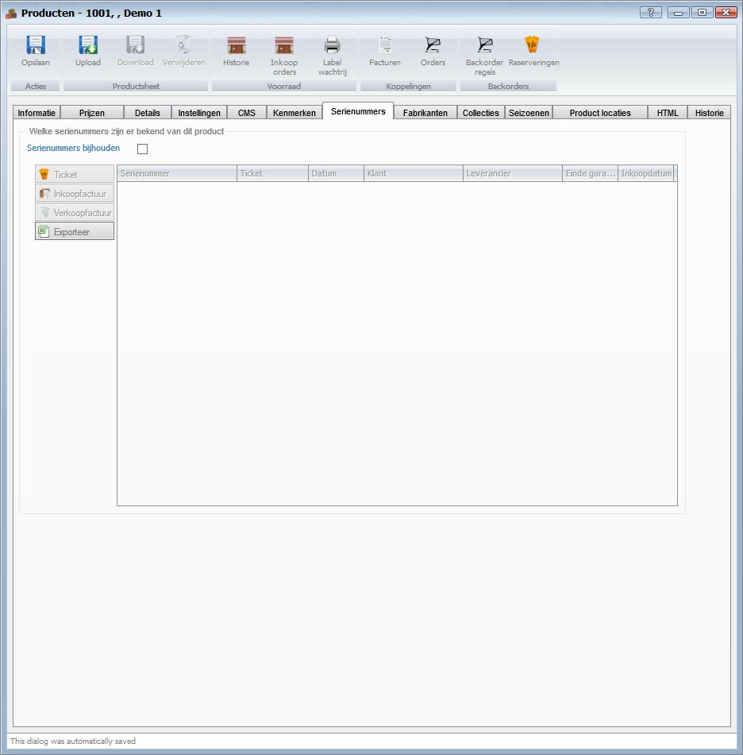

**Welke serienummers zijn er bekend van dit product**

-Serienummers bijhouden

- Ticket
- Inkoopfactuur
- Verkoopfactuur
- Exporteren

#Fabrikanten#
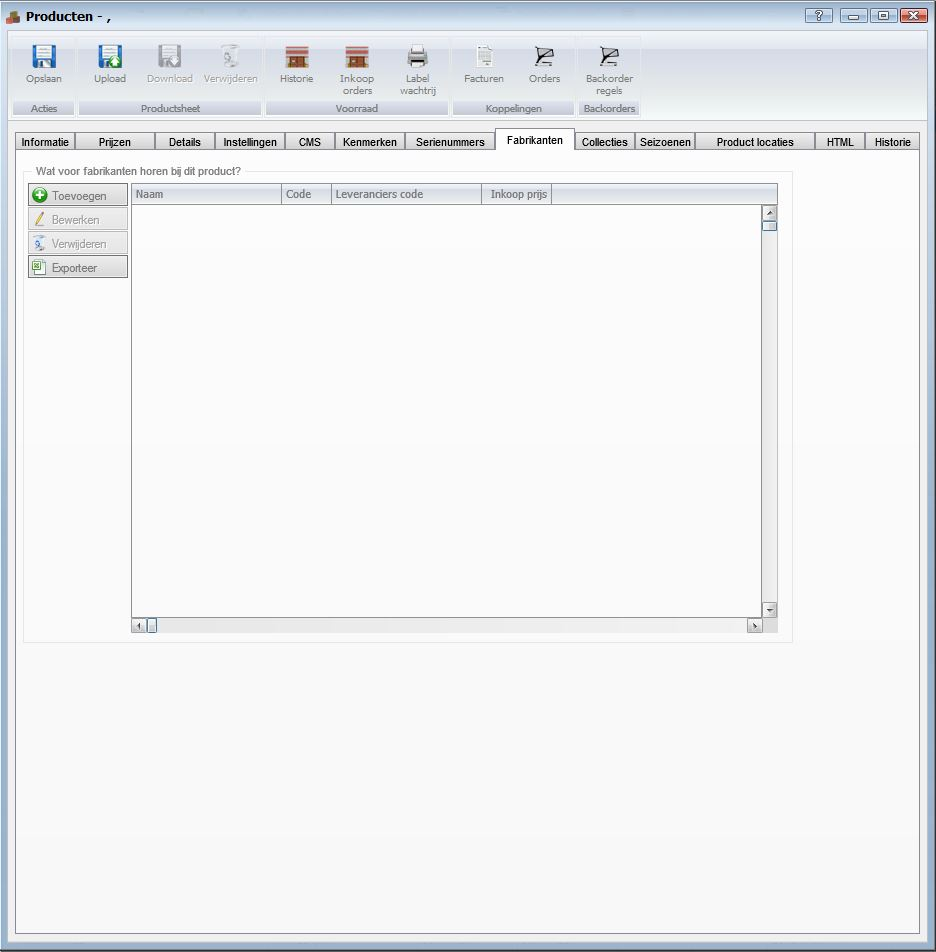

**Wat voor fabrikanten horen bij dit product?**

- Toevoegen
- Bewerken
- Verwijderen
- Exporteren

#Collecties#
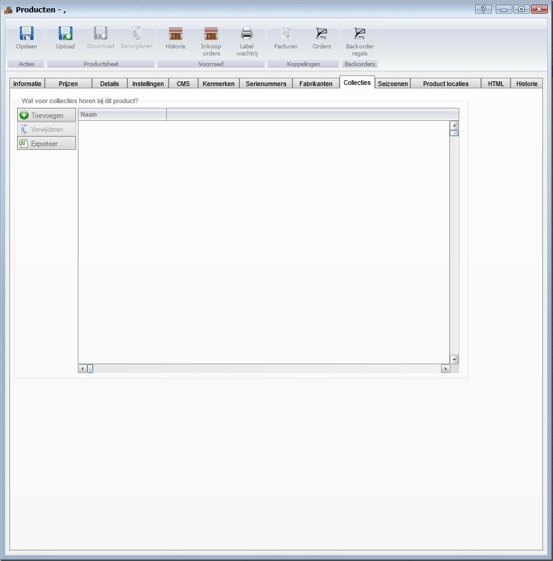

**Wat voor collecties horen bij dit product?**

- Toevoegen
- Verwijderen
- Exporteren

#Seizoenen#
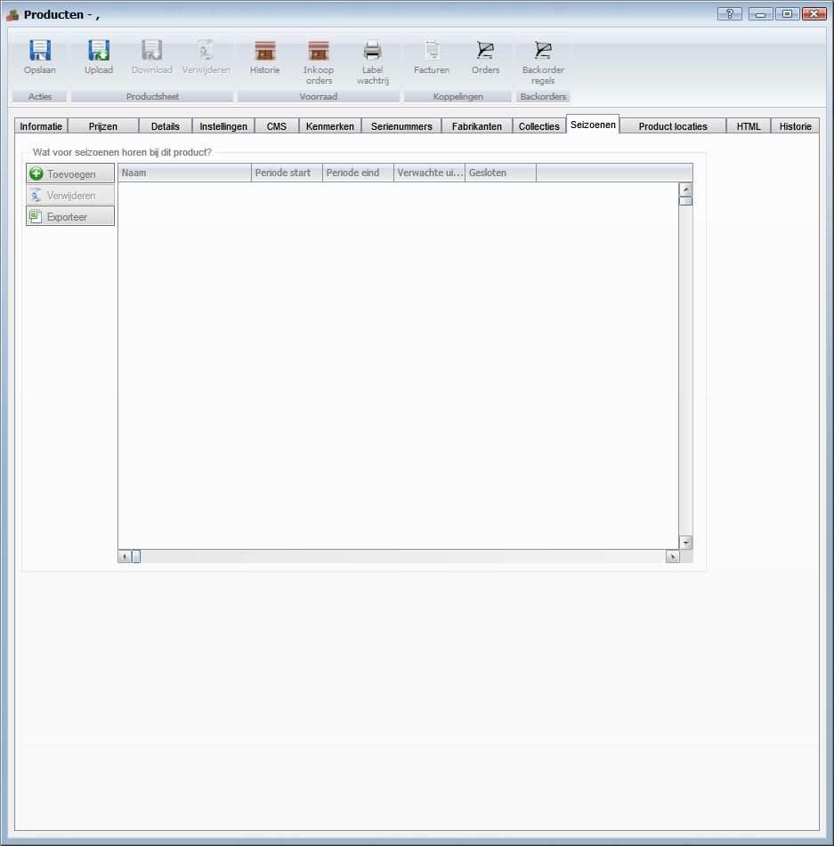

**Wat voor seizoenen horen bij dit product?**

- Toevoegen
- Verwijderen
- Exporteren

#Product locatie#
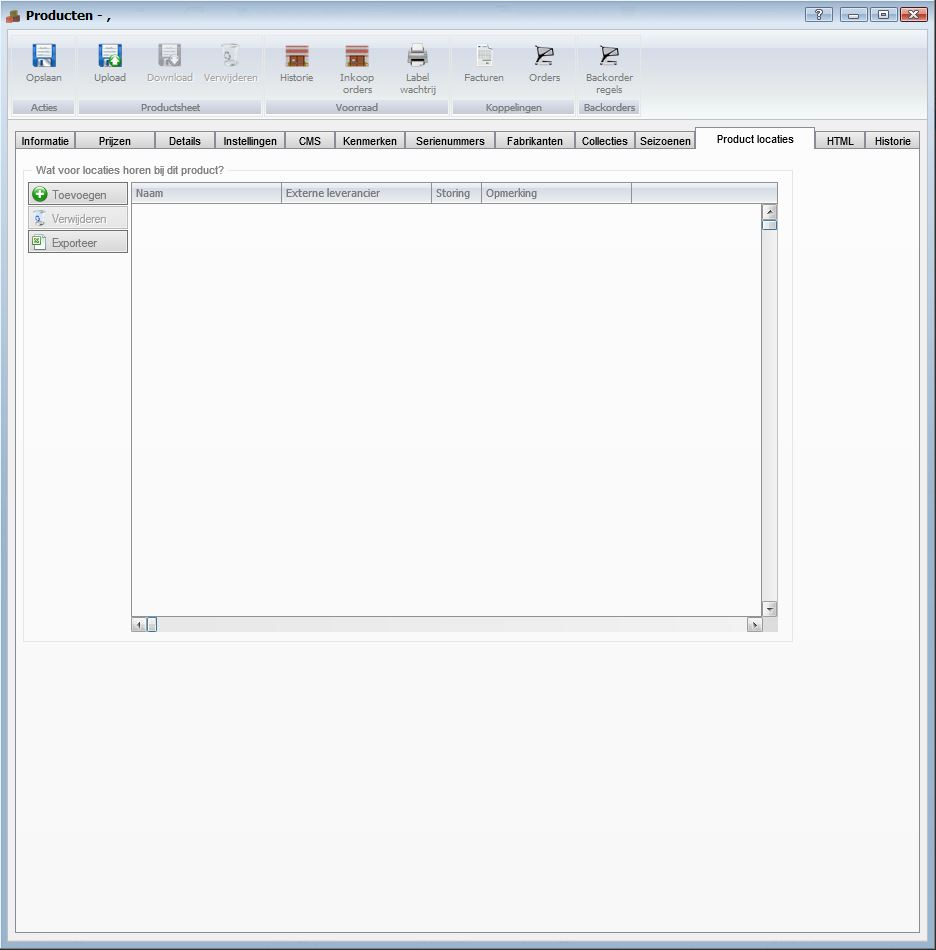

**Wat voor locaties horen bij dit product?**

- Toevoegen
- Verwijderen
- Exporteren

#HTML#
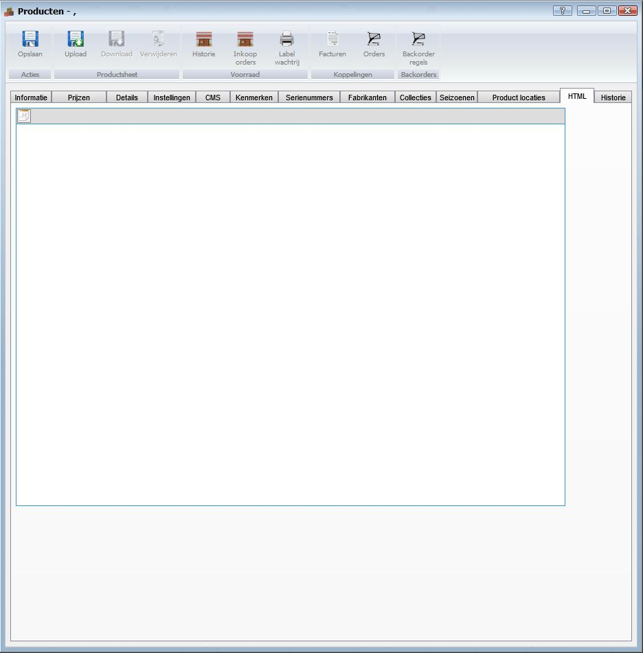

#Historie#
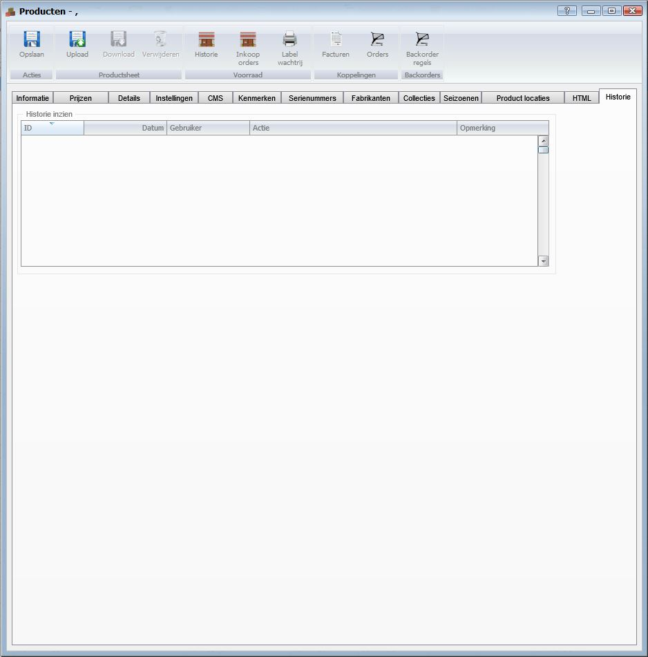

**Historie inzien**

----------
[Stappenplan](http://hybridsaas.support/pages/handleiding/extra/omgeving)

[Website](http://hybridsaas.support/pages/handleiding/modules/P-Z/website/Introductie)

[Website menu](http://hybridsaas.support/pages/handleiding/modules/P-Z/website/Website-menu)

[Offerte/orde aanmaken](http://hybridsaas.support/pages/handleiding/modules/F-O/offerte-en-orders/een-offerte-of-order-aanmaken)

[Producten](http://hybridsaas.support/pages/handleiding/modules/P-Z/producten/Introductie)