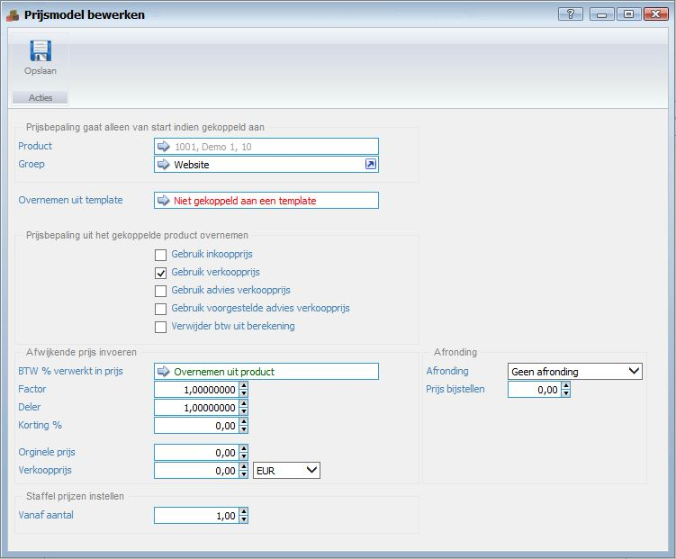

<properties>
	<page>
		<title>Producten prijsmodel</title>
		<description>Producten prijsmodel</description>
	</page>
	<menu>
		<position>Handleiding / Webshop</position>
		<title>Producten prijsmodel</title>
		<sort>g</sort>
	</menu>
</properties>

Ga terug <[Product](http://hybridsaas.support/pages/handleiding/modules/P-Z/Producten-website-gewoon/Product)>

----------

#Producten#
**Tabblad Prijzen toevoegen**

*Prijsbepaling gaat alleen van start indien gekoppeld aan*

- Product
- Groep
  - Hier kan je de groep opzoeken waar de prijs aan gekoppeld moet worden dit is over het algemeen 'Webshop' of 'Webwinkel' of wat hier mee overeen komt
- Overnemen uit template

*Prijsbepaling uit het gekoppelde product overnemen*

- Gebruik inkoopprijs
- Gebruik verkoopprijs
  - Hier moet je het vinkje aanzetten dan neemt die de verkoopprijs over die je heb ingevuld bij tabblad Prijzen-Verkoopprijs
- Gebruik advies verkoopprijs
- Gebruik voorgestelde verkoopprijs
- Verwijder btw uit berekening

*Afwijkende prijs invoeren*

- BTW % verwerkt in prijs
- Factor
- Deler
- Korting %
- Orginele prijs
- Verkoopprijs
- Pijltje EUR
  - Dit pijltje kan je openen en hier moet dan EUR komen te staan

*Staffel prijzen instellen*

- Vanaf aantal

*Afrondingen*

- Afrondingen
- Prijs bijstellen

----------

Ga terug <[Product](http://hybridsaas.support/pages/handleiding/modules/P-Z/Producten-website-gewoon/Product)>