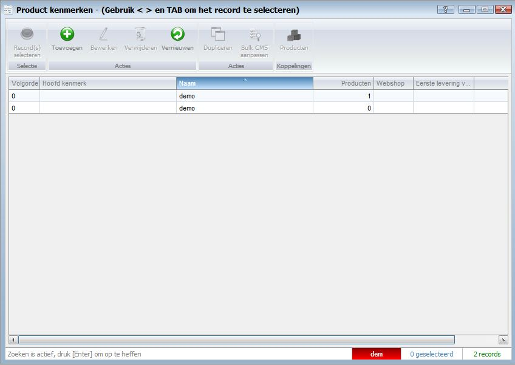

<properties>
	<page>
		<title>Kenmerken</title>
		<description>Kenmerken</description>
		<context></context>
	</page>
	<menu>
		<position>Handleiding / Webshop</position>
		<title>Kenmerken</title>
		<sort>h</sort>
	</menu>
</properties>

Ga terug <[Website](http://hybridsaas.support/pages/handleiding/modules/P-Z/website/Website)>
<[Producten](http://hybridsaas.support/pages/handleiding/modules/P-Z/Producten-webiste-gewoon/Product)>

----------

#Kenmerk Toevoegen#

**Tabblad Algemeen**

----------

Ga terug 
<[Website](http://hybridsaas.support/pages/handleiding/modules/P-Z/website/Website)>
<[Producten](http://hybridsaas.support/pages/handleiding/modules/P-Z/Producten-webiste-gewoon/Product)>