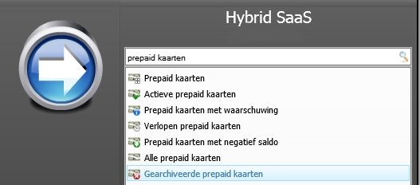
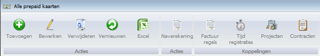
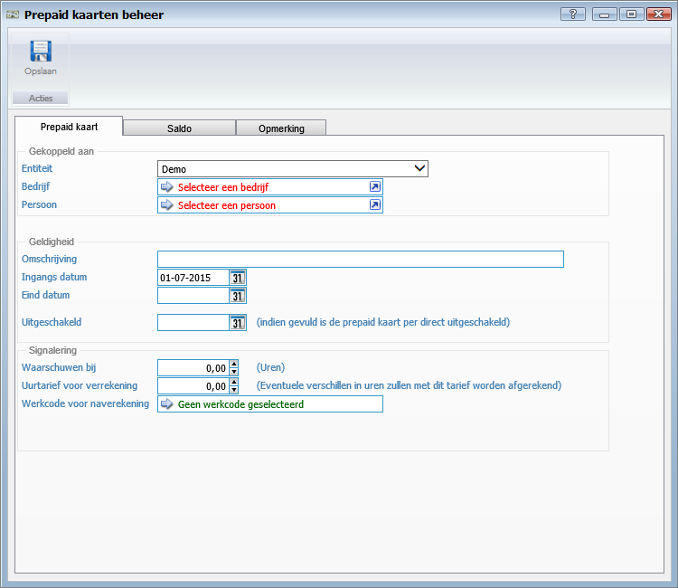
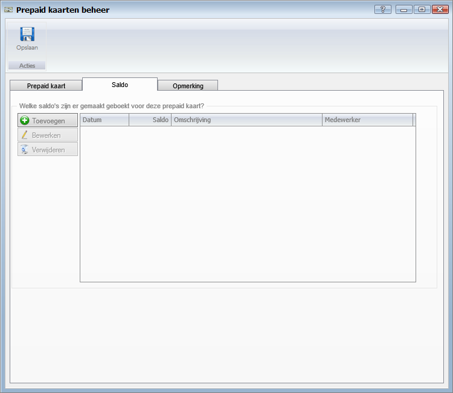
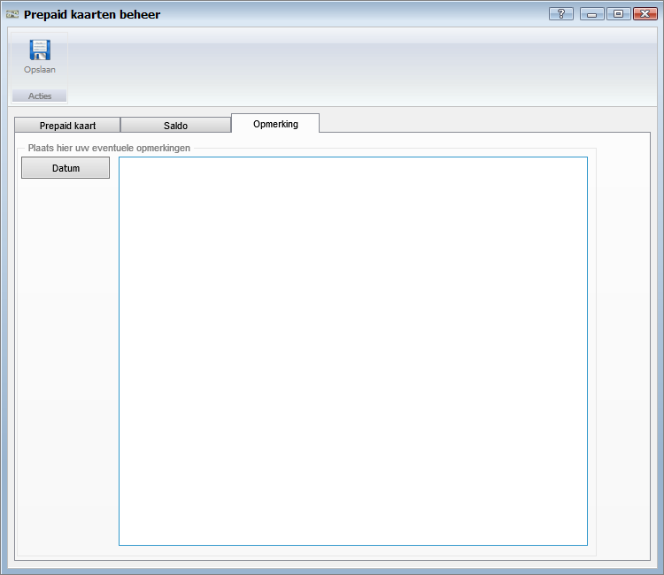

<properties>
	<page>
		<title>Prepaid kaart</title>
		<description>Prepaid kaart</description>
		<context></context>
	</page>
	<menu>
		<position>Handleiding / Modules / P - Z / Prepaid kaarten</position>
		<title>Prepaid kaart</title>
		<sort></sort>
	</menu>
</properties>

#Prepaid kaart#

----------
#Start#

#Alle Prepaid kaarten#

**Acties**

- Toevoegen
- Bewerken
- Verwijderen
- Vernieuwen
- Excel

**Acties**

- Naverekening

**Koppelingen**

- Factuur regels
- Tijd registratie
- Projecten
- Contracten

#Tabblad Prepaid kaart#

**Gekoppeld aan**

- Entiteit
- Bedrijf
- Persoon

**Geldigheid**

- Omschrijving
- Ingangs datum
- Eind datum
- Uitgeschakeld

**Signalering**

- Waarschuwen bij
- Uurtarief voor verreking
- Werkcode voor naverekening

#Tabblad Saldo#

**Welke saldo's zijn er gemaakt geboekt voor deze prepaid kaart?**

- Toevoegen
- Bewerken
- Verwijderen

#Tabblad Opmerking#

**Plaats hier uw eventuele opmerkig**

- Om een datum aan de opmerking toe te voegen klikt u op de button Datum.