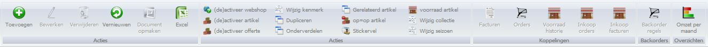

<properties>
	<page>
		<title>Producten modulebeschrijving</title>
		<description>Producten modulebeschrijving</description>
		<context>product-active*</context>
	</page>
	<menu>
		<position>Handleiding / Modules / P - Z / Producten</position>
		<title>Introductie</title>
		<sort>A</sort>
	</menu>
</properties>

# Producten #
Overal ter wereld je complete productenbestand snel en eenvoudig beheren? Hybrid Saas Productbeheer maakt het mogelijk. Producten worden voorzien van een duidelijke omschrijving en zijn op deze manier altijd gemakkelijk terug te vinden. Ook is het mogelijk om producten naar eigen inzicht onder te verdelen aan de hand van verschillende eigenschappen, zoals productkenmerken, product- of barcodes en leveranciers.

Hybrid SaaS Productbeheer helpt je een goed overzicht te houden over je producten en maakt het gemakkelijk om gegevens aan te passen of een productafbeelding toe te voegen. Wanneer een product niet meer op voorraad is, word je hier automatisch van op de hoogte gesteld. Wel zo gemakkelijk!

#Buttonbalk#

Ga naar {[Product aanmaken](http://hybridsaas.support/pages/handleiding/modules/P-Z/producten/Product-aanmaken)} {[Product locatie aanmaken](http://hybridsaas.support/pages/handleiding/modules/P-Z/producten/Product-locatie-aanmaken)} {[CMS Importeren](http://hybridsaas.support/pages/handleiding/modules/P-Z/producten/producten-importeren-cms)}

