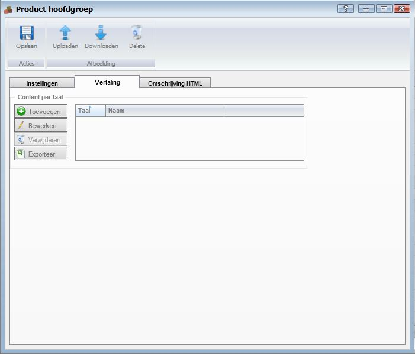
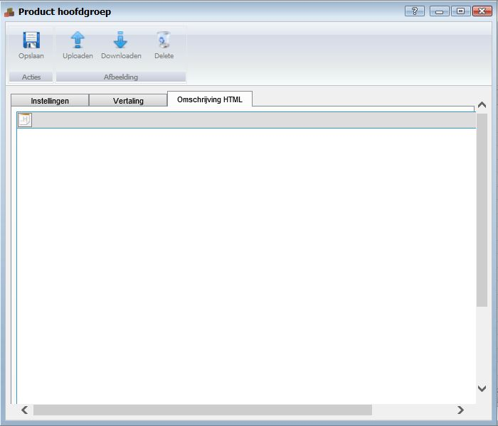
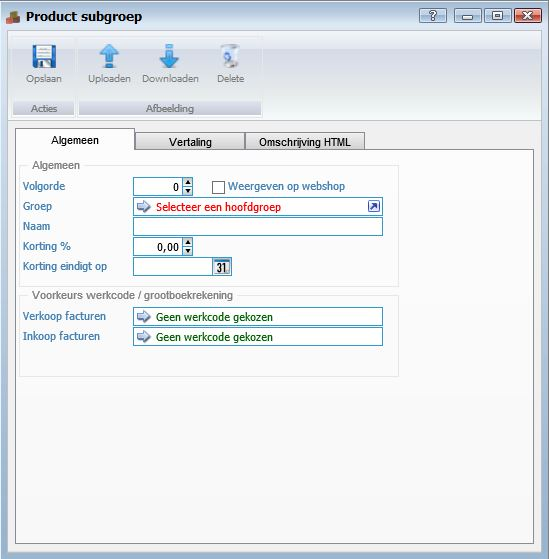
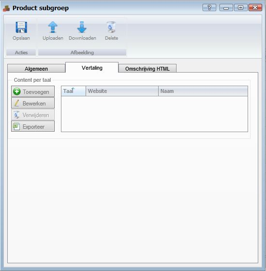
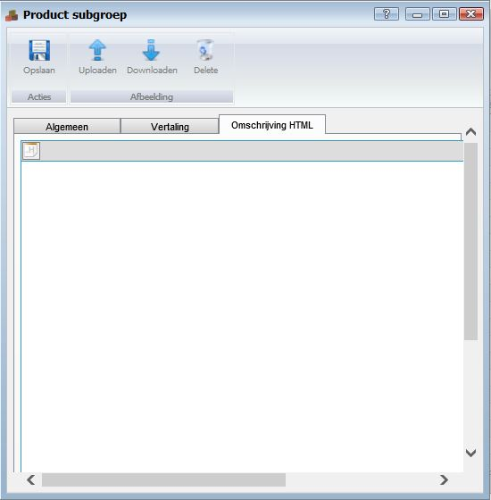

<properties>
	<page>
		<title>Product groep aanmaken</title>
		<description>Product groep aanmaken</description>
		<context>product-categories*</context>
	</page>
	<menu>
		<position>Handleiding / Modules / P - Z / Producten</position>
		<title>Product groep aanmaken</title>
		<sort>e</sort>
	</menu>
</properties>

Terug naar <[Producten](http://hybridsaas.support/pages/handleiding/modules/P-Z/producten/Introductie)>

----------

#Product hoofdgroep aanmaken#
Product hoofdgroepen zijn een verzameling product subgroepen, die tot dezelfde categorie behoren. Door product subgroepen te groeperen kunt u overzicht houden in uw producten bestand.

**Tabblad Instellingen**

- Volgorde
	- Optioneel
- Website
- Naam
- Omschrijving
	- Optioneel
- Korting %
- Korting eindigt op

*Voorkeurs werkcode/grootboekrekening*

- Verkoop facturen
	- Koppel de voorkeurs werkcode waarvan u wilt dat deze automatisch bij orders en facturen naar voren komt.
- Inkoop facturen
	- Koppel de voorkeurs werkcode waarvan u wilt dat deze automatisch bij orders en facturen naar voren komt.

**Tabblad Vertaling**

- Toevoegen
	- Om toe te voegen klikt u op de button Toevoegen.
- Bewerken
	- Om te bewerken selecteert u een regel en klikt op de button Bewerken.
- Verwijderen
	- Om te verwijderen selecteert u een regel en klikt op de button Verwijderen.
- Exporteren

**Tabblad Omschrijving HTML**

#Product subgroep aanmaken#
Product subgroepen zijn een verzameling producten, die tot één productcategorie behoren. Door producten te groeperen kunt u overzicht houden in uw producten.

**Tabblad Instellingen**

- Volgorde
	- Optioneel
- Weergeven op webshop
- Groep
	- Selecteer de groep die hoort bij de subgroep die u aanmaakt.
- Naam
	- Optioneel
- Korting %
- Korting eindigt op

*Voorkeurs werkcode/grootboekrekening*

- Verkoop facturen
	- Koppel de voorkeurs werkcode waarvan u wilt dat deze automatisch bij orders en facturen naar voren komt.
- Inkoop facturen
	- Koppel de voorkeurs werkcode waarvan u wilt dat deze automatisch bij orders en facturen naar voren komt.

**Tabblad Vertaling**

- Toevoegen
	- Om toe te voegen klikt u op de button Toevoegen.
- Bewerken
	- Om te bewerken selecteert u een regel en klikt op de button Bewerken.
- Verwijderen
	- Om te verwijderen selecteert u een regel en klikt op de button Verwijderen.
- Exporteren

**Tabblad Omschrijving HTML**

----------

Terug naar <[Producten](http://hybridsaas.support/pages/handleiding/modules/P-Z/producten/Introductie)>