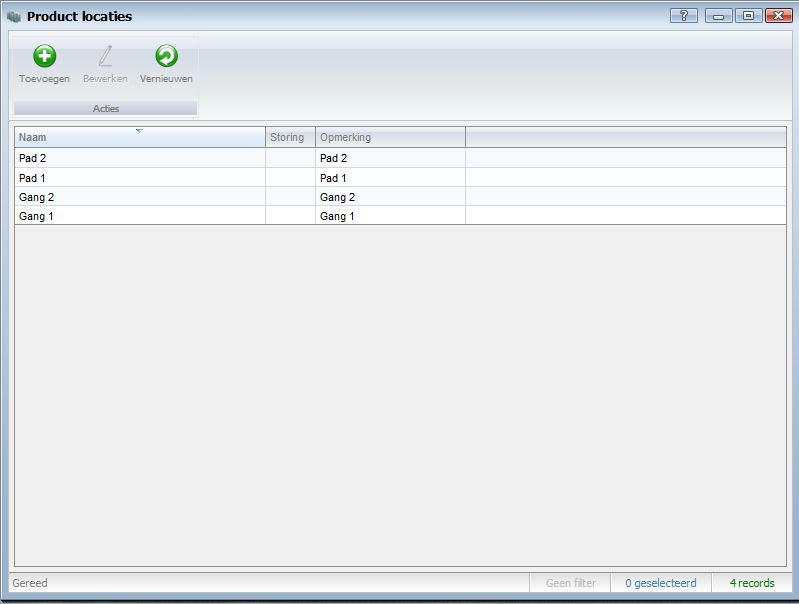

<properties>
	<page>
		<title>Product locaties</title>
		<description>Product locaties</description>
		<context>product-locations*</context>
	</page>
	<menu>
		<position>Handleiding / Modules / P - Z / Producten</position> 
		<title>Product locatie aanmaken</title>
	</menu>
</properties>

Terug naar een [offerte/orde aanmaken](http://hybridsaas.support/pages/handleiding/modules/F-O/offerte-en-orders/een-offerte-of-order-aanmaken)
#Een product locatie aanmaken#

Terug naar een [offerte/orde aanmaken](http://hybridsaas.support/pages/handleiding/modules/F-O/offerte-en-orders/een-offerte-of-order-aanmaken)