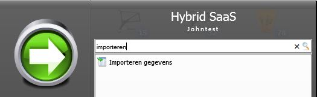

<properties>
	<page>
		<title>Importeren</title>
		<description>Importeren</description>
	</page>
	<menu>
		<position>Handleiding / Modules / P - Z / Producten</position>
		<title>Importeren</title>
		<sort>D</sort>
	</menu>
</properties>

Ga terug <[Producten](http://hybridsaas.support/pages/handleiding/modules/P-Z/producten/Introductie)> 
<[Website](http://hybridsaas.support/pages/handleiding/modules/P-Z/website/Introductie)>

----------
#Importeren#

#Importeren Producten#
Zoek in start naar Importeren

Om te importeren klik je eerst op 
*Producten importeren - Exporteren*

De geëxporteerde excel sheet bevat 2 tabbladen, namelijk "Products" en "Products NL".
Het tabblad Products is bedoeld om de gewone producten te importeren en Het tabblad Product NL is er voor de CMS gegevens.

We gebruiken nu het tabblad *Products* de andere kan je verwijderen

Je krijgt een hele lijst met velden de velden die je niet gebruikt kan je verwijderen zodat je een overzicht houd.
Als je nieuw Product wilt toevoegen dan kan dit op basis van de kolom Search_field.
Je voert hier het woord "Productcode" in en haalt de kolom "Recordindex" weg. 
Vul vervolgens alle kolommen in die nodig zijn.

**Importeren**

Gebruik nu de knop "Klik hier om producten te importeren" om de producten te importeren. 
Zoek via de Windows verkenner het juiste importbestand op.
Na de import verschijnt er een intenet pagina met daarin het resultaat van de import.

 Je moet het Excel bestandje sluiten voordat je hem gaat importeren anders zal die een fout melding aangeven 

Je kan nu in HybridSaas bij de producten de geïmporteerde gegevens terugvinden.

----------

#Importeren cms#
Hier wordt uitgelegd hoe je eenvoudig de CMS gegevens van producten kan importeren.

**Exporteren producten**

 

De geëxporteerde excelsheet bevat 2 tabbladen, namelijk "Products" en "Products NL".
Het tabblad Products kan je verwijderen.

Als je nieuwe CMS records wilt toevoegen dan kan dit op basis van de kolom Search_field. Je voert hier het woord "Productcode" in en haalt de kolom "Search index" weg. 
Vul vervolgens alle kolommen in die nodig zijn.
Verwijder het tabblad "Products"en sla het bestand op.

**Importeren**

Ga via de startknop naar "Importeren gegevens".
Gebruik de knop "Klik hier om producten te importeren" om de producten te importeren. Zoek via de Windows verkenner het juiste importbestand op.
Na de import verschijnt er een window met daarin het resultaat van de import.

Je kan nu in HybridSaas bij de producten in het tabblad "CMS" de geïmporteerde gegevens terugvinden.

----------

Ga terug <[Producten](http://hybridsaas.support/pages/handleiding/modules/P-Z/producten/Introductie)>
<[Website](http://hybridsaas.support/pages/handleiding/modules/P-Z/website/Introductie)>