<properties>
	<page>
		<title>Invoervenster Projecten</title>
		<description>Invoervenster Projecten</description>
		<context>dlgproject*</context>
	</page>
	<menu>
		<position>Handleiding / Modules / P - Z / Projecten</position>
		<title>Invoervenster Projecten</title>
	</menu>
</properties>

#Invoervenster projecten#

De tabbladen en functies van het invoervenster offerte en order word in dit artikel behandeld.

**Tabblad N.A.W.**
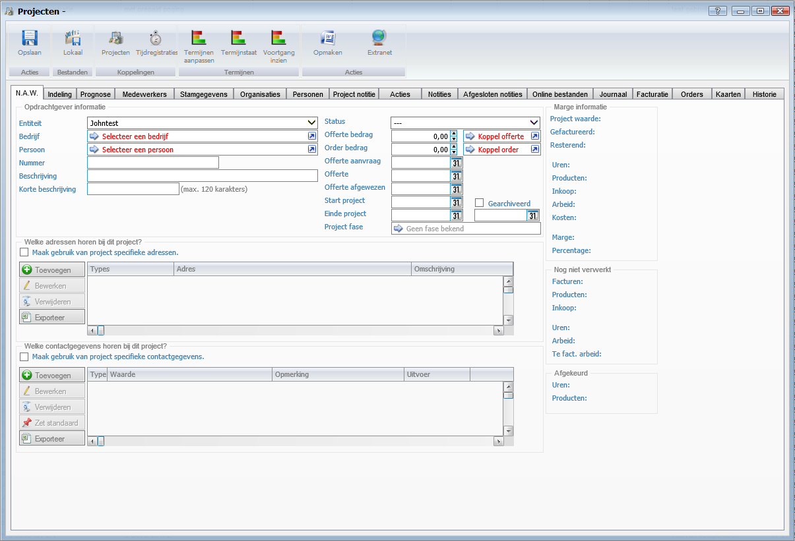 

*Opdrachtgever informatie*

- Entiteit
- Bedrijf
- Persoon
- Nummer
- Beschrijving
- Korte beschrijving
- Status
- Offerte bedrag
- Order bedrag
- Offerte aanvraag
- Offerte
- Offerte afgewezen
- Start project
- Gearchiveerd
- Einde project
- Project fase

*Welke adressen horen bij dit project*

- Maak gebruik van project specifieke adressen

*Welke contactgegevens horen bij dit project*

- Maak gebruik van project specifieke contactgegevens

*Marge informatie*

- Project waarde
- Gefactureerd Resterend
- Uren
- Producten
- Inkoop
- Arbeid
- Kosten
- Marge
- Percentage

*Nog niet verwerkt*

- Facturen
- Producten
- Inkoop
- Uren
- Arbeid
- Te fact. arbeid

*Afgekeurd*

- Uren
- Producten

**Tabblad Prognose**
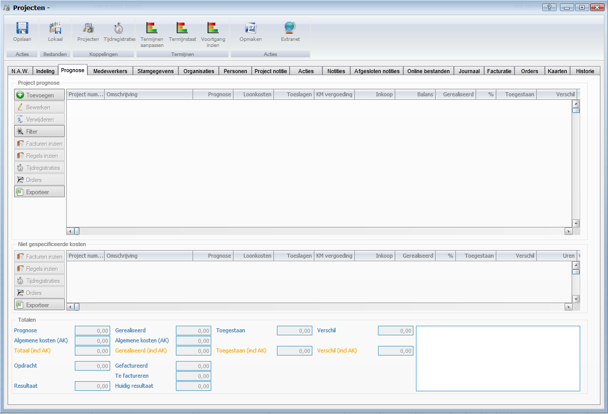 

*Project prognose*

*Niet gespecificeerde kosten*

*Totalen*

- Prognose
- Algemene kosten (AK)
- Totaal(incl AK)
- Opdracht
- Resultaat
- Gerealiseerd
- Algemene kosten (AK)
- Gerealiseerd (incl AK)
- Gefactureerd
- Te factureren
- Huidige resultaat
- Toegestaan
- Toegestaan (incl AK)
- Verschil
- Verschil (incl AK)

 **Tabblad Indeling**
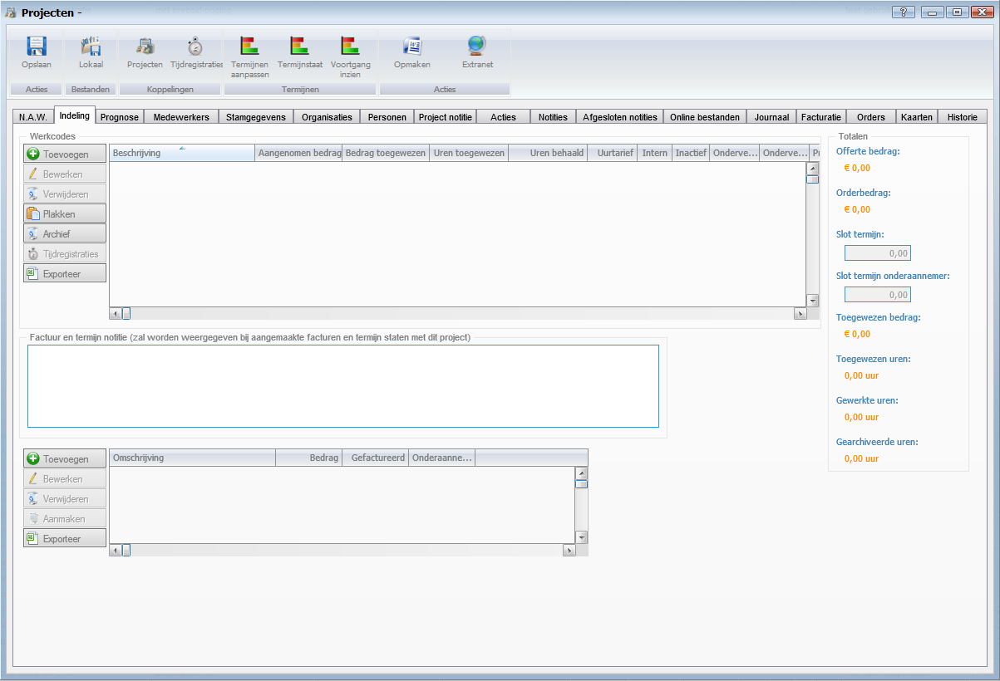

*Werkcodes*

*Factuur en termijn notitie*

*Totalen*

- Offerte bedrag
- Orderbedrag
- Slot termijn
- Slot termijn onderaannemer
- Toegewezen bedrag
- Toegewezen uren
- Gewerkte uren
- Gearchiveerde uren

**Tabblad Medewerkers**
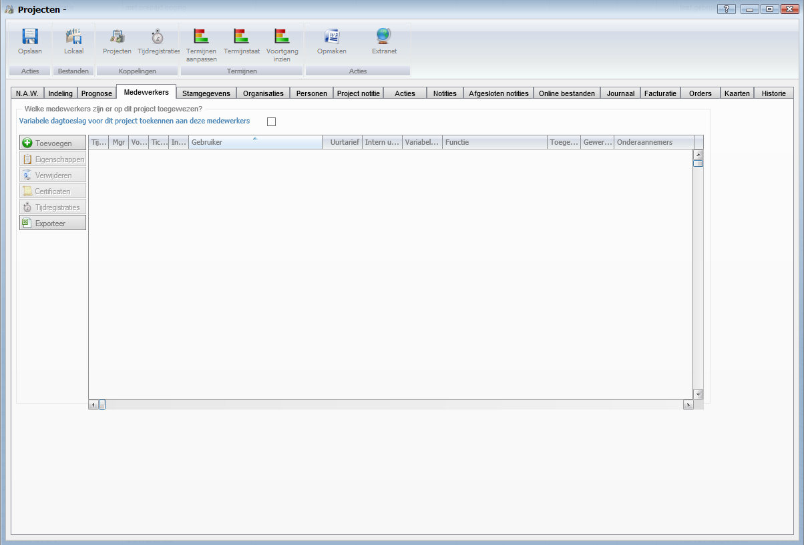 

*Welke medewerkers zijn er op dit project toegewezen?*

- Variabele dagtoeslag voor dit project toekennen aan deze medewerkers

**Tabblad Stamgegevens**
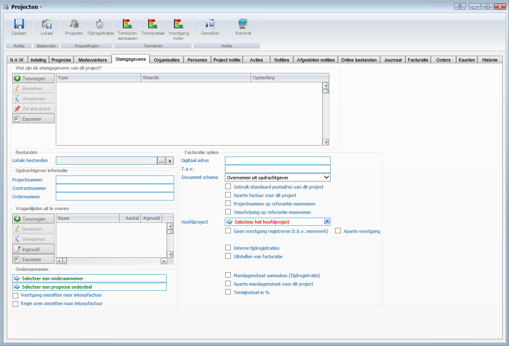 

*Wat zijn de stamgegevens van dit project*

*Bestanden*

- Lokale bestanden

*Opdrachtgever informatie*

- Projectnummer
- Contractnummer
- Ordernummer

*Vragenlijsten uit te voeren*

*Orderaannemer*

*Facturatie opties*

- Digitaal adres
- T.a.v.
- Document schema
- Gebruik standaard postadres van dit project
- Aparte factuur voor dit project
- Projectnummer op referentie meenemen
- Omschrijving op referentie meenemen
- Hoofdproject
- Geen voortgang registreren
- Aparte voortgang
- Interne tijdregistratie
- Uitstellen van facturatie
- Mandagenstaat aanmaken
- Aparte mandagenstaat voor dit project
- Termijnstaat in %

**Tabblad Organisaties**
 

*Welke bedrijven zijn betrokken bij dit project*

**Tabblad Personen**
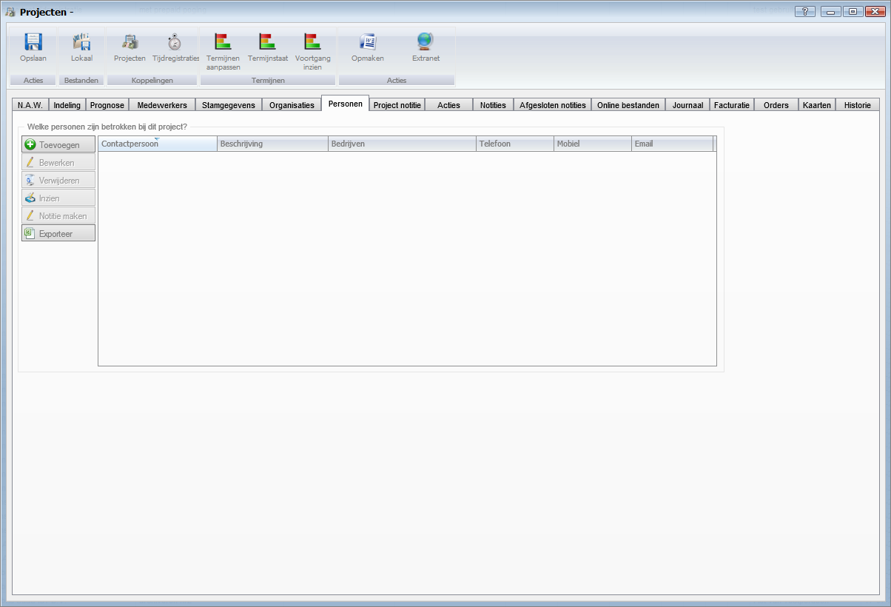 

*Welke personen zijn betrokken bij dit project?*

**Tabblad Project notitie**
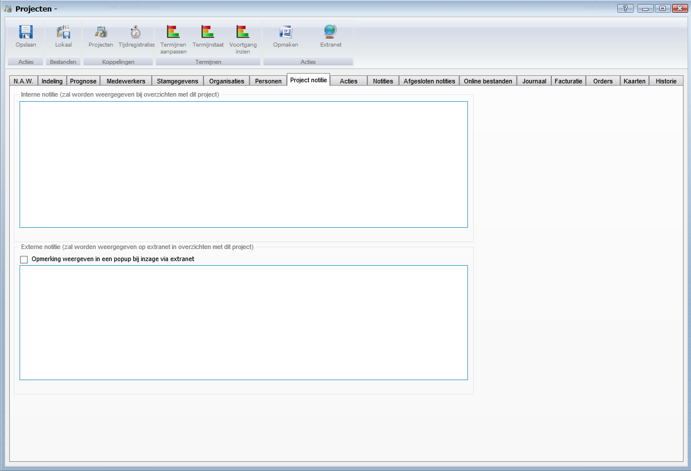 

*Interne notitie*

*Externe notitie*

- Opmerking weergeven in een popup bij inzage via extranet

**Tabblad Acties**

 
*Acties voor dit project*

**Tabblad Notities**
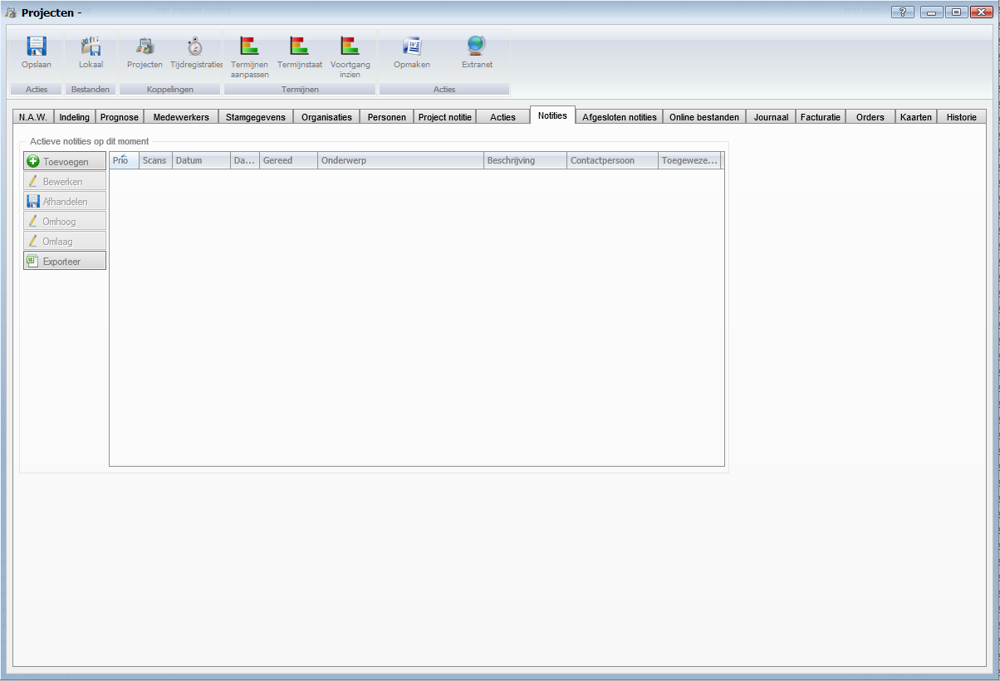 

*Actieve notities op dit moment*

**Tabblad Afgesloten notities**
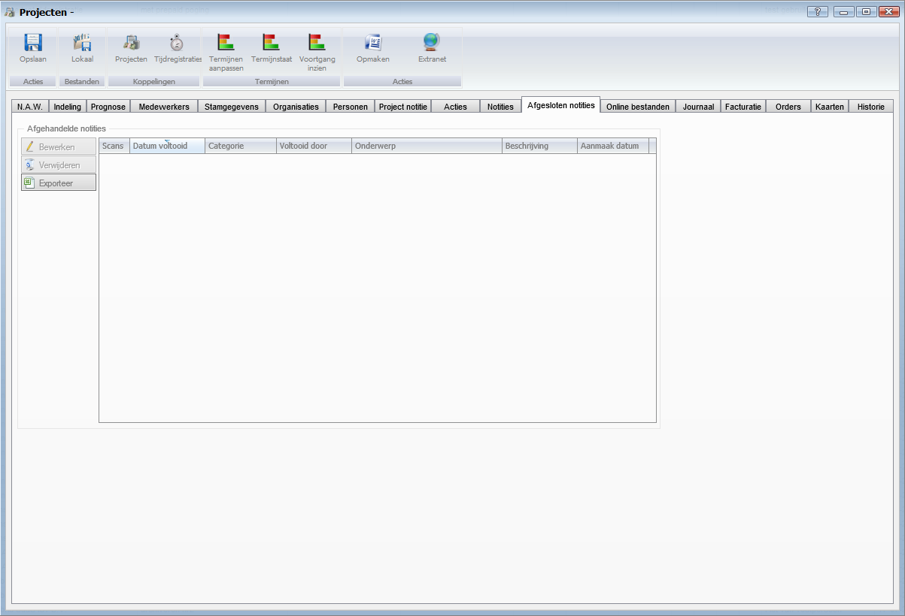 

*Afgehandelde notities*

**Tabblad Online bestanden**
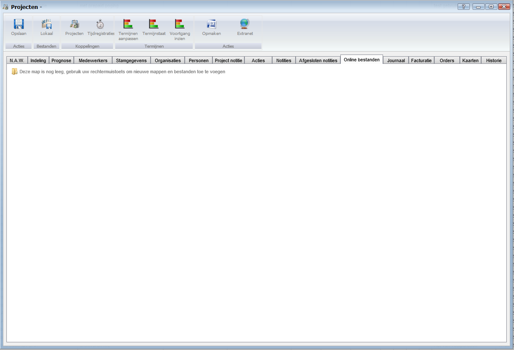 

**Tabblad Journaal**
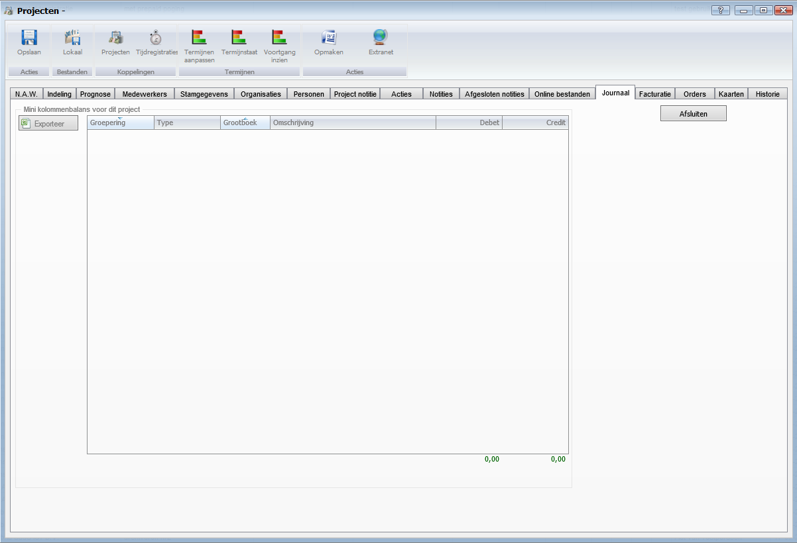

*Mini kolommenbalans voor dit project*

- Afsluiten

**Tabblad Facturatie**
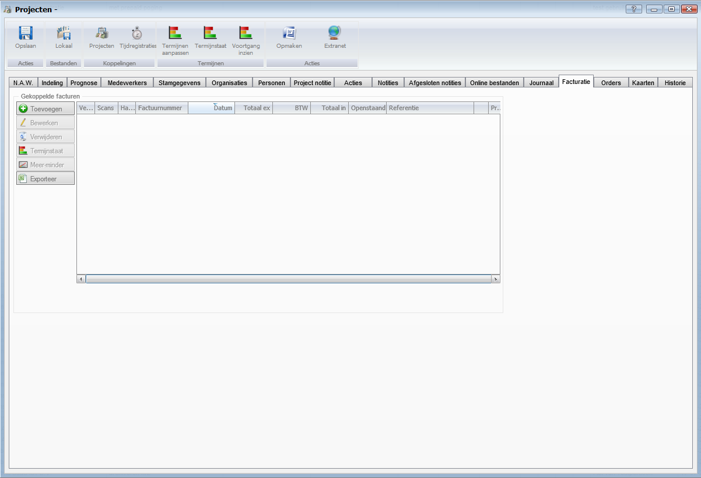 

*Gekoppelde facturen*

**Tabblad Orders**
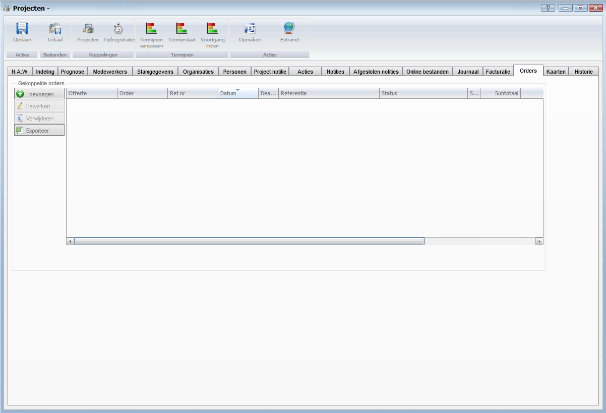 

*Gekoppelde orders*

**Tabblad Kaarten**
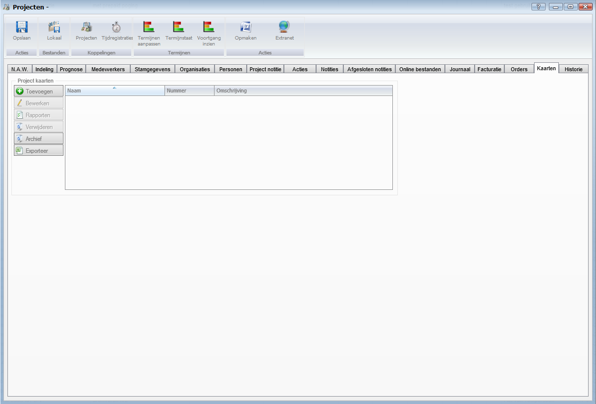 

*Project kaarten*

**Tabblad Historie**
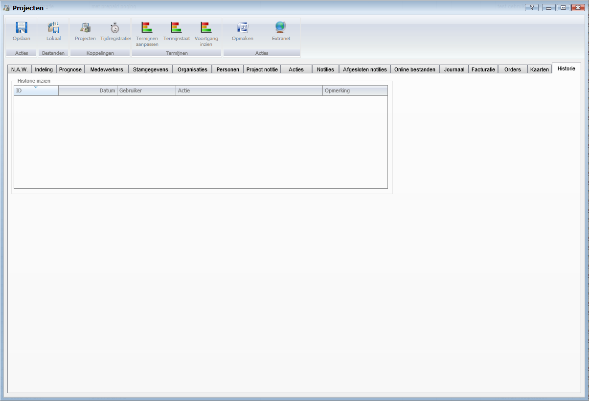

*Historie inzien*

Terug naar een [offerte/orde aanmaken](http://hybridsaas.support/pages/handleiding/modules/F-O/offerte-en-orders/een-offerte-of-order-aanmaken)