<properties>
	<page>
		<title>Nieuw persoon aanmaken modulebeschrijving</title>
	</page>
	<menu>
		<position>Handleiding / Modules / P - Z / Relatiebeheer</position>
		<title>Nieuw Persoon aanmaken</title>
	</menu>
</properties>

#Personen#

#Een nieuw persoon aanmaken#

**Aanmaken van een nieuw persoon**

**Tabblad N.A.W.**
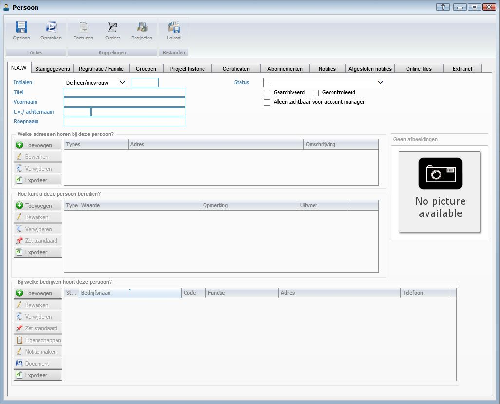

- Initialen
- Titel
- Voornaam
- T.v./Achternaam
- Roepnaam
- Status
- Gearchiveerd
- Gecontroleerd
- Alleen zichtbaar voor account manager
- Afbeelding

*Welke adressen horen bij deze persoon?*

*Hoe kunt u deze persoon bereiken?*

*Bij welke bedrijven hoort deze persoon?*

**Tabblad Stamgegevens** 
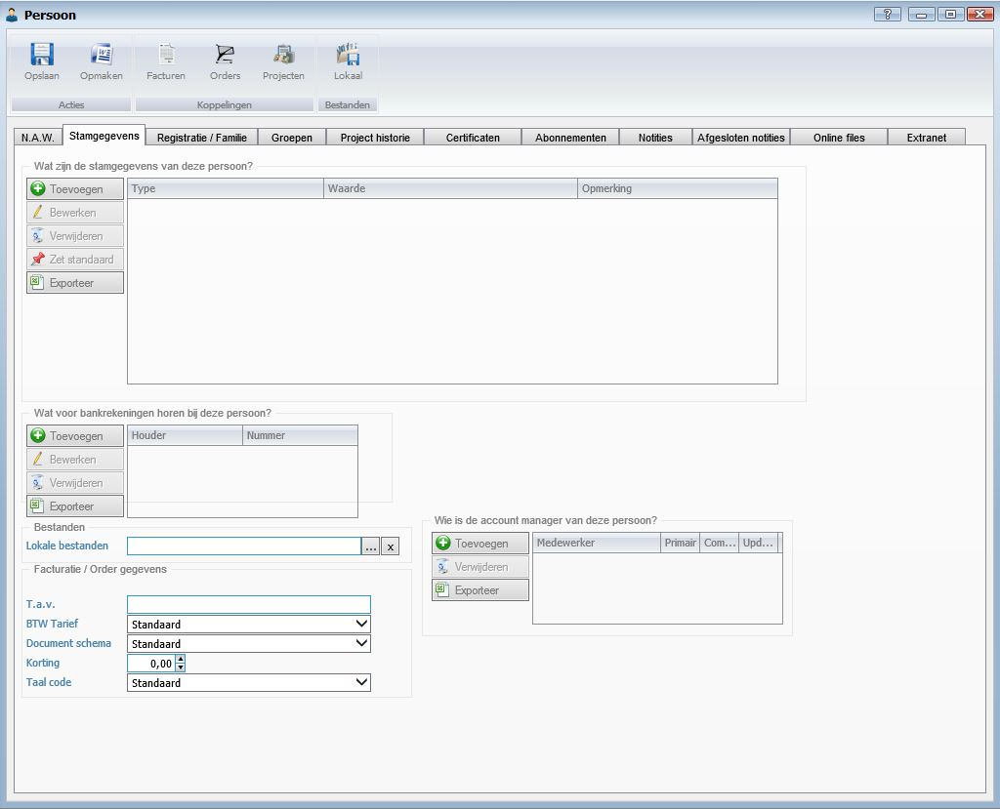
*Wat zijn de stamgegevens van deze persoon?*

*Wat voor bankrekeningen horen bij deze persoon?*

*Bestanden*

-Lokale bestanden

*Facturatie/Order gegevens*

- T.a.v.
- BTW Tarief
- Document schema
- Korting
- Taal code

*Wie is de account manager van deze persoon?*

**Tabblad Registratie/Familie**
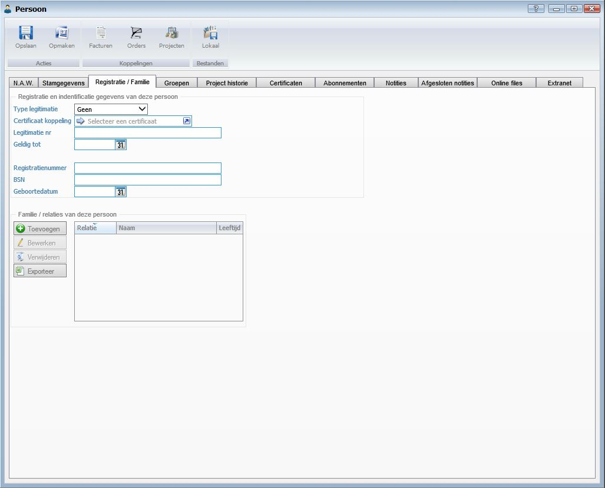
*Registratie en identificatie gegevens van deze persoon*

- Type legitimatie
- Certificaat koppeling
- Legitimatie nr
- Geldig tot
- Registratienummer
- BSN
- Geboortedatum

*Familie/Relaties van deze persoon*

**Tabblad Groepen**
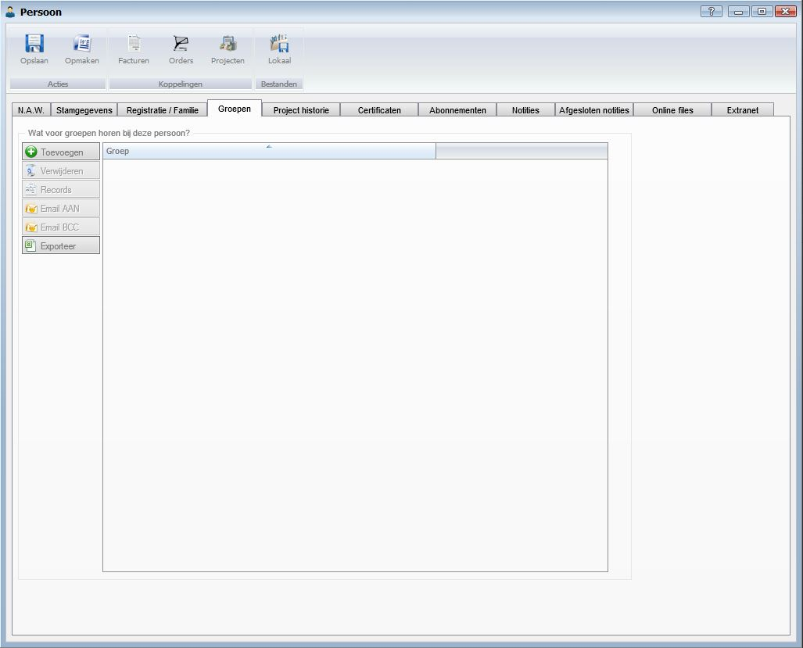
*Wat voor groepen horen bij deze persoon?*

**Tabblad Project historie**
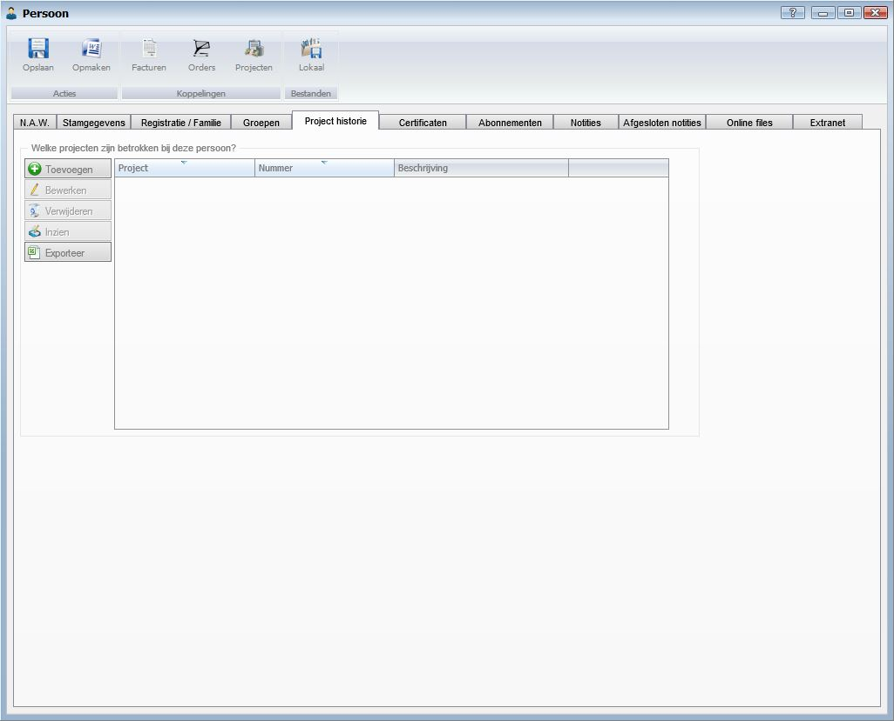
*Welke projecten zijn betrokken bij deze persoon?*

**Tabblad Certificaten**
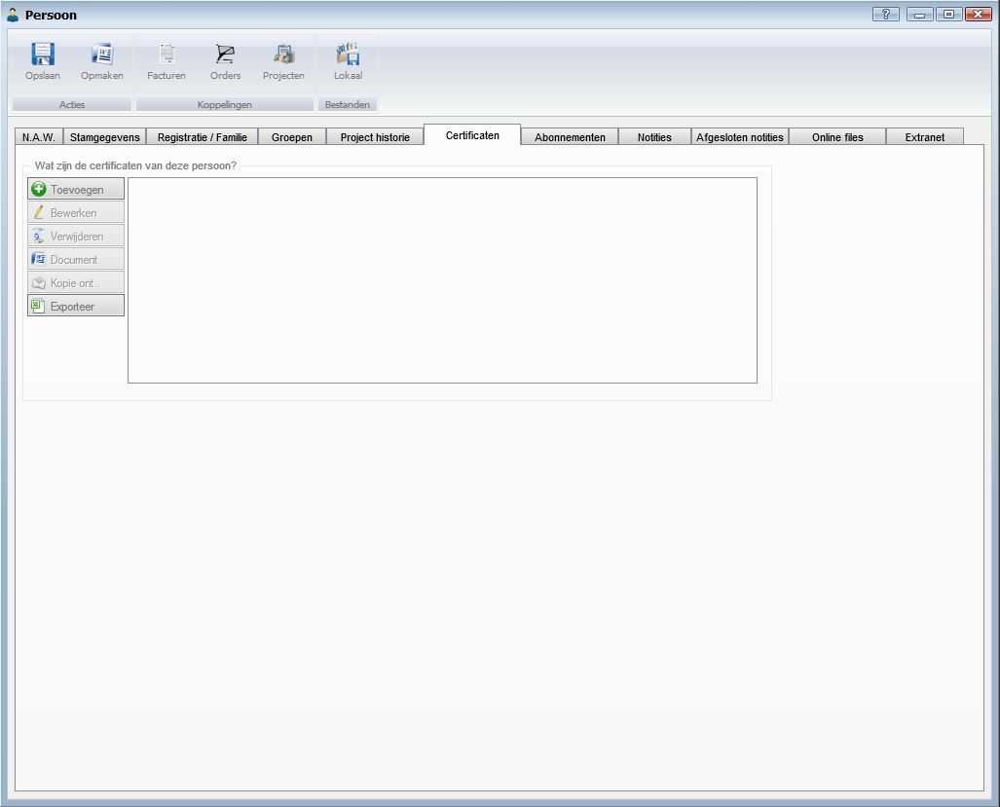
*Wat zijn de certificaten van deze persoon?*

**Tabblad Abonnementen**
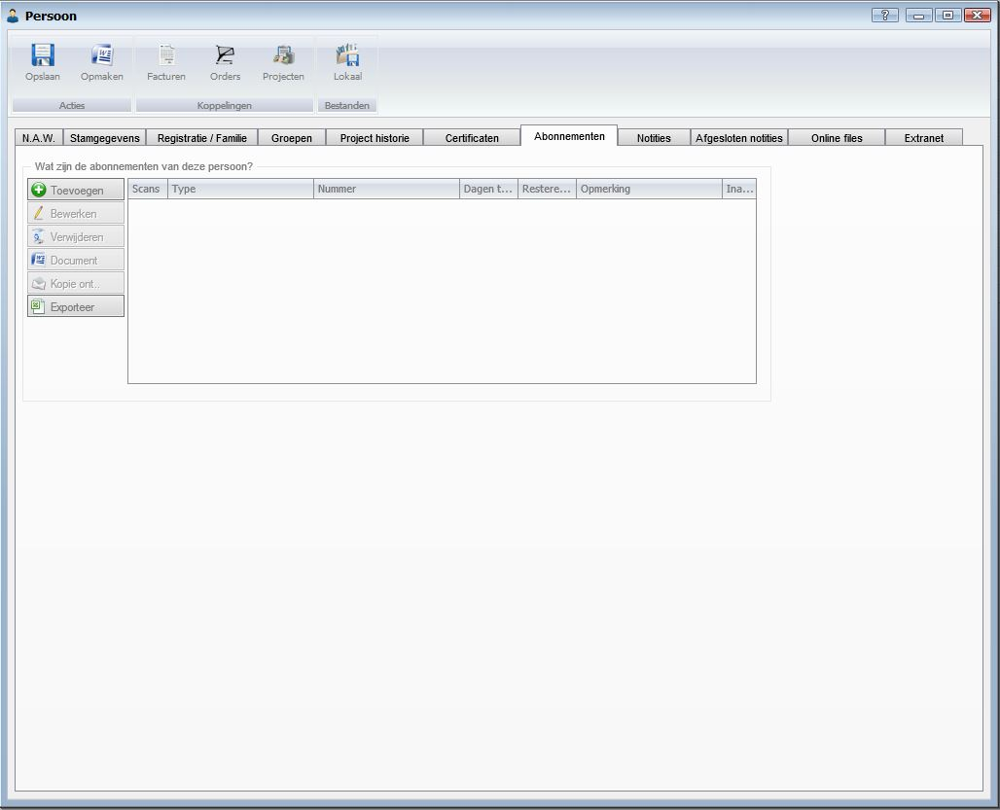
*Wat zijn de abonnementen van deze persoon?*

**Tabblad Notities**
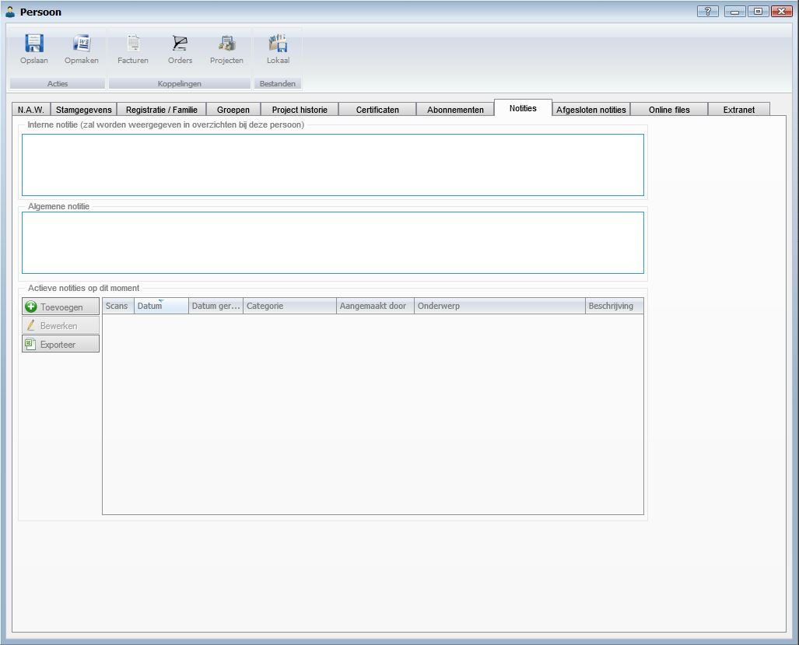
*Interne notitie (zal worden weergegeven in overzichten bij deze persoon)*

*Algemene notitie*

*Actieve notities op dit moment*
**Tabblad Afgesloten notities**
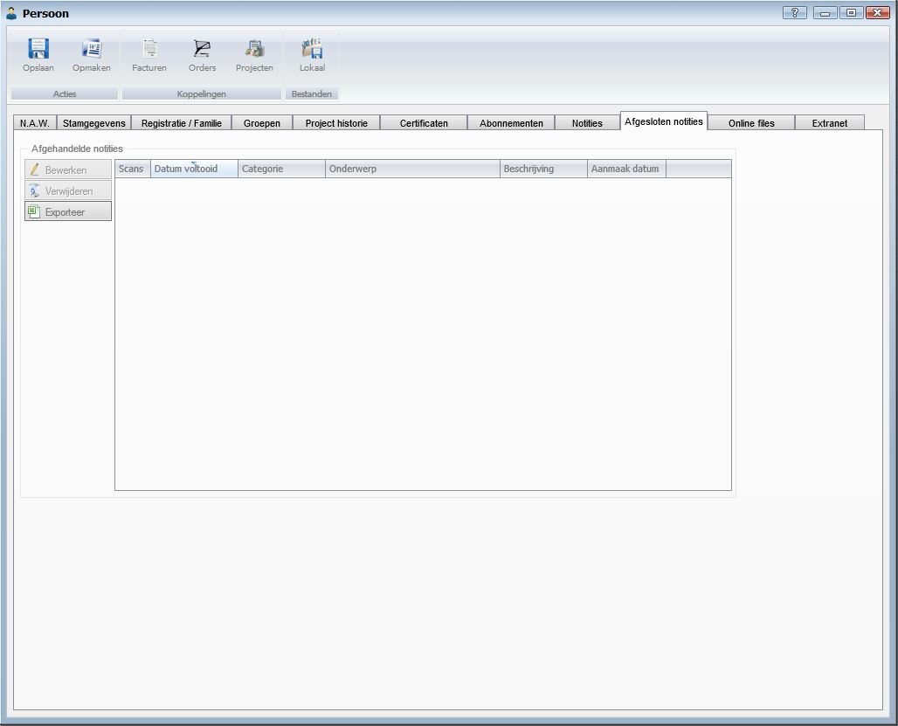
*Afgehandelde notities*

**Tabblad Online files**
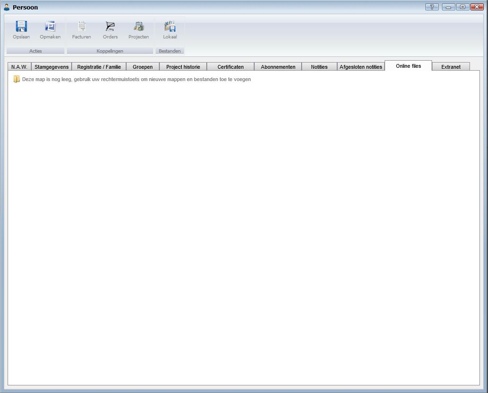
**Tabblad Extranet**
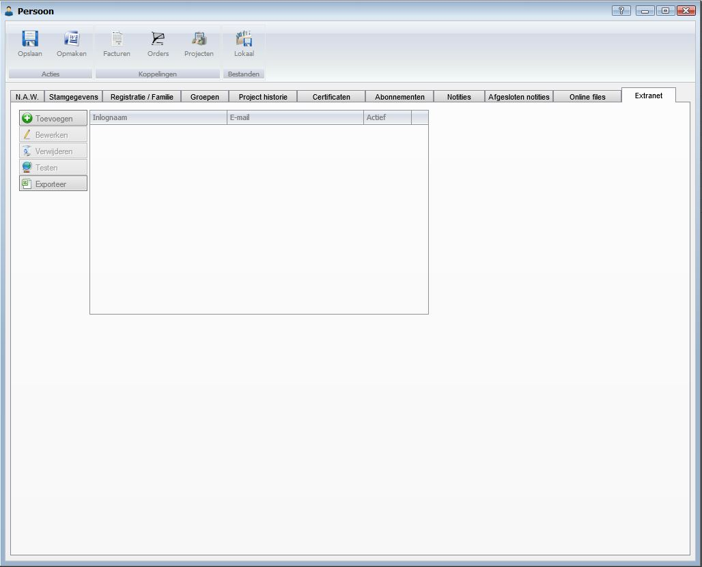
