<properties>
	<page>
		<title>Relatiebeheer aanmaken</title>
		<description>Relatiebeheer aanmaken</description>
        <context>dlgorganization*</context>
	</page>
	<menu>
		<position>Handleiding / Modules / P - Z / Relatiebeheer</position>
		<title>Relatiebeheer aanmaken</title>
		<sort>C</sort>
	</menu>
</properties>

# Relaties#
Een relatie aanmaken kan verschillen tussen of een *klant* of een *leverancier* of een *fabrikant* 
of een combinatie van dit

----------
#Start#
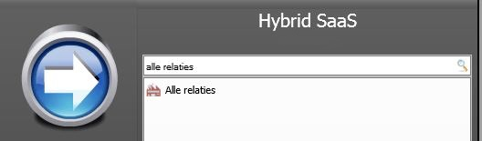
#Alle relaties#

**Acties**

- Toevoegen
- Bewerken
- Verwijderen
- Vernieuwen
- Document opmaken
- Excel

**Acties**

- (de)activeer
- Wijzig groep

**Exporteren**

- Outlook

**Koppelingen**

- Contracten
- Contract regels
- Personen
- Projecten
- Voortgang
- Orders
- Facturen
- Gasmetingen
- Inkoop-factuur
- Bank transacties
- Openstaande
- Afgesloten
- Per categorie

**Bestanden**

- Lokale bestanden

**Overzichten**

- Omzet werkcodes
- Maand omzet
- Kwartaal omzet

#Alle relaties#

**Acties**

- Opslaan
- Opmaken

**Exporteren**

- Outlook

**Koppelingen**

- Projecten
- Orders
- Facturen
- Gasmetingen
- Inkoop-factuur
- Openstaande
- Afgesloten
- Per categorie
- Transacties

**Bestanden**

- Lokale bestanden

**Overzichten**

- Omzet werkcodes
- Maand omzet
- Kwartaal omzet

#N.A.W.#
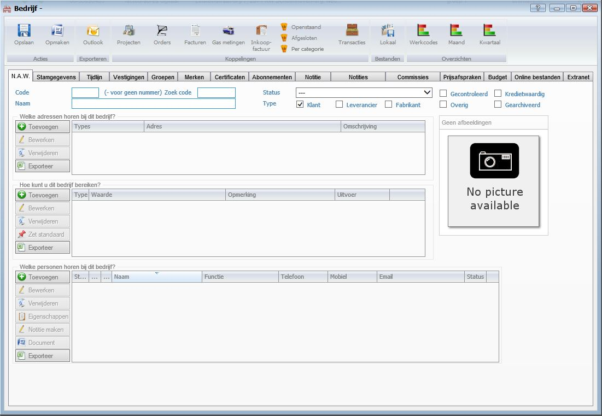 

- Code
- Zoek code
- Naam
- Status
- Type: Klant/Leverancier/Fabrikant
- Gecontroleerd
- Overige
- Kredietwaardig
- Gearchiveerd
- Afbeelding

**Welke adressen horen bij dit bedrijf?**

- Toevoegen
- Bewerken
- Verwijderen
- Exporteren

**Hoe kunt u dit bedrijf bereiken?**

- Toevoegen
- Bewerken
- Verwijderen
- Zet standaard
- Exporteren

**Welke personen horen bij dit bedrijf?**

- Toevoegen
- Bewerken
- Verwijderen
- Eigenschappen
- Notitie maken
- Document
- Exporteren

#Stamgegevens#
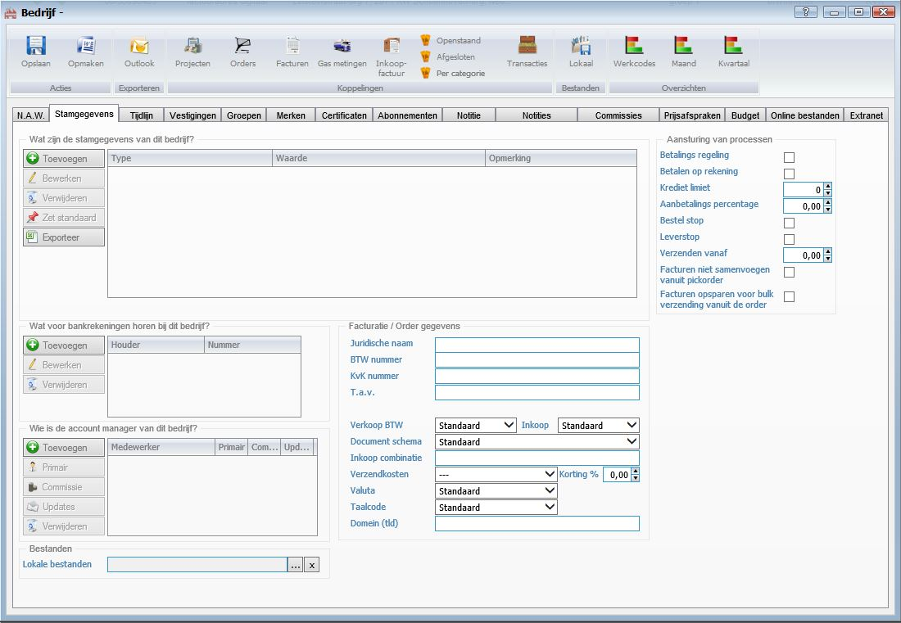

**Wat zijn de stamgegevens van dit bedrijf?**

- Toevoegen
- Bewerken
- Verwijderen
- Zet standaard
- Exporteren

**Wat voor bankrekeningen horen bij dit bedrijf?**

- Toevoegen
- Bewerken
- Verwijderen

**Wie is de account manager van dit bedrijf?**

- Toevoegen
- Primair
- Commissie
- Update
- Verwijderen

**Bestanden**

- Lokale bestanden

**Facturatie/ Order gegevens**

- Juridische naam
- BTW nummer
- KvK nummer
- T.a.v.
- Verkoop BTW
- Inkoop
- Document schema
- Inkoop combinatie
- Verzendkosten
- Korting
- Valuta
- Taalcode
- Domein (tld)

**Aansturing van processen**

- Betalings regeling
- Betalen op rekening
- Krediet Limiet
- Aanbetalings percentage
- Bestel stop
- Leverstop
- Verzenden vanaf
- Facturen niet samenvoegen vanuit pickorde
- Facturen opsparen voor bulk verzending vanuit de orde

#Tijdlijn#
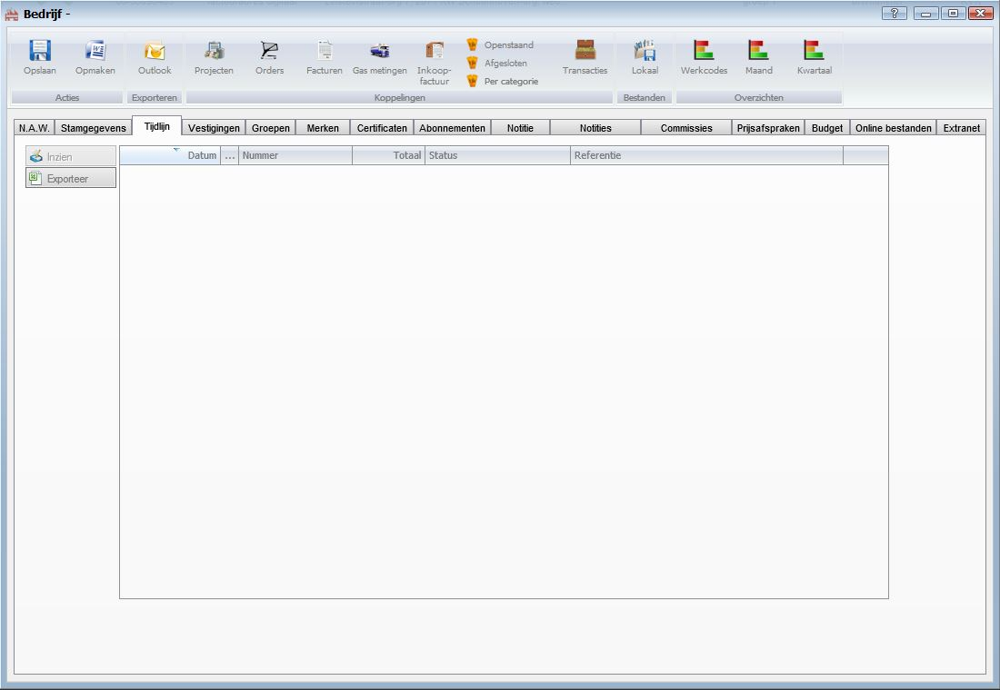

- Inzien
- Exporteren

#Vestigingen#
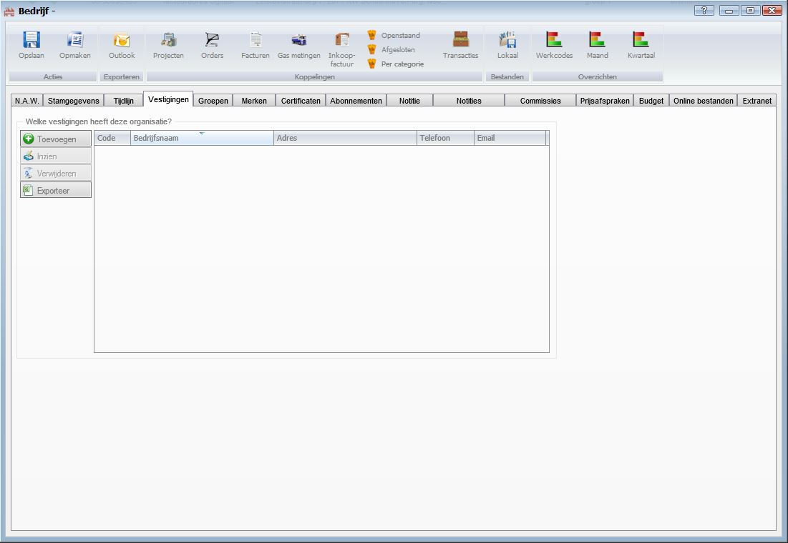

**Welke vestigingen heeft deze organisatie?**

- Toevoegen
- Inzien
- Verwijderen
- Exporteren

#Groepen#
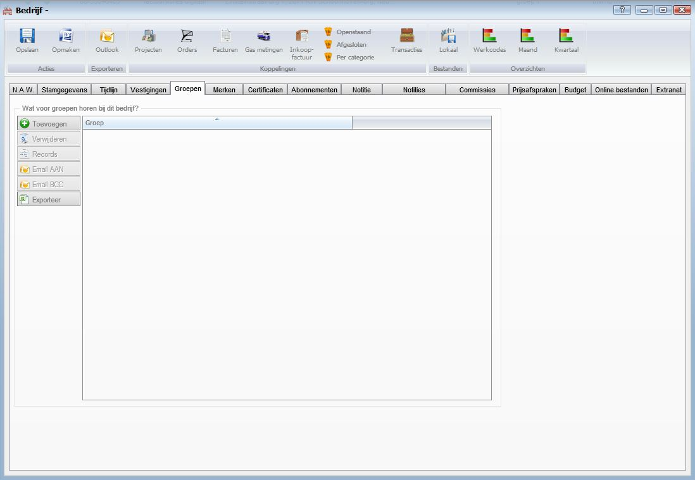

**Wat voor groepen horen bij dit bedrijf**

- Toevoegen
- Verwijderen
- Records
- Email AAN
- Email BCC
- Exporteren

#Merken#
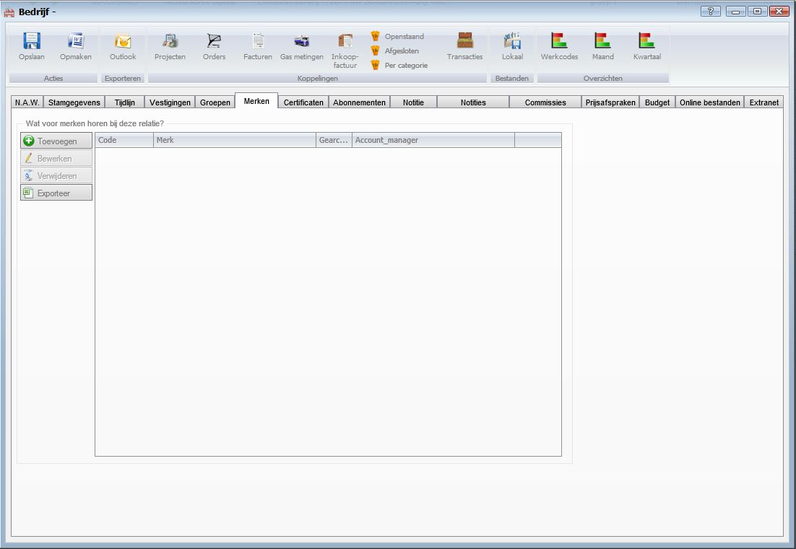

**Wat voor merken horen bij deze relatie?**

- Toevoegen
- Bewerken
- Verwijderen
- Exporteren

#Certificaten#
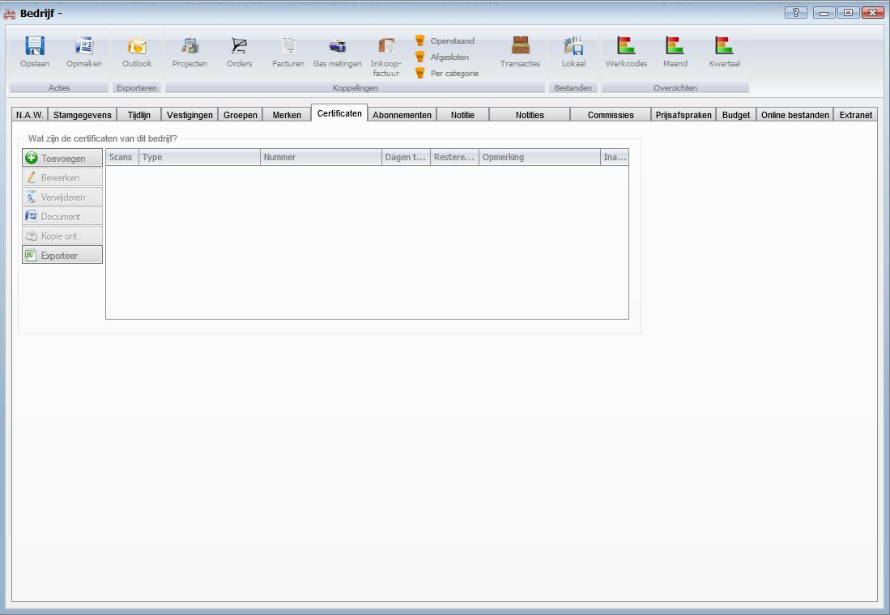

**Wat zijn de certificaten van dit bedrijf?**

- Toevoegen
- Bewerken
- Verwijderen
- Document
- Kopie ont..
- Exporteren

#Abonnementen#
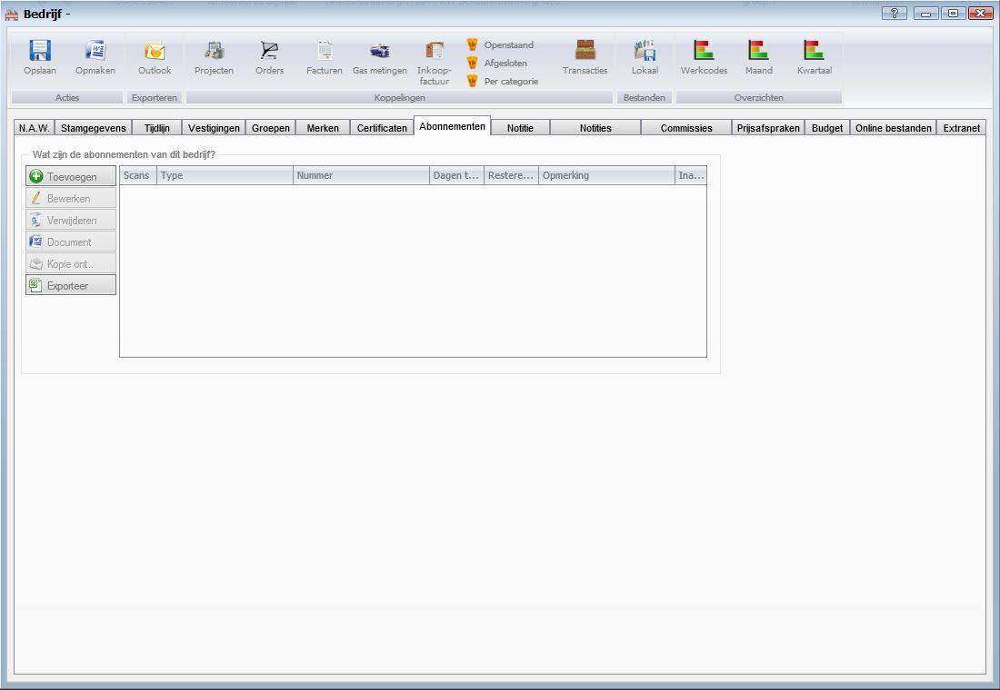

**Wat zijn de abonnementen van dit bedrijf?**

- Toevoegen
- Bewerken
- Verwijderen
- Document
- Kopie ont..
- Exporteren

#Notitie#
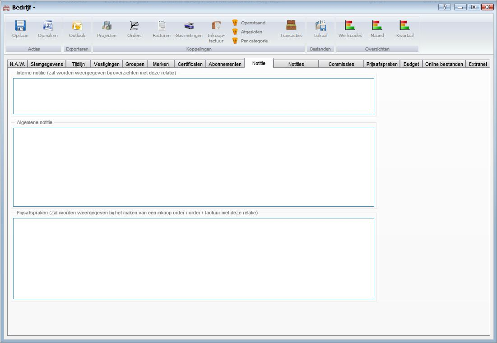

**Interne notitie (zal worden weergegeven bij overzichten met deze relatie)**

**Algemene notitie**

**Prijsafspraken (zal worden weergegeven bij het maken van een inkoop orde/orde/factuur met deze relatie**

#Notities#
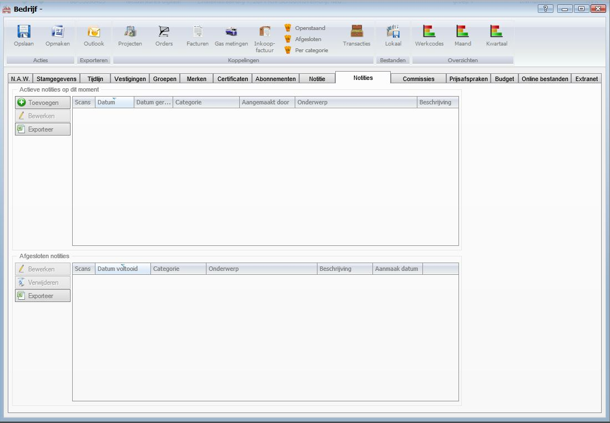

**Actieve notities op dit moment**

- Toevoegen
- Bewerken
- Exporteren

**Afgesloten notities**

- Bewerken
- Verwijderen
- Exporteren

#Commissies#
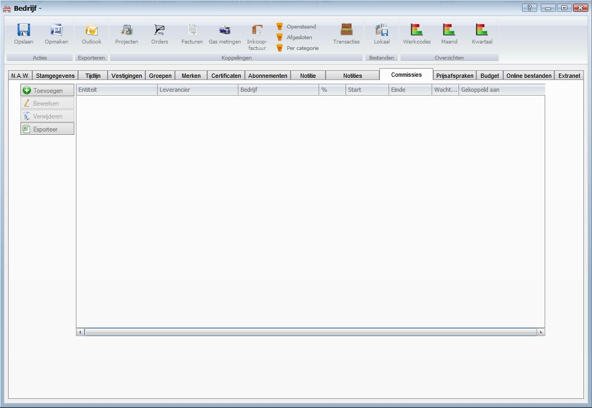

- Toevoegen
- Bewerken
- Verwijderen
- Exporteren

#Prijsafspraken#
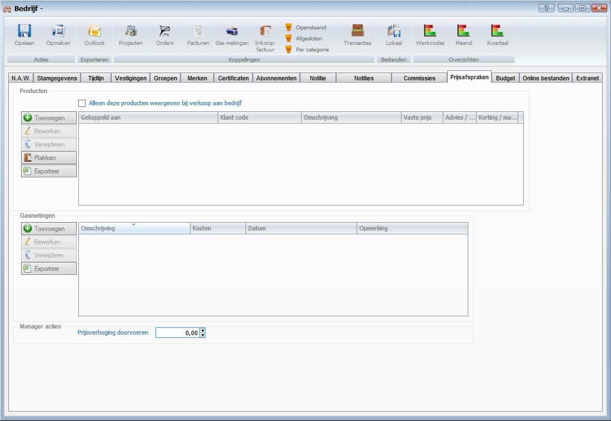

**Producten**

- Alleen deze producten weergeven bij verkoop aan het bedrijf
- Toevoegen
- Bewerken
- Verwijderen
- Plakken
- Exporteren

**Gasmetingen**
- Toevoegen
- Bewerken
- Verwijderen
- Exporteren

**Manager acties**

- Prijsverhoging doorvoeren

#Budget#
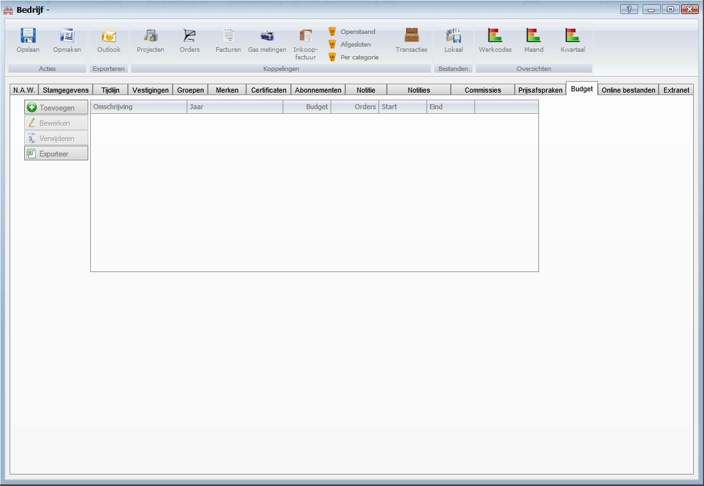

- Toevoegen
- Bewerken
- Verwijderen
- Exporteren

#Online bestanden#
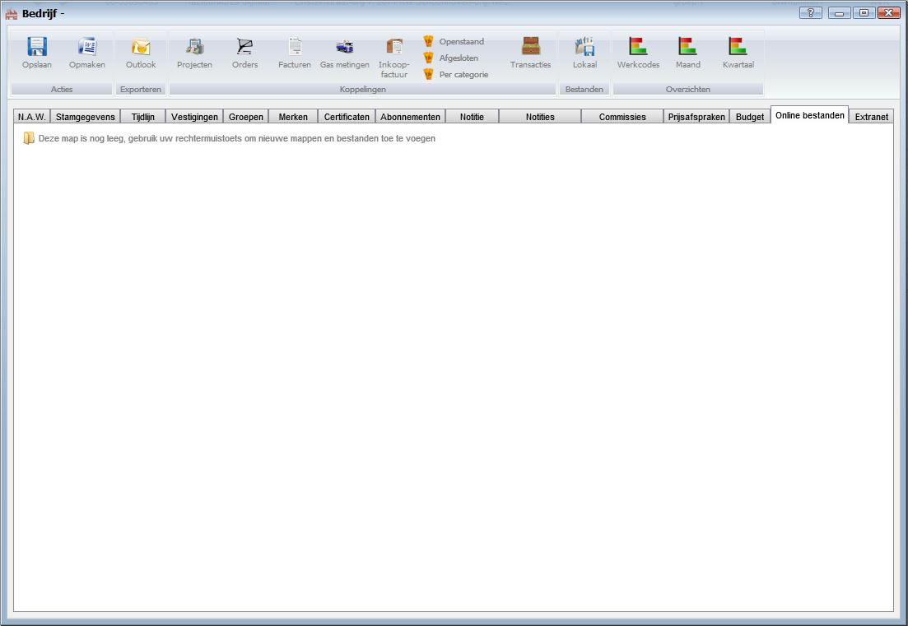

#Extranet#
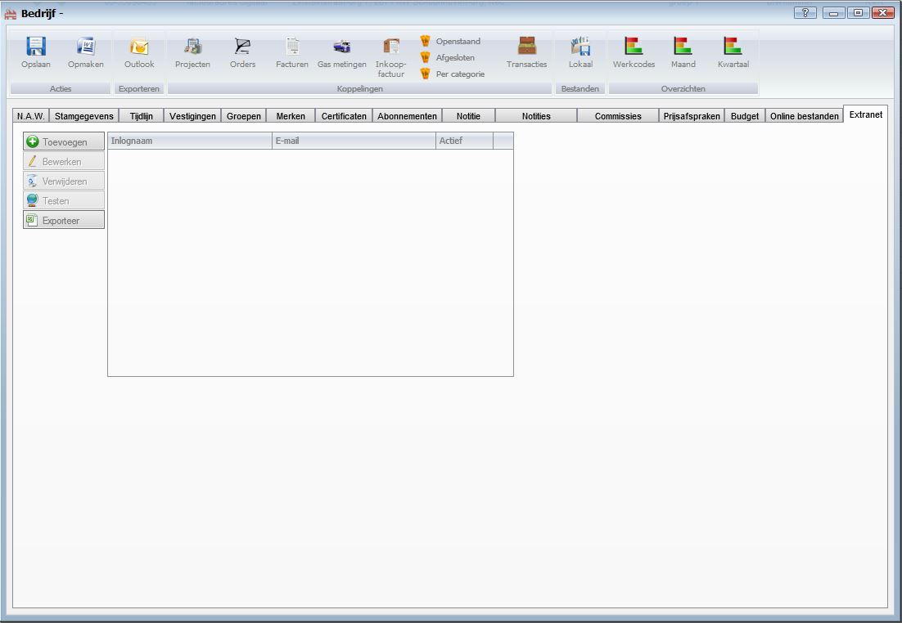

- Toevoegen
- Bewerken
- Verwijderen
- Testen
- Exporteren

----------
[Stappenplan](http://hybridsaas.support/pages/handleiding/extra/omgeving)

[Relatiebeheer](http://hybridsaas.support/pages/handleiding/modules/P-Z/relatiebeheer/relatiebeheer)