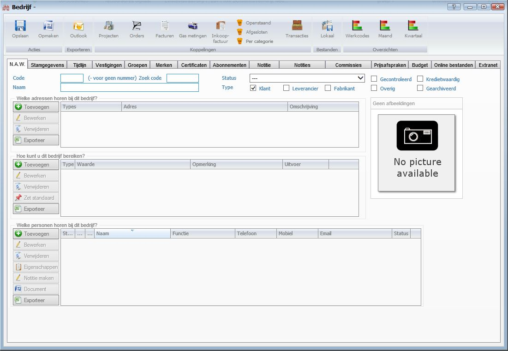

<properties>
	<page>
		<title>Relatiebeheer</title>
			</page>
	<menu>
		<position>Handleiding / Modules / P - Z / Relatiebeheer</position>
		<title>Relatiebeheer</title>
	</menu>
</properties>

# Relatiebeheer #
<description>Relaties zijn de motor van iedere organisatie. Juist daarom is het belangrijk om als organisatie over een compleet en overzichtelijk CRM-systeem (Customer Relationship Management) te beschikken.

Met de module Relatiebeheer van Hybrid SaaS kunnen klantgegevens gemakkelijk en snel worden vastgelegd. Bovendien heeft elke medewerker altijd en overal toegang tot de actuele gegevens en de historie van elke klant. Dit is ook voor de klant een goede zaak, want dit zorgt voor een optimale klantbediening.
</description>

# Bedrijf aanmaken #

**Aanmaken van een nieuw bedrijf**

**Tabblad N.A.W.**
 

- Code
- Zoek code
- Naam
- Status
- Type: Klant/Leverancier/Fabrikant
- Gecontroleerd
- Overige
- Kredietwaardig
- Gearchiveerd
- Afbeelding

*Welke adressen horen bij dit bedrijf?*

*Hoe kunt u dit bedrijf bereiken?*

*Welke personen horen bij dit bedrijf?*

**Tabblad Stamgegevens**

*Wat zijn de stamgegevens van dit bedrijf?*

*Wat voor bankrekeningen horen bij dit bedrijf?*

*Wie is de account manager van dit bedrijf?*

*Bestanden*

- Lokale bestanden

*Facturatie/ Order gegevens*

- Juridische naam
- BTW nummer
- KvK nummer
- T.a.v.
- Verkoop BTW
- Inkoop
- Document schema
- Inkoop combinatie
- Verzendkosten
- Korting
- Valuta
- Taalcode
- Domein (tld)

*Aansturing van processen*

- Betalings regeling
- Betalen op rekening
- Krediet Limiet
- Aanbetalings percentage
- Bestel stop
- Leverstop
- Verzenden vanaf
- Facturen niet samenvoegen vanuit pickorde
- Facturen opsparen voor bulk verzending vanuit de orde

**Tabblad Tijdlijn**

**Tabblad Vestigingen**

*Welke vestigingen heeft deze organisatie?*

**Tabblad Groepen**

*Wat voor groepen horen bij dit bedrijf*

**Tabblad Merken**

*Wat voor merken horen bij deze relatie?*

**Tabblad Certificaten**

*Wat zijn de certificaten van dit bedrijf?*

**Tabblad Abonnementen**

*Wat zijn de abonnementen van dit bedrijf?*

**Tabblad Notitie**

*Interne notitie (zal worden weergegeven bij overzichten met deze relatie)*

*Algemene notitie*

*Prijsafspraken (zal worden weergegeven bij het maken van een inkoop orde/orde/factuur met deze relatie*

**Tabblad Notities**

*Actieve notities op dit moment*

*Afgesloten notities*

**Tabblad Commissies**

**Tabblad Prijsafspraken**

*Producten*

- alleen deze producten weergeven bij verkoop aan het bedrijf

*Gasmetingen*

*Manager acties*

- Prijsverhoging doorvoeren

**Tabblad Budget**

**Tabblad Online bestanden**

**Tabblad Extranet**

