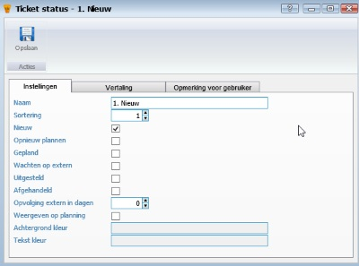
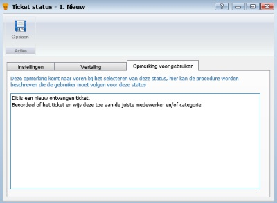

<properties>
	<page>
		<title>Tickets</title>
	</page>
	<menu>
		<position>Handleiding / Modules / P - Z / Tickets</position> 
		<title>Beheren ticketsysteem</title>
	<sort>B</sort>
	</menu>
</properties>

#Beheren ticketsysteem#

#Status#
Voordat je begint met de inrichting van je ticketsysteem moet je bepalen hoe het proces gaat verlopen. Hoe komt een ticket binnen, hoe wordt deze verwerkt en hoe wordt deze afgehandeld. Deze stappen kan je dan vastleggen in het systeem. Deze worden statussen genoemd. Er is altijd 1 status die het proces start en één die het proces beëindigd.
  
 

