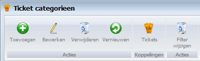
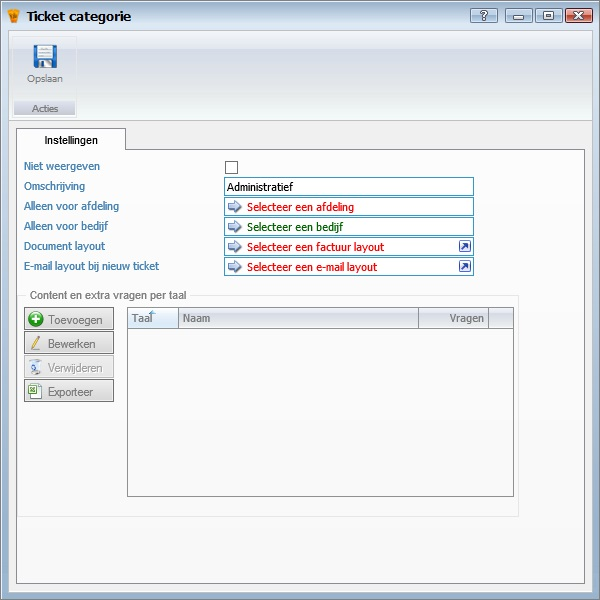

<properties>
	<page>
		<title>tickets-categorieen</title>
		<description>tickets-categorieen</description>
		<context>ticket-categories*</context>
	</page>
	<menu>
		<position>Handleiding /Modules /P-Z /Tickets</position>
		<title>Tickets Categorieën</title>
		<sort></sort>
	</menu>
</properties>

#Tickets Categorieën#
----------
#Start#

#Ticket categorieen#

**Acties**

- Toevoegen
- Bewerken
- Verwijderen
- Vernieuwen

**Koppelingen**

- Tickets

**Acties**

- Filter wijzigen

#Instellingen#

- Niet weergeven
- Omschrijving
- Alleen voor afdeling
- Alleen voor bedrijf
- Document layout
- E-mail layout bij nieuw ticket

**Content en extra vragen per taal**

- Toevoegen
- Bewerken
- Verwijderen
- Exporteren

----------
[Stappenplan](http://hybridsaas.support/pages/handleiding/extra/omgeving)
