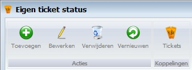
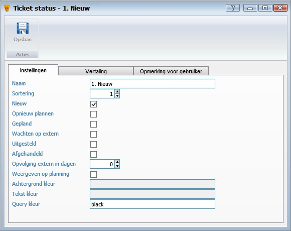
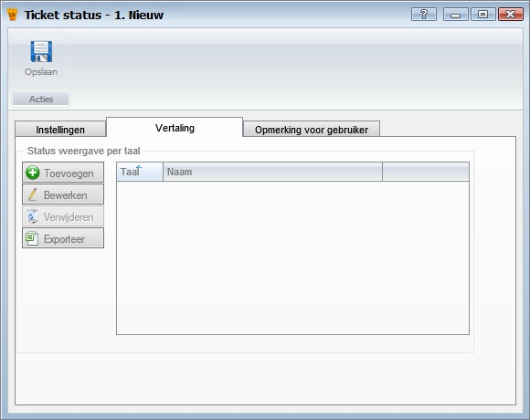
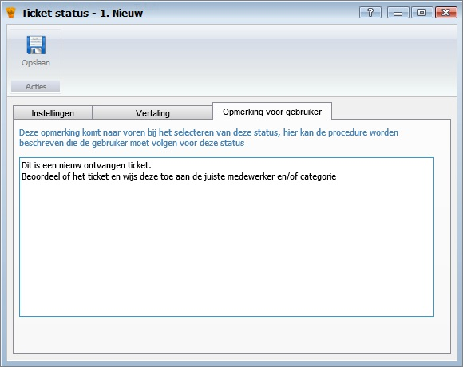

<properties>
	<page>
		<title>tickets-status</title>
		<description>tickets-status</description>
		<context>ticket-status*</context>
	</page>
	<menu>
		<position>Handleiding /Modules /P-Z /Tickets</position>
		<title>Tickets Statussen</title>
		<sort></sort>
	</menu>
</properties>

#Tickets Statussen#
Voordat je begint met de inrichting van je ticketsysteem moet je bepalen hoe het proces gaat verlopen. Hoe komt een ticket binnen, hoe wordt deze verwerkt en hoe wordt deze afgehandeld. Deze stappen kan je dan vastleggen in het systeem. Deze worden statussen genoemd. Er is altijd 1 status die het proces start en één die het proces beëindigd.

----------
#Start#

#Eigen ticket status#

**Acties**

- Toevoegen
- Bewerken
- Verwijderen
- Vernieuwen

**Koppelingen**

- Tickets

#Instellingen#

- Naam
- Sortering
- Nieuw
- Opnieuw plannen
- Gepland
- Wachten op extern
- Uitgesteld
- Afgehandeld
- Opvolging extern in dagen
- Weergeven op planning
- Achtergrond kleur
- Tekst kleur
- Query kleur

#Vertaling#

- Toevoegen
- Bewerken
- Verwijderen
- Exporteren

#Opmerking voor gebruiker#

----------
[Stappenplan](http://hybridsaas.support/pages/handleiding/extra/omgeving)
