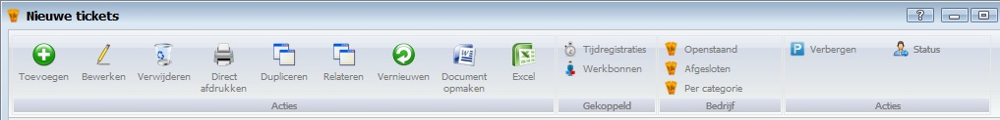
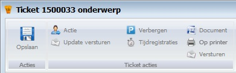
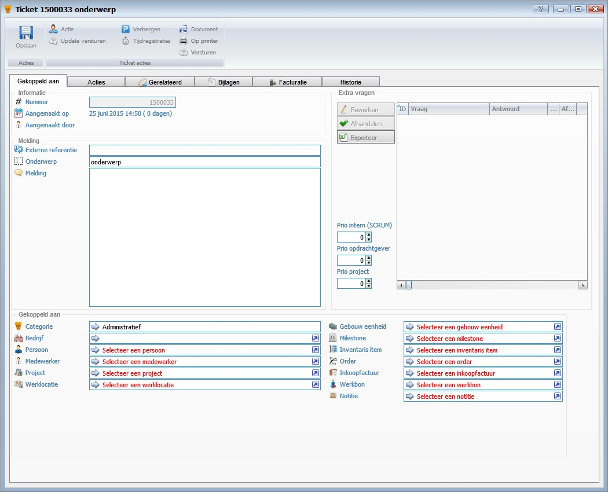
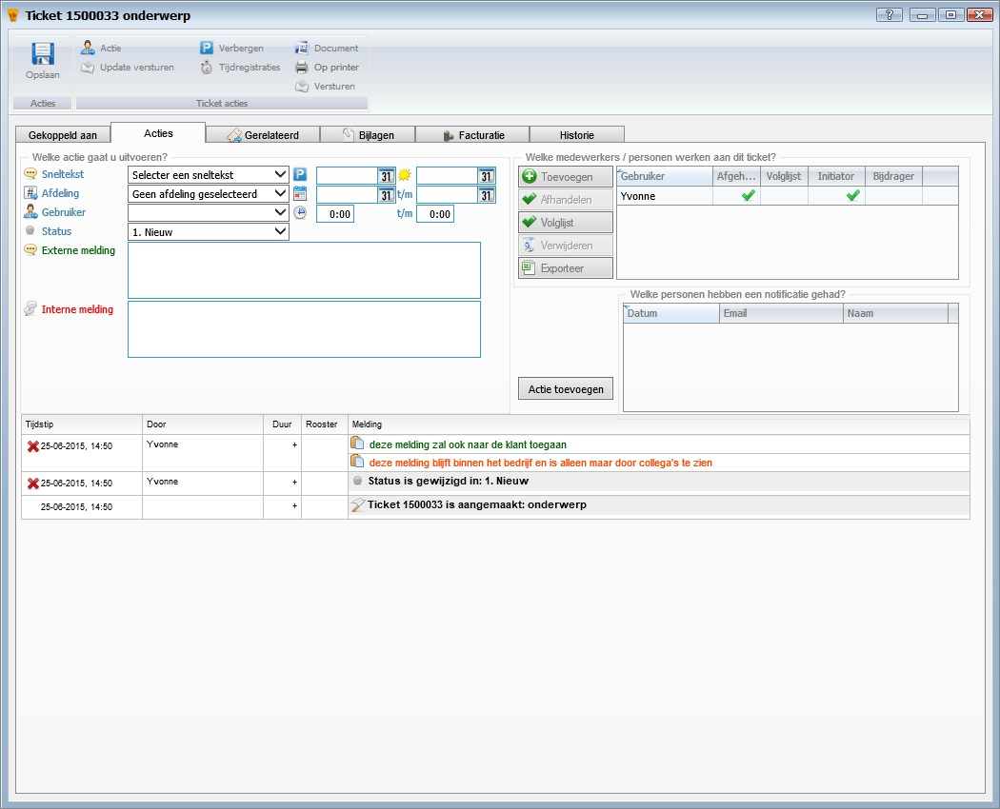
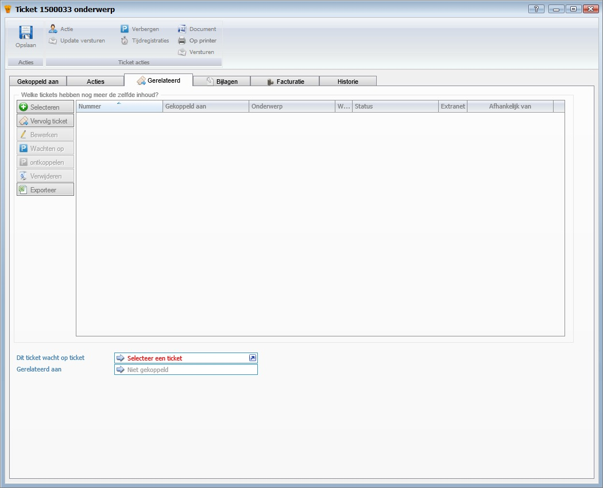
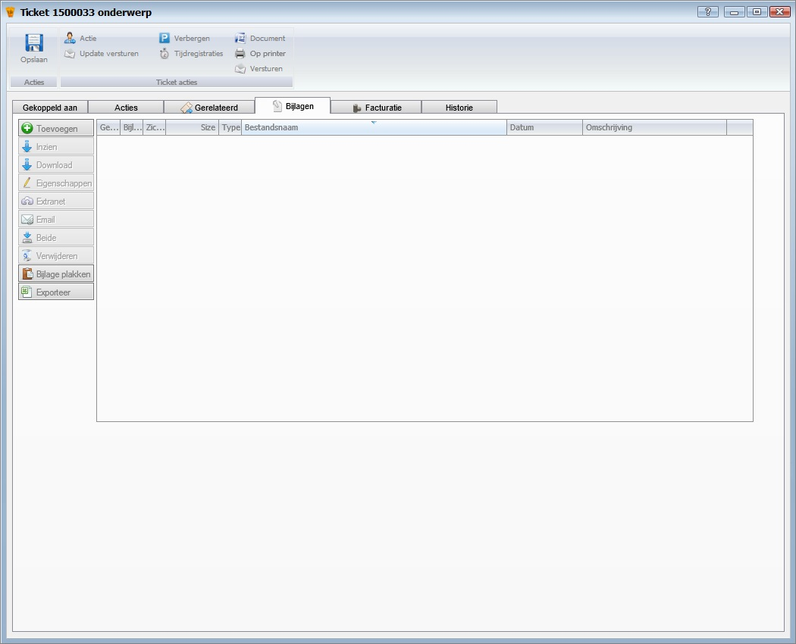
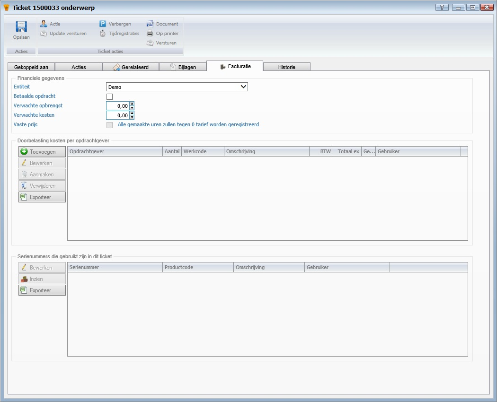
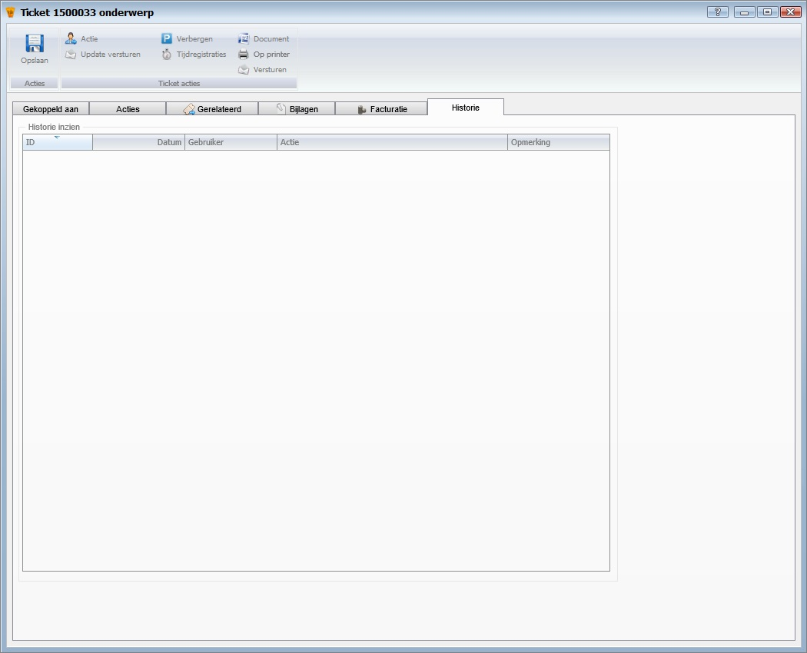

<properties>
	<page>
		<title>tickets-aanmaken</title>
		<description>tickets-aanmaken</description>
		<context>tickets-new*</context>
	</page>
	<menu>
		<position>Handleiding /Modules /P - Z /Tickets</position>
		<title>tickets Aanmaken</title>
		<sort></sort>
	</menu>
</properties>

#Tickets Aanmaken#
----------
#Start#

#Ticket categorieen#

**Acties**

- Toevoegen
- Bewerken
- Verwijderen
- Direct afdrukken
- Dupliceren
- Relateren
- Vernieuwen
- Document opmaken
- Excel

**Gekoppeld**

- Tijdregistratie
- Werkbonnen

**Bedrijf**

- Openstaand
- Afgesloten
- Per categorie

**Acties**

- Verbergen
- Status

#Ticket#

**Acties**

- Opslaan

**Ticket acties**

- Actie
- Update versturen
- Verbergen
- Tijdregistraties
- Document
- Op printer
- Versturen

#Gekoppeld aan#

**Informatie**

- Nummer
- Aangemaakt op
- Aangemaakt door

**Melding**

- Externe referentie
- Onderwerp
- Melding

**Gekoppeld aan**

- Categorie
- Bedrijf
- Persoon
- Medewerker
- Project
- Werklocatie
- Gebouw
- Milestone
- Inventaris item
- Order
- Inkoopfactuur
- Werkbon
- Notitie

**Extra vragen**

- Bewerken
- Afhandelen
- Exporteren
- Prio intern (SCRUM)
- Prio opdrachtgever
- Prio Project

#Acties#

**Welke actie gaat u uitvoeren**

- Sneltekst
- Afdeling
- Gebruiker
- Status
- Externe melding
- Interne melding
- Verbergen tot /Deadline
- Gepland /t/m
- Gepland /t/m

**Welke medewerkers/personen werken aan dit ticket**

- Toevoegen
- Afhandelen
- Volglijst
- Verwijderen
- Exporteren

**Welke personen hebben een notificatie gehad**

- Actie toevoegen

#Gerelateerd#

**Welke tickets hebben nog meer de zelfde inhoud**

- Selecteren
- Vervolg ticket
- Bewerken
- Wachten op
- Ontkoppelen
- Verwijderen
- Exporteren
- Dit ticket wacht op ticket
- Gerelateerd aan

#Bijlage#

- Toevoegen
- Inzien
- Downloaden
- Eigenschappen
- Extranet
- Email
- Beide
- Verwijderen
- Bijlage plakken
- Exporteren

#Facturatie#

**Financiele gegevens**

- Entiteit
- Betaalde opdracht
- Verwachte opbrengst
- Verwachte kosten
- Vaste prijs

**Doorbelasting kosten per opdrachtgever**

- Toevoegen
- Bewerken
- Aanmaken
- Verwijderen
- Exporteren

**Serienummer die gebruikt zijn in dit ticket**

- Bewerken
- Inzien
- Exporteren

#Historie#

----------
[Stappenplan](http://hybridsaas.support/pages/handleiding/extra/omgeving) x