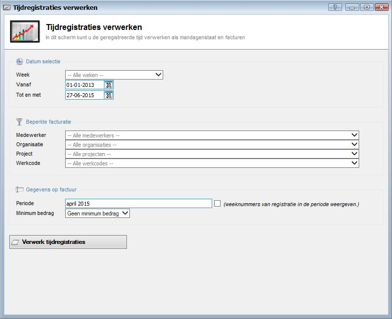
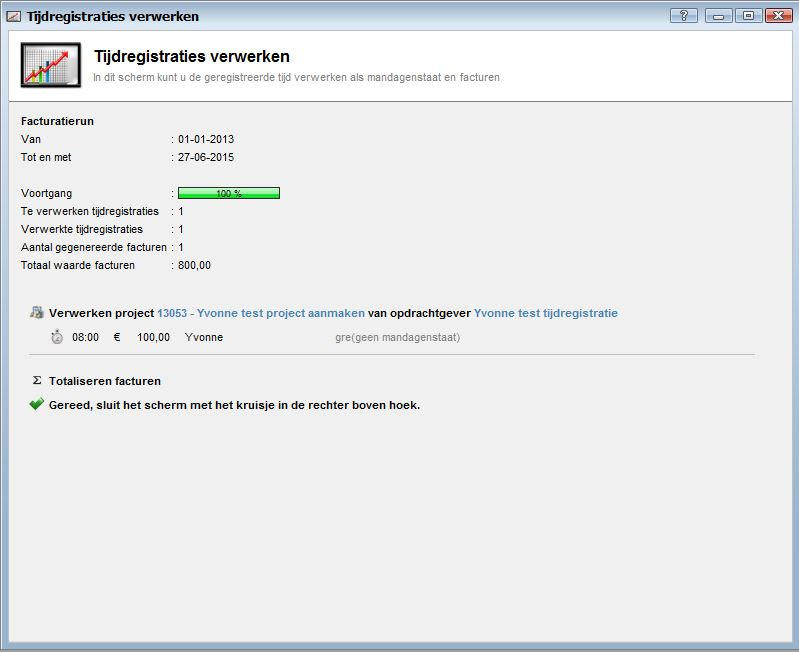

<properties>
	<page>
		<title>Tijdregistratie verwerken</title>
		<description>Tijdregistratie verwerken</description>
	</page>
	<menu>
		<position>Handleiding / Modules / P - Z / Tijdregistratie</position>
		<title>Tijdregistratie verwerken</title>
	</menu>
</properties>

Terug naar [Tijdregistratie](http://hybridsaas.support/pages/handleiding/modules/P-Z/tijdregistratie/tijdregistratie)

#Tijdregistratie verwerken#

*Datum selectie*

- Week
- Vanaf
- Tot en met

*Beperkte facturatie*

- Medewerker
- Organisatie
- Project
- Werkcode

*Gegevens op factuur*

- Periode
- Minimum bedrag

*Verwerk tijdregistratie*

als je alles heb ingevuld en gekozen kan je op verwerk tijdregistratie klikken dan krijg je het volgende scherm en is je tijdregistratie voltooid

Terug naar [Tijdregistratie](http://hybridsaas.support/pages/handleiding/modules/P-Z/tijdregistratie/tijdregistratie)