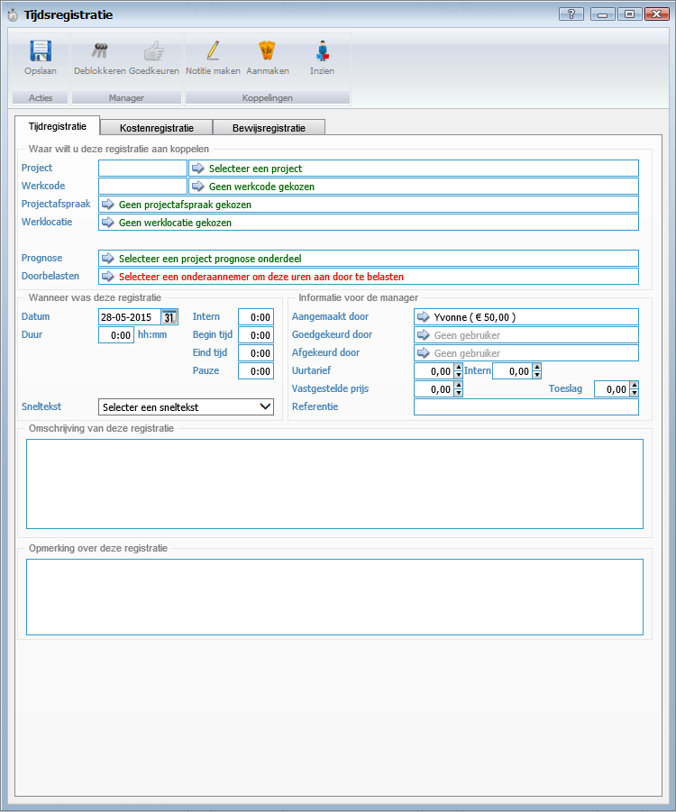
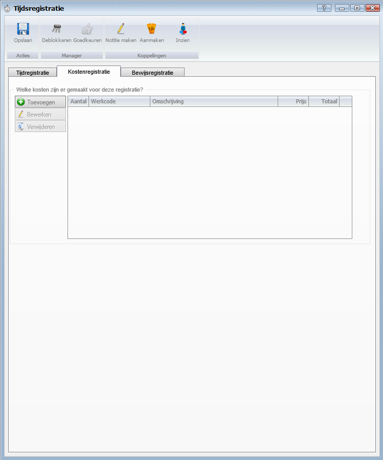
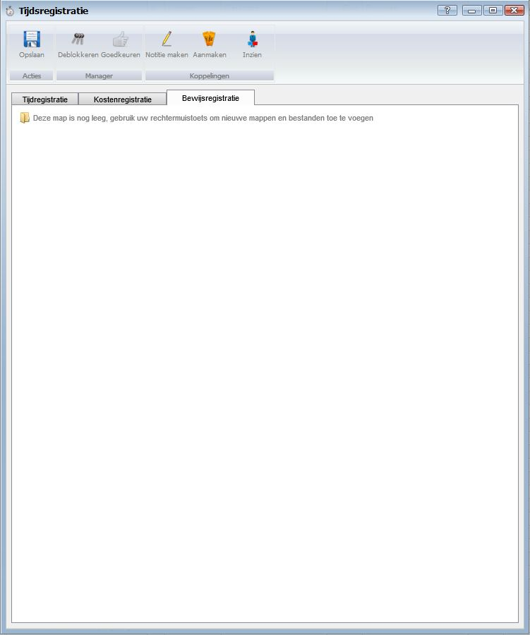

<properties>
	<page>
		<title>Tijdregistratie</title>
		<description>Tijdregistratie</description>
	</page>
	<menu>
		<position>Handleiding / Modules / P - Z / Tijdregistratie</position>
		<title>Invoerscherm tijdregistratie</title>
		<sort>B</sort>
	</menu>
</properties>

Terug naar [Tijdregistratie](http://hybridsaas.support/pages/handleiding/modules/P-Z/tijdregistratie/tijdregistratie)

#Invoerscherm tijdregistratie#
**Tabblad Tijdregistratie**

*Waar wilt u deze registratie aan koppelen*

- Project
- Werkcode
- Projectafspraak
- Werklocatie
- Prognose
- Doorbelasten

*Wanneer was deze registratie*

- Datum
- Duur
- Intern
- Begin tijd
- Eind tijd
- Pauze
- Sneltekst

*Informatie voor de manager*

- Aangemaakt door
- Goedgekeurd door
- Afgekeurd door
- Uurtarief
- Vast gestelde prijs
- Referentie

*Omschrijving van deze registratie*

*Opmerking over deze registratie*

**Tabblad Kostenregistratie**

*Welke kosten zijn er gemaakt voor deze registratie?*

**Tabblad Bewijsregistratie**

Terug naar [Tijdregistratie](http://hybridsaas.support/pages/handleiding/modules/P-Z/tijdregistratie/tijdregistratie)