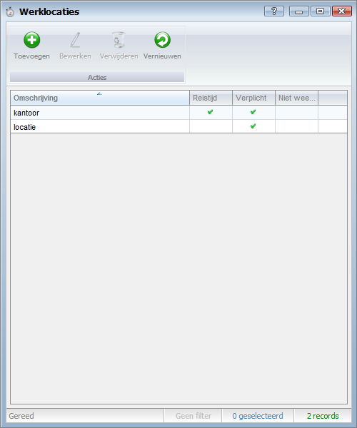
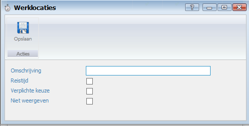

<properties>
	<page>
		<title>Werklocatie</title>
		<description>Werklocatie</description>
		<context>time-registration-location*</context>
	</page>
	<menu>
		<position>Handleiding / Modules / P - Z / Tijdregistratie</position>
		<title>Werklocatie</title>
	</menu>
</properties>

Terug naar {[Tijdregistratie](http://hybridsaas.support/pages/handleiding/modules/P-Z/tijdregistratie/tijdregistratie)}

#Een werklocatie aanmaken#

**Werklocaties**

 
- Omschrijving
- Reistijd
- Verplichte keuze
- Niet weergeven

Terug naar {[Tijdregistratie](http://hybridsaas.support/pages/handleiding/modules/P-Z/tijdregistratie/tijdregistratie)}