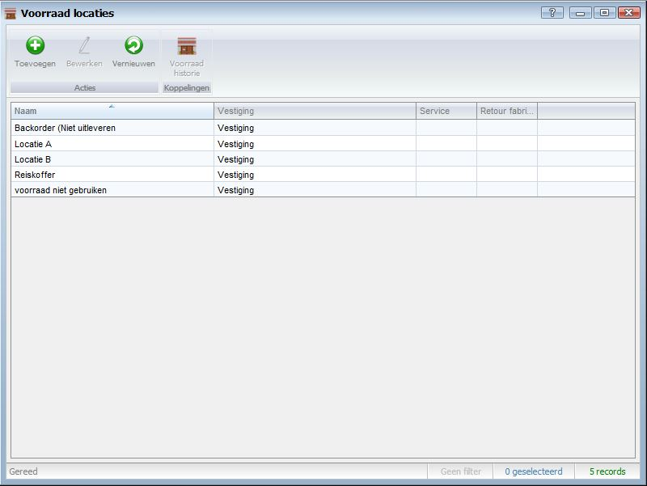

<properties>
	<page>
		<title>Voorraad locaties</title>
		<description>Voorraad locaties</description>
		<context>stock-locations*</context>
	</page>
	<menu>
		<position>Handleiding / Modules / P - Z / Voorraad</position> 
		<title>Voorraad locatie aanmaken</title>
	</menu>
</properties>

Terug naar een [offerte/orde aanmaken](http://hybridsaas.support/pages/handleiding/modules/F-O/offerte-en-orders/een-offerte-of-order-aanmaken)

#Voorraad locaties aanmaken#

Terug naar een [offerte/orde aanmaken](http://hybridsaas.support/pages/handleiding/modules/F-O/offerte-en-orders/een-offerte-of-order-aanmaken)

