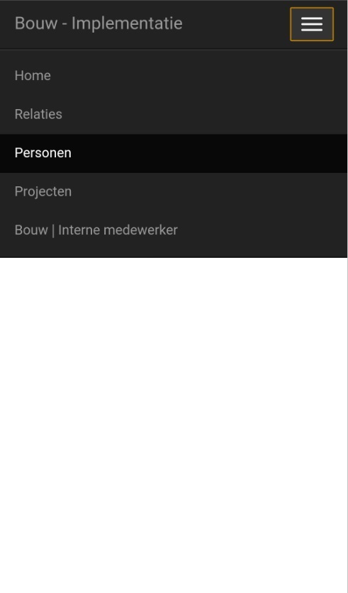

<properties>
	<page>
		<title>Vragenlijst invoeren</title>
	</page>
	<menu>
		<position>Handleiding / Modules / P - Z / Vragenlijst</position> 
		<title>Vragenlijst invoeren</title>
	</menu>
</properties>

#Vragenlijsten#
<description>Je kan op verschillende manieren een vragenlijst invoeren.</description>

#Vragenlijst invoeren op je mobiel#

Door de knop met de 3 lijntjes te gebruiken krijg je onderstaand scherm. 

 
.

      