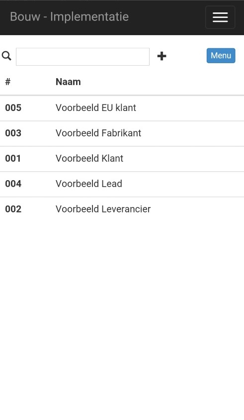
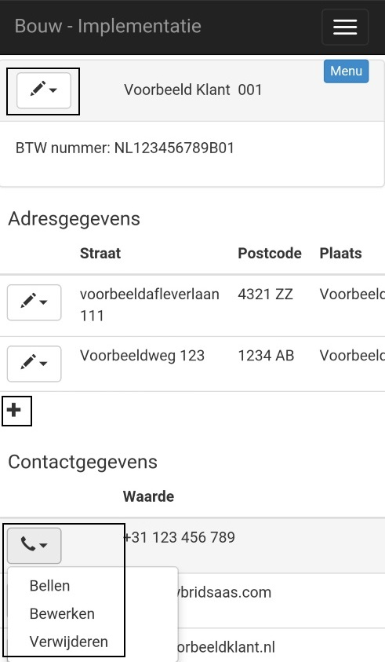

<properties>
	<page>
		<title>Vragenlijst invoeren</title>
	</page>
	<menu>
		<position>Handleiding / Modules / P - Z / Vragenlijst</position> 
		<title>Vragenlijst invoeren</title>
	<sort>B</sort>
	</menu>
</properties>

#Vragenlijst invoeren op je mobiel#

<description>Je kan op verschillende manieren een vragenlijst invoeren. een van de manieren is om dit op je mobile telefoon te doen. ga dan naar een browser en voor onderstaande URL in **https://{bedrijfsnaam}.hybridsaas.com/extranet/login/login.asp** . (sla deze als favoriet (bladwijzer) op). </description>
Voer de ontvangen gebruikersnaam en bijbehorende wachtwoord in en druk op de knop Inloggen.  

*Inlogscherm

*Hoofdscherm*

Dan kom je in het hoofdscherm. Door middel van de knop   krijg je de verschillende mogelijkheden te zien. Dit is afhankelijk van de rechten. De rechten zijn :

- Relaties
- Personen
- Projecten

Hier kan je relaties, personen en projecten bekijken, toevoegen, aanpassen en verwijderen. 
Klik op relaties om de relaties te bekijken.

 

Er volgt dan een scherm met alle relaties gesorteerd op Naam. Met het menu knopje kan je nog een extra filter gebruiken. Je kan dan kiezen uit alles en alleen klanten. "Alles" geeft ook de fabrikanten en leveranciers weer.
Door op een klant te klikken kom je in de gegevens van deze klant.
 

Je hebt 3 categorien.

- relatiegegevens
- adres gegevens
- contactgegevens

**Relatiegegevens:**
 
je kan door middel van de   knop deze gegevens bewerken of verwijderen. Je kan de bedrijfsnaam, het btw-nummer wijzigen en je kan een opmerking toevoegen.

**Adresgegevens**

Bij adres gegevens kan je door middel van de  knop ook de adres bewerken of verwijderen. Je kan de straatnaam, het nummer, de postcode, de plaats en het land wijzigen en je kan een omschrijving toevoegen. Verder kan je met "Tonen" via Maps zien waar dit adres zich bevindt.

Met de  knop kan je een nieuw adres toevoegen

**Contactgegevens**

Bij contact gegevens kan je door middel van de  knop een contact bewerken of verwijderen. Je kan een telefoon, mobiel, emial, fax, website, IM of socialmedia wijzigen en je kan een opmerking toevoegen. Verder kan je afhankelijk van het contact direct bellen, mail, de website bezoeken, etc.
   
Ook hier kann je met de  knop kan je een nieuw contact toevoegenadres toevoegen