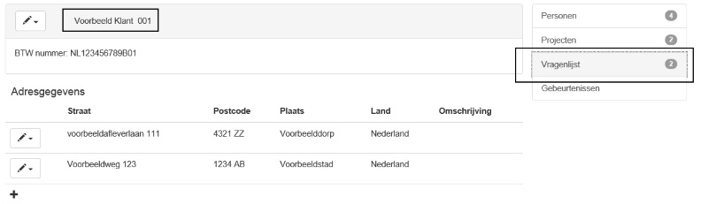

<properties>
	<page>
		<title>Vragenlijst</title>
	</page>
	<menu>
		<position>Handleiding / Modules / P - Z / Vragenlijst</position> 
		<title>Vragenlijst Extranet-1</title>
	<sort>B</sort>
	</menu>
</properties>

#Vragenlijst extranet#
<description>Het invullen van een vragen lijst kan door iedere gebruiker gedaan worden via het extranet. Het extranet is een module die het mogelijk maakt om op mobiele devices informatie te halen of in te voeren.
</description>

#Hoe log ik in op extranet#

Maak een gebruiker aan die alleen via extranet kan inloggen. Geef deze gebruiker de juiste rechten. dit doe je door middel van een beveiligingsgroep aan te maken en deze aan de gebruiker te koppelen.

**Aanmaken gebruiker**

Ga naar [gebruiker-aanmaken-wijzigen](http://hybridsaas.support/pages/handleiding/extra/gebruiker-aanmaken-wijzigen)

Voor een gebruiker die alleen via het extranet vragenlijsten gaat invoeren is onderstaande inrichting voldoende
Het vinkje "Gebruiker mag niet inloggen op Hybrid SaaS" moet aan staan. Hiermee geef je aan dat dit alleen een extranet gebruiker is. (De kosten zijn hierdoor ook lager).

- Inlognaam: dit is je gebruikersnaam voor het inloggen
- Weergave naam: zo wordt je in de applicatie weergegeven
- Functie: niet verplicht
- E-mail adres: vul hier je email adres in
 
  

**Rechten**

Voor de individuele rechten ga je bij de gebruikerskaart naar het tabblad "Rechten" 

  

Het scherm bestaat uit een bepaald aantal onderdelen. Je kan deze gebruiker aan een beveiligingsgroep koppelen (Beveiligingsgroep moet wel bestaan)
Je kan op zoek gaan naar een bepaald recht door een stuk van de tekst in te voeren in het veld "Zoeken in rechten" en dan op ENTER te drukken. Je krijgt dan alle rechten te zien die aan deze tekst voldoen ongeacht in welke module deze zitten.
Voorbeeld : zoeken op het woord "bewerken" heeft als resultaat 
  
  

Verder kan je ook per module zoeken en dan de rechten aan- of uitvinken. Klik dan op de module aan de linkerkant. Alle mogelijke rechten binnen deze module worden dan zichtbaar.
Voorbeeld module Extranet. Met de scrollbar kan je alle rechten zien.

  

Er zijn 4 soorten rechten die je terug ziet en of kan zetten. Standaard zullen alle rechten op "Geen recht beveiligingsgroep" staan.

  

- Recht beveiligingsgroep
	- dit is een recht dat aanstaat, indien je een beveiligingsgroep hebt gekozen. 
- Geen recht beveiligingsgroep
	- dit is een recht dat uitstaat, indien je een beveiligingsgroep hebt gekozen.
- Recht gebruiker
	- dit is een recht dat je aan kan zetten indien je geen beveiligingsgroep hebt gekozen, ook kan je hiermee het recht van de beveiligingsgroep overrulen. Dit kan voorkomen als bijvoorbeeld één persoon binnen een bepaalde beveiligingsgroep iets **extra's** moet kunnen.  
- Geen recht gebruiker 
	- dit is een recht dat je uit kan zetten indien je geen beveiligingsgroep hebt gekozen, ook kan je hiermee het recht van de beveiligingsgroep overrulen. Dit kan voorkomen als bijvoorbeeld één persoon binnen een bepaalde beveiligingsgroep iets **NIET** mag.  

**Extranet**

Wat krijg je te zien als je via het extranet inlogt, dit is afhankelijk van de keuzes die zijn gemaakt bij het inrichten van de vragenlijst. Daar kan je namelijk 4 plaatsen aangeven waar je de vragenlijst te zien krijgt.
Afhankelijk van deze keuzes worden rechten toebedeeld.

  

**Bedrijven**

    