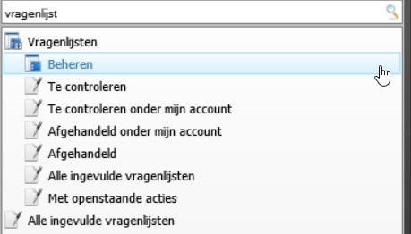

<properties>
	<page>
		<title>Vragenlijst</title>
	</page>
	<menu>
		<position>Handleiding / Modules / P - Z / Vragenlijst</position> 
		<title>Vragenlijst Extranet</title>
	<sort>B</sort>
	</menu>
</properties>

#Vragenlijst extranet#
<description>Het invullen van een vragen lijst kan door iedere gebruiker gedaan worden via het extranet. Het extranet is een module die het mogelijk maakt om op mobiele devices informatie te halen of in te voeren.
</description>

#Hoe log ik in op extranet#

Maak een gebruiker aan die alleen via extranet kan inloggen. Geef deze gebruiker de juiste rechten. dit doe je door middel van een beveiligingsgroep aan te maken en deze aan de gebruiker te koppelen.

Aanmaken gebruiker

Ga naar [gebruiker-aanmaken-wijzigen](http://hybridsaas.support/pages/handleiding/extra/gebruiker-aanmaken-wijzigen)

  
 

