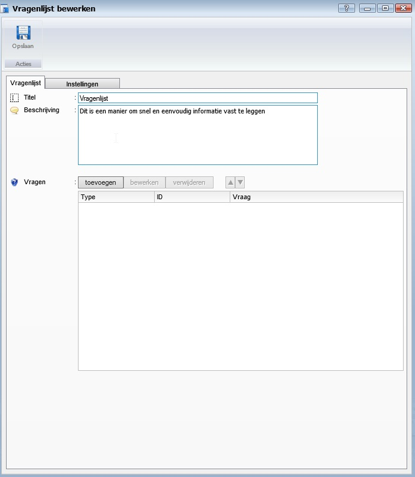

<properties>
	<page>
		<title>Vragenlijsten</title>
	</page>
	<menu>
		<position>Handleiding / Modules / P - Z / Vragenlijst</position> 
		<title>Vragenlijst</title>
	<sort>B</sort>
	</menu>
</properties>

Terug naar {[Vragenlijst](http://hybridsaas.support/pages/handleiding/modules/P-Z/Vragenlijst)}

#Vragenlijsten#
<description>Informatie is misschien wel het belangrijkste onderdeel binnen elke organisatie. Maar hoe zorgt u ervoor dat u de juiste informatie krijgt, zonder dat er een hele papierstroom aan vooraf gaat.
Met de Online Enquête en vragenlijsten van Hybrid SaaS kunt u klanttevredenheidsonderzoeken uitvoeren, gestandaardiseerde (voor) opnamelijsten en nog veel meer. U heeft de volledige vrijheid om zelf vragen op te stellen en deze te laten beantwoorden door middel van muliplechoice of open antwoorden.
</description>

# Vragenlijst #
De tabbladen en functies van het invoervenster Product aanmaken word in dit artikel behandeld.

**Tabblad Informatie**
 
