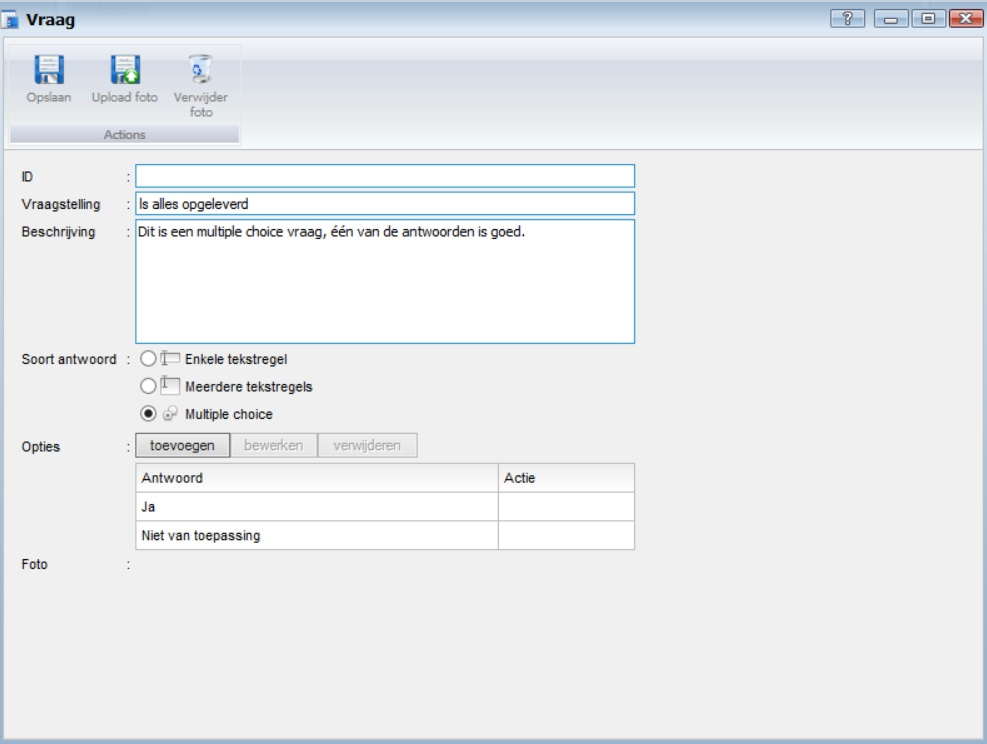

<properties>
	<page>
		<title>Vragenlijst</title>
	</page>
	<menu>
		<position>Handleiding / Modules / P - Z / Vragenlijst</position> 
		<title>Vragenlijst</title>
	<sort>B</sort>
	</menu>
</properties>

Terug naar {[Vragenlijst](http://hybridsaas.support/pages/handleiding/modules/P-Z/Vragenlijst)}

#Vragenlijsten#
<description>Informatie is misschien wel het belangrijkste onderdeel binnen elke organisatie. Maar hoe zorgt u ervoor dat u de juiste informatie krijgt, zonder dat er een hele papierstroom aan vooraf gaat.
Met de Online Enquête en vragenlijsten van Hybrid SaaS kunt u klanttevredenheidsonderzoeken uitvoeren, gestandaardiseerde (voor) opnamelijsten en nog veel meer. U heeft de volledige vrijheid om zelf vragen op te stellen en deze te laten beantwoorden door middel van muliplechoice of open antwoorden.
</description>

#Beheren vragenlijst#

Voordat je een vragenlijst kan aanbieden moet deze samengesteld worden. Dit doe je door naar het menu Beheren te gaan onder Vragenlijsten. 

 

Door middel van de knop Toevoegen kan je een nieuwe vragenlijst maken. 

 

De vragenlijst bestaat uit een titel, dit is de naam die verder in de applicatie (backoffice en extranet) wordt gebruikt. Je kan een beschrijving invoeren, dit is een korte uitleg wat bijvoorbeeld de bedoeling is van deze vragenlijst, wie deze gaat gebruiken, hoe vaak deze wordt gebruikt, etc.
En verder worden er een aantal vragen toegevoegd.  

Dit doe je met de knop toevoegen. Als je in een bestaande vragenlijst aan het werken bent, kan je hier ook vragen bewerken en/of verwijderen.

Er zijn 3 soorten vragen 

- Enkele tekstregel
- Meerdere tekstregels
- Multiple choice

**Enkele tekstregel**

 

**Meerdere tekstregels**

 

**Multiple choice**

 

Voordat je de vragenlijst kan opslaan is er ook nog een tabblad "Instellingen" Hierop geef je aan waar de vragenlijst wordt weergegeven en je bent verplicht om een document layout en een email layout te selecteren.

Hieronder het resultaat van bovenstaande vragenlijst
 

**Extra actie**

Je kan bij de multiple choice vragen ook extra vragen toevoegen als een bepaald antwoord wordt gegeven.
Maak dan eerste de extra vragen aan en groepeer deze door er een ID aan te geven. Dit kan een willekeurige naam zijn. In het voorbeeld is dit "extra"

Door bij de antwoord opties een actie toe te voegen, zullen de extra vragen in de vragenlijst wel mof niet worden getoond. 

- SHOW "ID"
	- vragen met hetzelfde ID worden nu zichtbaar als deze optie gekozen wordt
- HIDE "ID" 
	- vragen met hetzelfde ID worden nu verborgen als deze optie gekozen wordt

De extra vragen die je maakt kunnnen weer van de 3 verschillende types zijn,   

 

**Resultaat:** Als er voor de optie "Ja" wordt gekozen dan worden de 3 extra vragen zichtbaar. Deze kunnen dan extra beantwoord worden.

**Resultaat:** Als er voor de optie "NVT" wordt gekozen dan komen er geen extra vragen bij, deze zijn dan ook niet relevant.  

        