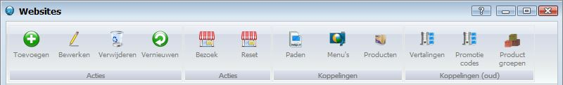

<properties>
	<page>
		<title>Website</title>
		<description>Website</description>
		<context>website</context>
	</page>
	<menu>
		<position>Handleiding / Webshop</position>
		<title>Introductie</title>
		<sort>A</sort>
	</menu>
</properties>

# Website #

#Buttonbalk#

*Acties*

- Toevoegen
- Bewerken
- Verwijderen
- Vernieuwen

*Acties*

- Bezoek
- Reset

*Koppelingen*

- Paden
- Menu's
- Producten

*Koppelingen oud*

- Vertalingen
- Promotie codes
- Product groepen

> **Koppelingen die betrekking hebben op 'Website':**

----------
Volgorde om een website op te bouwen

<[Website](http://hybridsaas.support/pages/handleiding/modules/P-Z/website/Website)>
<[URL](http://hybridsaas.support/pages/handleiding/modules/P-Z/website/URL)>
<[Content/Templates](http://hybridsaas.support/pages/handleiding/modules/P-Z/website/content)>
<[Menu paden](http://hybridsaas.support/pages/handleiding/modules/P-Z/website/menupaden)>
<[Website menu](http://hybridsaas.support/pages/handleiding/modules/P-Z/website/Website-menu)>
<[Producten zichtbaar](http://hybridsaas.support/pages/handleiding/modules/P-Z/website/Product%20zichtbaar)>

----------
<[Dns instellen](http://hybridsaas.support/pages/handleiding/modules/P-Z/website/koppelen-domein-aan-hybridsaas)>

----------
