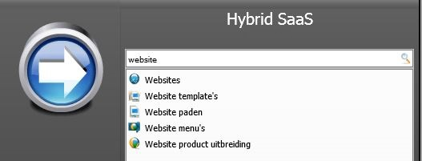

<properties>
	<page>
		<title>Website</title>
		<description>Website</description>
		<context>website</context>
	</page>
	<menu>
		<position>Handleiding / Webshop</position>
		<title>Introductie</title>
		<sort>A</sort>
	</menu>
</properties>
#Website#
#Start#

#Websites#

**Acties**

- Toevoegen
- Bewerken
- Verwijderen
- Vernieuwen

**Acties**

- Bezoek
	- Door hier op te klikken kan je de website bezoeken
- Reset
	- Sommige aanpassingen zullen niet direct aangepast worden, hiervoor kan je de reset knop gebruiken

**Koppelingen**

- Paden
	- Hiermee ga je naar de [menupaden](http://hybridsaas.support/pages/handleiding/modules/P-Z/website/menupaden)
- Menu's
	- Hiermee ga je naar de [menu's](http://hybridsaas.support/pages/handleiding/modules/P-Z/website/Website-menu)
- Producten
	- Hiermee ga je naar de [producten](http://hybridsaas.support/pages/handleiding/modules/P-Z/producten/Introductie)

**Koppelingen oud**

- Vertalingen
- Promotie codes
- Product groepen

#De website leeg#

----------

**Hier volgt het stappenplan om een website op te bouwen:**

#Stap 1#
Om te beginnen moet je eerst je 
[Dns instellen](http://hybridsaas.support/pages/handleiding/modules/P-Z/website/koppelen-domein-aan-hybridsaas)
#Stap 2#
Nu kan je een [Website](http://hybridsaas.support/pages/handleiding/modules/P-Z/website/Website) aanmaken
#Stap 3#
Tijdens het invullen van de website word er gevraagd om de [URL](http://hybridsaas.support/pages/handleiding/modules/P-Z/website/URL) aan te maken
#Stap 4#
Tijdens het invullen van de url word er gevraagd om de [Content](http://hybridsaas.support/pages/handleiding/modules/P-Z/website/content) aan te maken
#Stap 5#
Tijdens het invullen van de url word er ook gevraagd om [Menu paden](http://hybridsaas.support/pages/handleiding/modules/P-Z/website/menupaden) van de betaling of fout pagina's aan te maken deze menu paden gebruik je ook voor je producten elke groep producten krijgt een eigen menupad 
#Stap 5#
Tijdens het invullen van het menupad word er gevraagd om een [Templates](http://hybridsaas.support/pages/handleiding/modules/P-Z/website/content) aan te maken deze kan je op standaard houden
#Stap 6#
Nu kan je [Website menu](http://hybridsaas.support/pages/handleiding/modules/P-Z/website/Website-menu) aanmaken.
Hierbij heb je altijd een aantal standaard menu's deze geven de plek aan waar het moet komen, deze worden uitgelegd in de pagina van de website menu's
#Stap 7#
De volgende stap is de [Producten](http://hybridsaas.support/pages/handleiding/modules/P-Z/Producten-website-gewoon/Product) invullen, de stappen die nodig zijn worden in het rood aangegeven deze zijn specifiek voor de website. op de pagina van de producten komen er nog 2 stappen: [Prijsmodel](http://hybridsaas.support/pages/handleiding/modules/P-Z/Producten-website-gewoon/Producten-prijsmodel) & [Product CMS](http://hybridsaas.support/pages/handleiding/modules/P-Z/Producten-website-gewoon/Product-cms)

