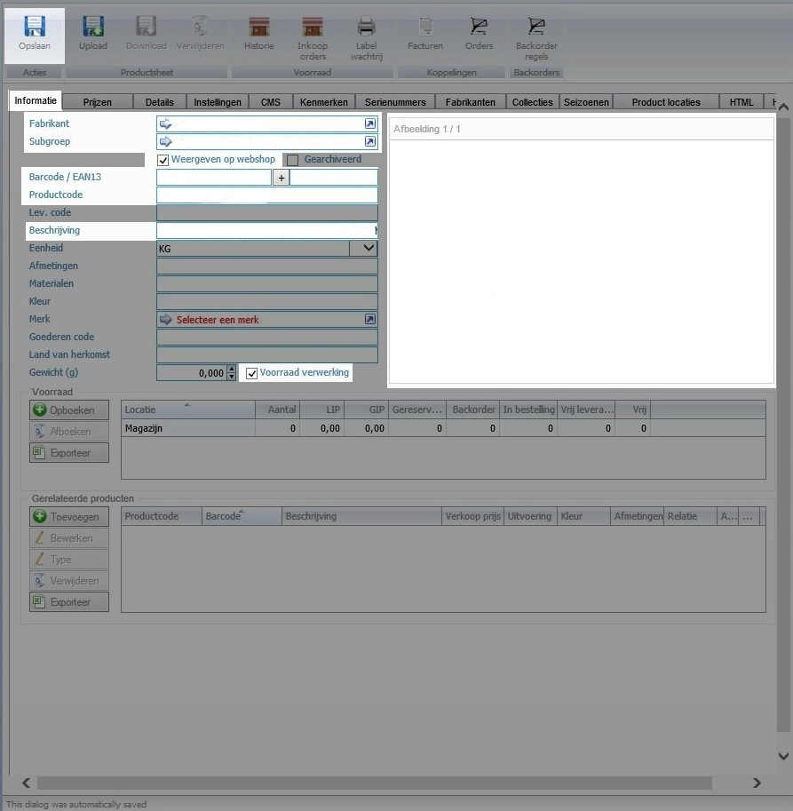
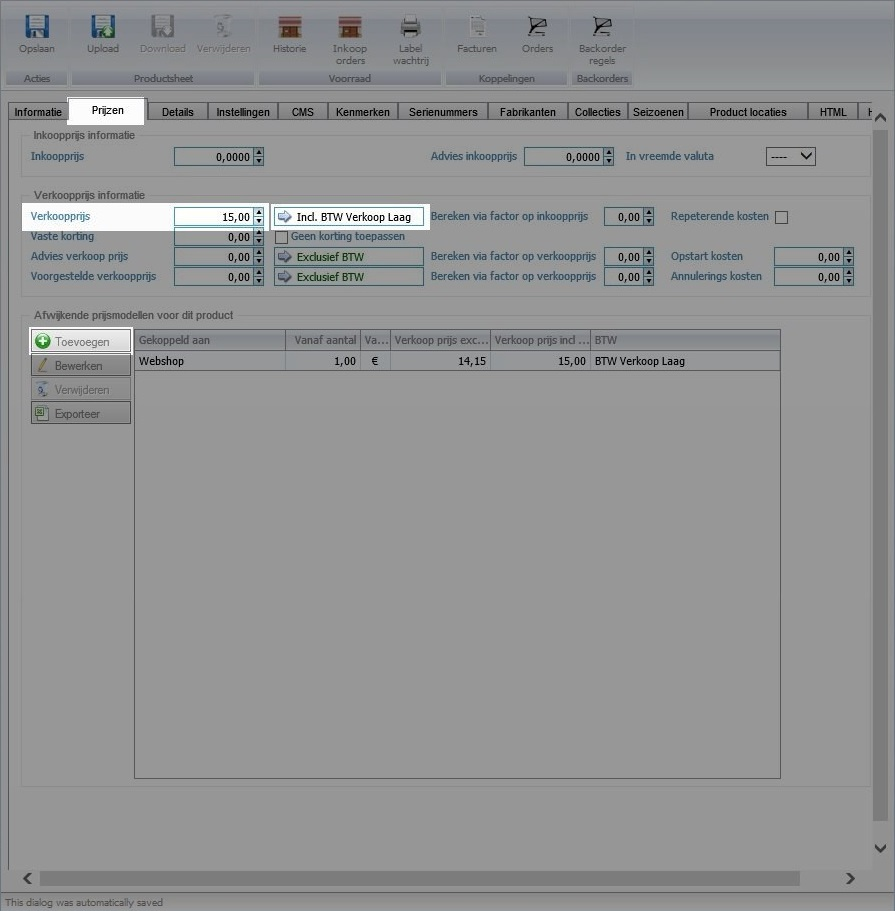
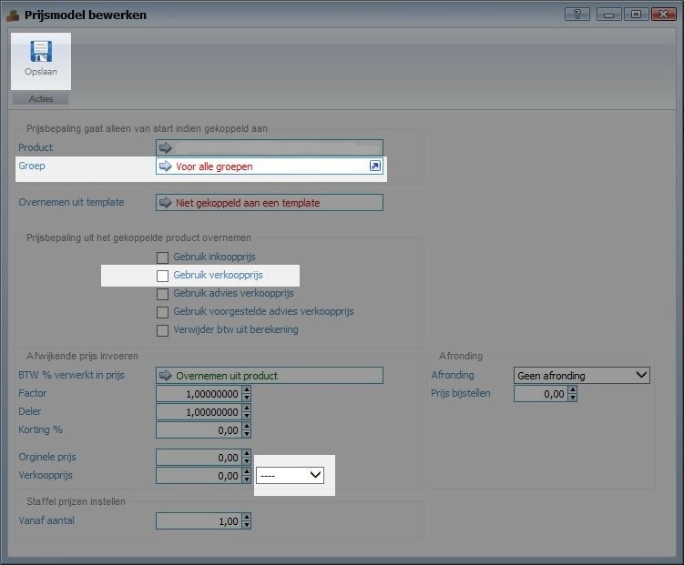
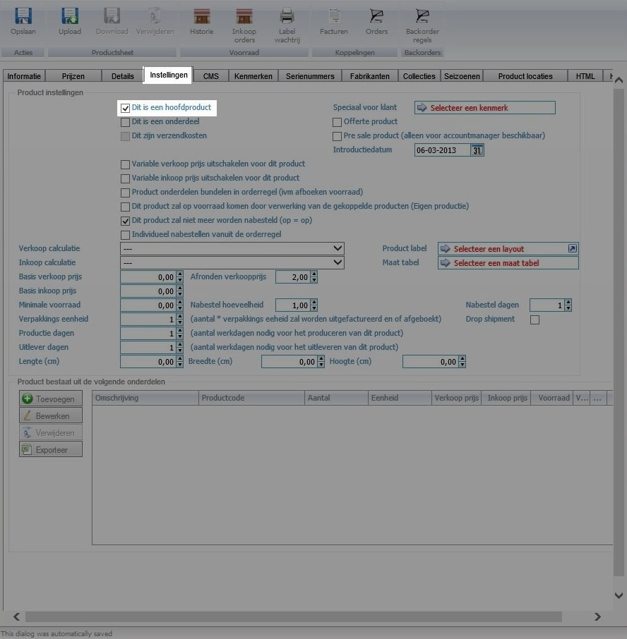
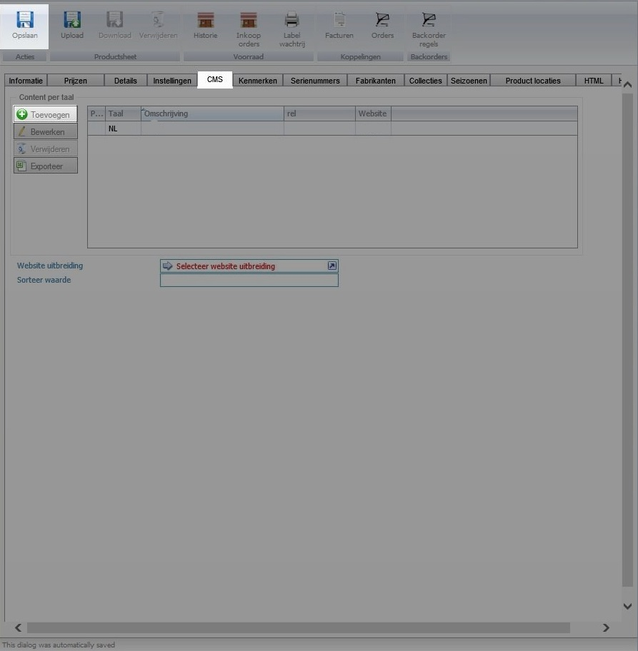
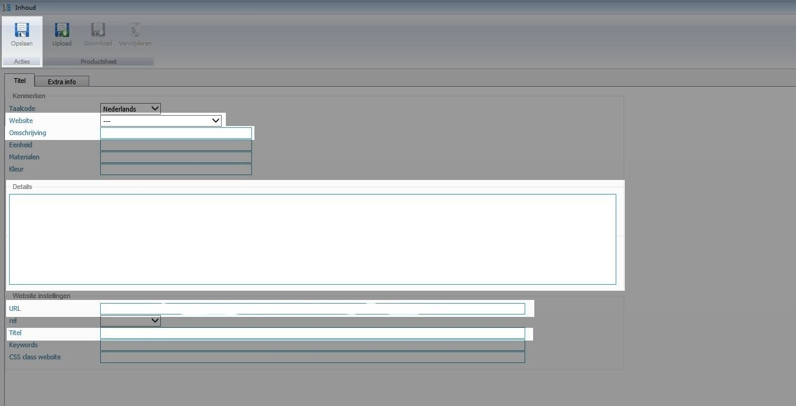

<properties>
	<page>
		<title>Product-zichtbaar</title>
		<description>Product-zichtbaar</description>
	</page>
	<menu>
		<position>Handleiding / Webshop</position>
		<title>Product zichtbaar</title>
		<sort>d</sort>
	</menu>
</properties>

Ga terug <[Website](http://hybridsaas.support/pages/handleiding/modules/P-Z/website/Introductie)>

----------

#Product zichtbaar#
Om je producten zichtbaar te laten worden op de website zijn een aantal gegevens van toepassing als 1 van deze gegevens niet ingevuld zijn zal niet worden weergegeven.

**Tabblad Informatie**

- Fabrikant
  - Hier kan je de Fabrikant opzoeken
- Subgroep
  - Hier kan je de Subgroep opzoeken
- Weergeven op webshop
  - Hiermee geef je aan dat je hem wilt weergeven op de webshop
- Barcode/EAN13
  - Hier kan je de bar en EAN13 code invullen van het product
- Productcode
  - Hier kan je het product een productcode geven deze vind je op meerdere plekken weer terug en hier kan je ook op zoeken het makkelijkste voor dit zou zijn zo kort en duidelijk mogelijk
- Beschrijving
  - Hier kan je een beschrijving geven over je product deze tekst kan je ook invullen bij je cms dan is het ook op de site zichtbaar
- Voorraad verwerking
  - Als je een voorraad verwerking bij wilt houden dien je dit vinkje aan te zetten
- Afbeelding
  - Hier kan je 1 of meerdere afbeeldingen toevoegen door middel van je rechter muisknop

**Tabblad Prijzen**

- Verkoopprijs
  - Hier kan je de verkoopprijs van het product invullen
- BTW
  - Hier kan je de BTW percentage aangeven
- Toevoegen
  - Door op deze knop te klikken kom je in het volgende scherm terecht

**Tabblad Prijzen toevoegen**

- Groep
  - Hier kan je de groep opzoeken waar de prijs aan gekoppeld moet worden dit is over het algemeen 'Webshop' of 'Webwinkel' of wat hier mee overeen komt
- Gebruik verkoopprijs
  - Hier moet je het vinkje aanzetten dan neemt die de verkoopprijs over die je heb ingevuld bij tabblad Prijzen-Verkoopprijs
- Pijltje EUR
  - Dit pijltje kan je openen en hier moet dan EUR komen te staan

**Tabblad Instellingen**

- Dit is een hoofdproduct
  - Hiermee geef je aan dat het een hoofdproduct is en zichtbaar zal moeten zijn
- Dit is een onderdeel
  - Je kan hier als je meerdere producten met elkaar gekoppeld heb aangeven dat dit een onderdeel van een ander artikel is
 
**Tabblad CMS**

- Toevoegen
  - Door op deze knop te klikken kom je in het volgende scherm terecht
 

**Tabblad CMS toevoegen**

- Website
  - Hier kan je de website opzoeken op welke die zichtbaar moet worden
- Omschrijving
  - Deze kan je gelijk houden aan je Productcode van tabblad Informatie-Productcode
- Details
  - Deze kan je gelijk houden aan je beschrijven van tabblad Informatie-beschrijving
- URL
  - hier kan je url voor je Google balk invullen

 Let hier wel bij op dat je geen hoofdletters , . / of spaties gebruikt als je meerdere woorden invuld kies dan voor - Voorbeeld fout: Test/Omgeving Voorbeeld goed: test-omgeving

- Titel
  - Deze kan je gelijk houden aan Omschrijving

----------

Ga terug <[Website](http://hybridsaas.support/pages/handleiding/modules/P-Z/website/Introductie)>