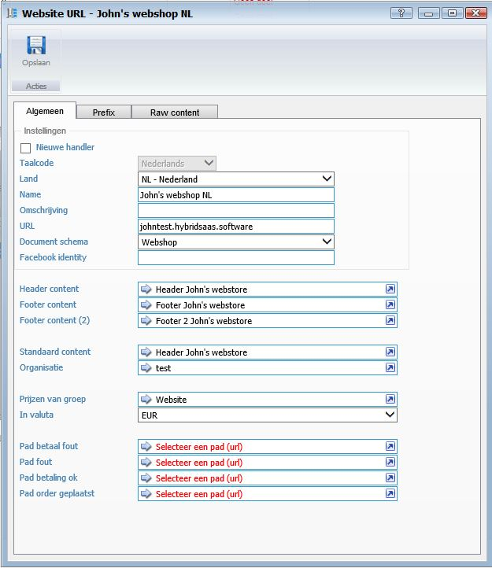
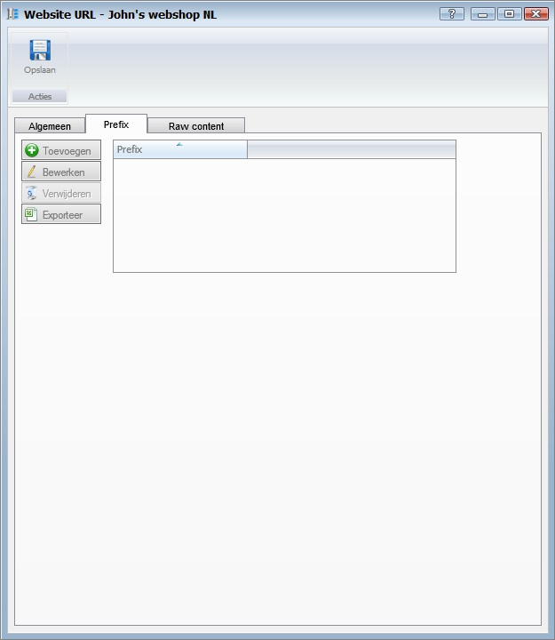

<properties>
	<page>
		<title>Website URL</title>
		<description>Website URL</description>
		<context>dlgwebsite-url*</context>
	</page>
	<menu>
		<position>Handleiding / Webshop</position>
		<title>URL</title>
		<sort>ba</sort>
	</menu>
</properties>

Ga terug <[Website](http://hybridsaas.support/pages/handleiding/modules/P-Z/website/Introductie)>

----------

#URL Toevoegen#

**Tabblad Algemeen**

- Nieuwe handler
- Taalcode
	- Hier word de taalcode ingevuld
- Land
	- Hier vul je het land in
- Name
	- Hier kan je de naam van je website invullen
- Omschrijving
	- Hier kan je een omschrijving invullen
- URL
	- Hier vul je de URL in
- Document schema
	- Hier kan je een document schema aanhangen welke gebruikt moet worden voor de website
- Facebook identity
- Header content
	- Hier kan je een header content toevoegen zie ook [content](http://hybridsaas.support/pages/handleiding/modules/P-Z/website/content)
- Footer content
- Footer content 2
- Standaard content
- Organisatie
- Prijzen van groep
- In valuta
- Pad betaal fout
	- Hier kan je een pad van betaalfout toevoegen zie ook [menu paden](http://hybridsaas.support/pages/handleiding/modules/P-Z/website/menupaden)
- Pad fout
	- Hier kan je een pad van fout toevoegen zie ook [menu paden](http://hybridsaas.support/pages/handleiding/modules/P-Z/website/menupaden)
- Pad betaling ok
	- Hier kan je een pad van betaling ok toevoegen zie ook [menu paden](http://hybridsaas.support/pages/handleiding/modules/P-Z/website/menupaden)
- Pad order geplaatst
	- Hier kan je een pad van order geplaatst toevoegen zie ook [menu paden](http://hybridsaas.support/pages/handleiding/modules/P-Z/website/menupaden)

**Tabblad Prefix**

- Toevoegen
	- Om toe te voegen klikt u op de button Toevoegen.
- Bewerken
	- Om te bewerken selecteert u een regel en klikt op de button Bewerken.
- Verwijderen
	- Om te verwijderen selecteert u een regel en klikt op de button Verwijderen.
- Exporteren

**Tabblad Raw content**

- Raw content head
- Raw content body

----------

Zie ook <[Content](http://hybridsaas.support/pages/handleiding/modules/P-Z/website/content)>
<[Menu paden](http://hybridsaas.support/pages/handleiding/modules/P-Z/website/menupaden)>

----------

Ga terug <[Introductie](http://hybridsaas.support/pages/handleiding/modules/P-Z/website/Introductie)> 
<[Website](http://hybridsaas.support/pages/handleiding/modules/P-Z/website/Website)>