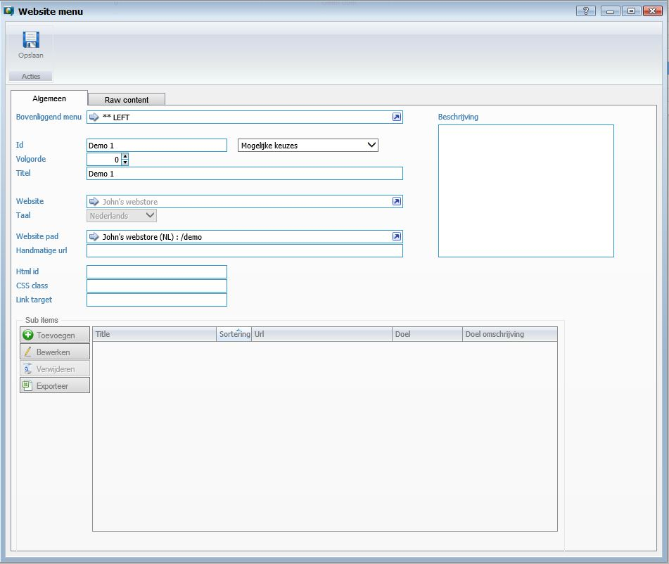
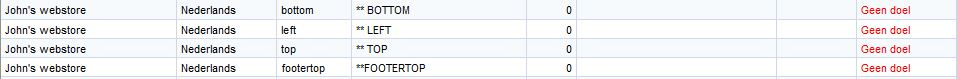
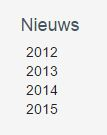
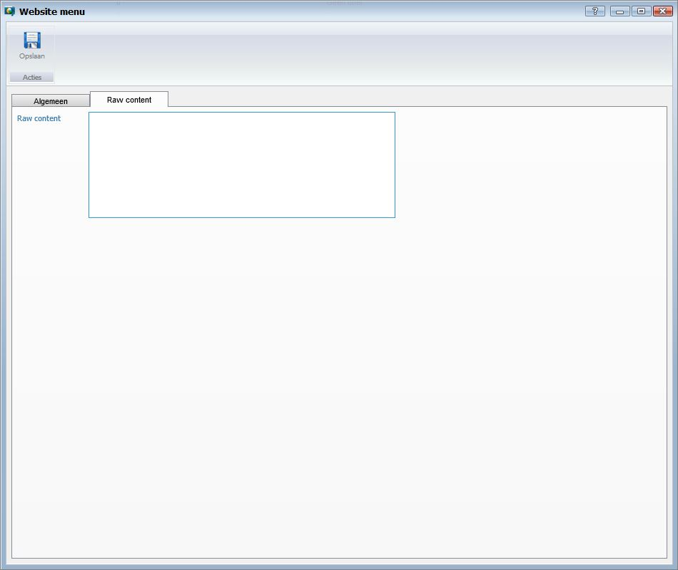

<properties>
	<page>
		<title>Website menu</title>
		<description>Website menu</description>
	</page>
	<menu>
		<position>Handleiding / Webshop</position>
		<title>Website menu</title>
		<sort>bd</sort>
	</menu>
</properties>

Ga terug <[Website](http://hybridsaas.support/pages/handleiding/modules/P-Z/website/website)>

----------

#Website menu#
Zoek in start naar menu

Om een menu aan te maken klik op Toevoegen

**Tabblad Algemeen**

- Bovenliggend menu
	- Hier kan je een menu kiezen waar van je wilt waar het moet komen keuze hieruit zijn:
		-  deze dien je dan ook aan te maken

De id moet gelijk zijn aan: bottom - left - top - footertop, alle met kleine letters dit is voorgeprogrammeerd voor waar het moet komen op de site 

- 		Het kan ook zijn dat je hem onder een andere pagina wilt, dit is ook mogelijk voorbeeld: 
- 		

- Id
	- Hier vul je de id in
- Volgorde
	- Hiermee kan je een volgorde bepalen (in top en bottom van link naar recht en in left van boven naar beneden)
- Titel
	- Hier geef je de titel van het menu aan (deze is zichtbaar op de site)
- Website
	- Hier geef je aan voor welke website het menu bedoeld is
- Taal
	- hier geef je de taalcode aan
- Website pad
	- Hier geef je aan naar welke website menupad hij moet gaan
- Handmatige url
	- hier kan je een handmatige url invoeren
- Html id
- CSS class
- Link target
- Beschrijving

*Sub items*

Hier kan je een andere menu koppelen doormidden van toevoegen

- Toevoegen
	- Om toe te voegen klikt u op de button Toevoegen.
- Bewerken
	- Om te bewerken selecteert u een regel en klikt op de button Bewerken.
- Verwijderen
	- Om te verwijderen selecteert u een regel en klikt op de button Verwijderen.
- Exporteren

**Tabblad Raw content**

----------

Next <[Producten](http://hybridsaas.support/pages/handleiding/modules/P-Z/Producten-website-gewoon/Product)>

----------

Ga terug <[Introductie](http://hybridsaas.support/pages/handleiding/modules/P-Z/website/Introductie)> 