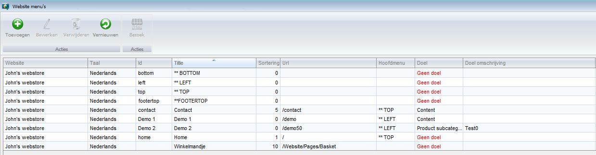
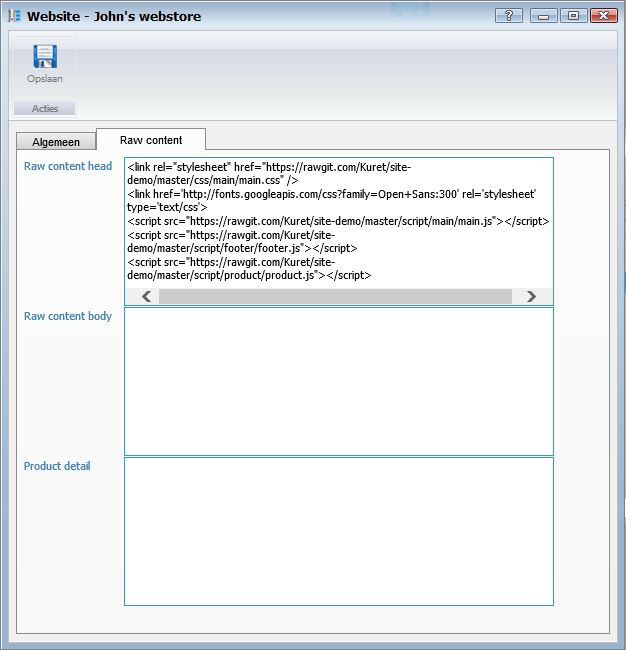
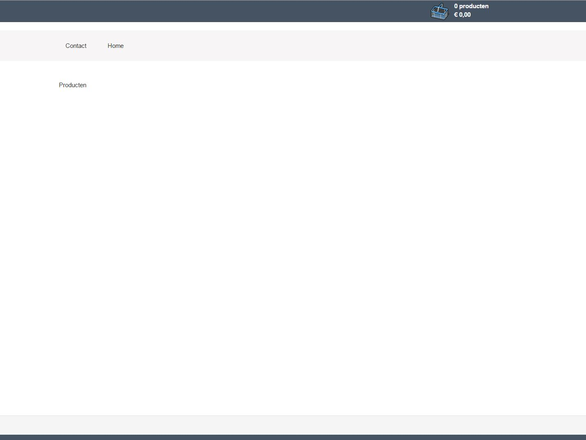

<properties>
	<page>
		<title>Website menu</title>
		<description>Website menu</description>
	</page>
	<menu>
		<position>Handleiding / Webshop</position>
		<title>Website menu</title>
		<sort>bd</sort>
	</menu>
</properties>

Ga terug <[Website Menu](http://hybridsaas.support/pages/handleiding/modules/P-Z/website/content)>

----------

#Website menu#
Zoek in start naar menu

Om een pad aan te maken klik op Toevoegen

**Tabblad Algemeen**

- Test mode
- Test mode betalingen
- Houd rekening met voorraad
	- Hier kan je het vinkje van aanzetten als je met voorraad wilt werken op de site
- Producten alleen zichtbaar na inlog
	- Hier kan je het vinkje van aanzetten als je een inlog op de website wil
- Omschrijving
	- Hier kan je de naam van je website invullen
- Code
- Volgorde
	- Als je meerdere website hebt dan kan je er een volgorde aangeven welke boven aan in de lijst en welke onderaan in de lijst
- Weergeven als webshop
- Entiteit
	- Hier geef je aan van welke entiteit je een website van wilt aanmaken

*URL per taal*

- Toevoegen zie [URL](http://hybridsaas.support/pages/handleiding/modules/P-Z/website/URL)
	- Om toe te voegen klikt u op de button Toevoegen.
- Bewerken
	- Om te bewerken selecteert u een regel en klikt op de button Bewerken.
- Verwijderen
	- Om te verwijderen selecteert u een regel en klikt op de button Verwijderen.
- Exporteren

**Tabblad Raw content**

- Raw content head
	- Hier vul je de stylesheet in daarnaast is de kleur en grote altijd aan te passen zie hier onder het voorbeeld zoals het standaard is  
- Raw content body
- Product details

----------

Next <[URL](http://hybridsaas.support/pages/handleiding/modules/P-Z/website/URL)>

----------

Ga terug <[Introductie](http://hybridsaas.support/pages/handleiding/modules/P-Z/website/Introductie)> 