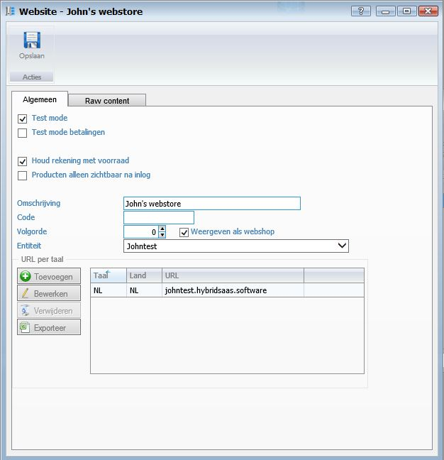

<properties>
	<page>
		<title>Website invullen</title>
		<description>Website invullen</description>
	</page>
	<menu>
		<position>Handleiding / Webshop</position>
		<title>Website</title>
		<sort>b</sort>
	</menu>
</properties>

Ga terug <[Website](http://hybridsaas.support/pages/handleiding/modules/P-Z/website/Introductie)>

----------

#Website#
Om je producten zichtbaar te laten worden op de website zijn een aantal gegevens van toepassing als 1 van deze gegevens niet ingevuld zijn zal niet worden weergegeven.

**Tabblad Algemeen**

- Test mode
- Test mode betalingen
- Houd rekening met voorraad
- Producten alleen zichtbaar na inlog
- Omschrijving
- Code
- Volgorde
- Weergeven als webshop
- Entiteit

*URL per taal*

- Toevoegen
	- Om toe te voegen klikt u op de button Toevoegen.
- Bewerken
	- Om te bewerken selecteert u een regel en klikt op de button Bewerken.
- Verwijderen
	- Om te verwijderen selecteert u een regel en klikt op de button Verwijderen.
- Exporteren

**Tabblad Raw content**

- Raw content head
	- Hier vul je de stylesheet in daarnaast is de kleur en grote altijd aan te passen zie hier onder het voorbeeld zoals het standaard is  
- Raw content body
- Product details

----------

Ga terug <[Website](http://hybridsaas.support/pages/handleiding/modules/P-Z/website/Introductie)>