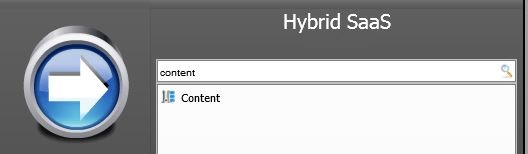
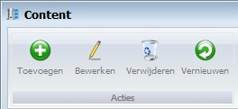

<properties>
	<page>
		<title>Content</title>
		<description>Content</description>
		<context>content*</context>
	</page>
	<menu>
		<position>Handleiding / Webshop</position>
		<title>Content</title>
		<sort>e</sort>
	</menu>
</properties>

#Content#

----------

#Start#

#Content#

#Toevoegen#

- Website
- ID
- Naam
- Titel
- Omschrijving
- Keywords

- Bewerk content 
	- Hiermee kan je het content nog extra bewerken en kom je in het volgende scherm
			
		
----------
[Introductie](http://hybridsaas.support/pages/handleiding/modules/P-Z/website/Introductie)
