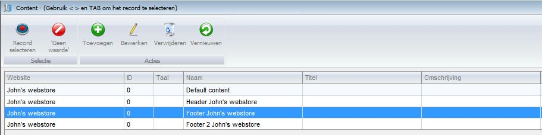
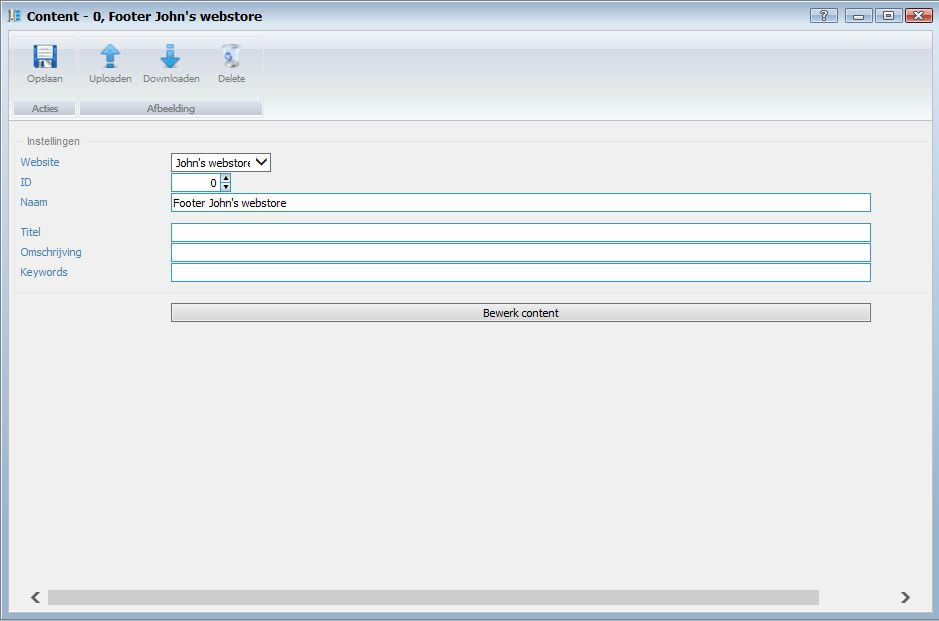
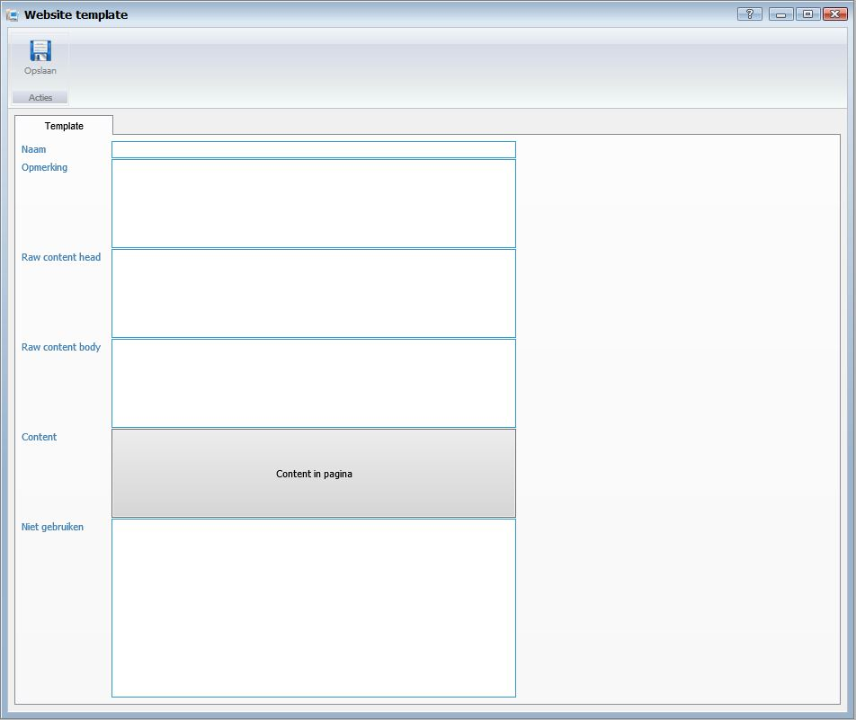

<properties>
	<page>
		<title>Content-Templates</title>
		<description>Content-Templates</description>
		<context>content*</context>
	</page>
	<menu>
		<position>Handleiding / Webshop</position>
		<title>Content-Templates</title>
		<sort>bb</sort>
	</menu>
</properties>

Ga terug <[Introductie](http://hybridsaas.support/pages/handleiding/modules/P-Z/website/Introductie)>

----------

#Website Content#

**Content**

- Website
- ID
- Naam
- Titel
- Omschrijving
- Keywords

- Bewerk content 

----------

Ga terug <[URL](http://hybridsaas.support/pages/handleiding/modules/P-Z/website/URL)>
<[Introductie](http://hybridsaas.support/pages/handleiding/modules/P-Z/website/Introductie)> 

----------

#Website Templates#

**Tamplate**

- Naam
- Opmerking
- Raw content head
- Raw content body
- Content (content in pagina)
- Niet gebruiken

----------

Ga terug <[Menu paden](http://hybridsaas.support/pages/handleiding/modules/P-Z/website/menupaden)>
<[Introductie](http://hybridsaas.support/pages/handleiding/modules/P-Z/website/Introductie)> 