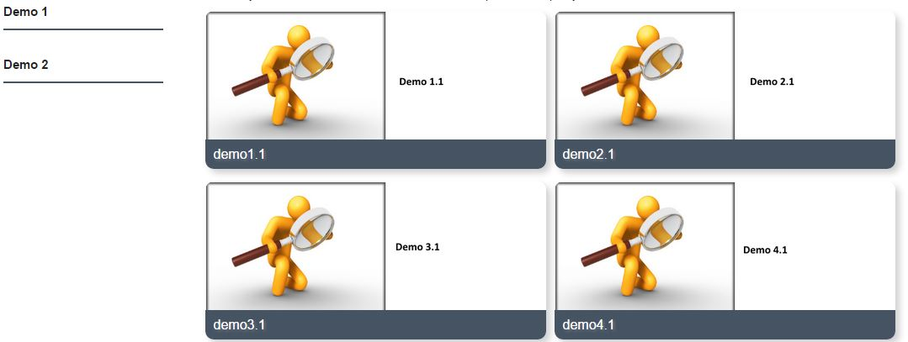
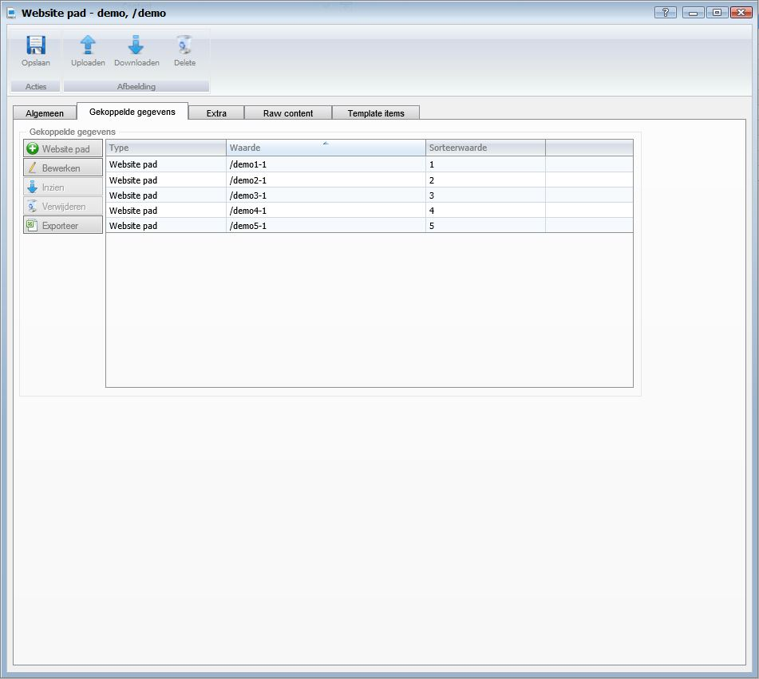
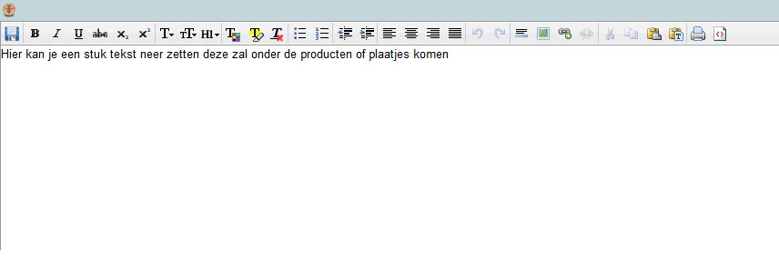

<properties>
	<page>
		<title>Website menupaden</title>
		<description>Website menupaden</description>
	</page>
	<menu>
		<position>Handleiding / Webshop</position>
		<title>Menu paden</title>
		<sort>bc</sort>
	</menu>
</properties>

Ga terug <[URL](http://hybridsaas.support/pages/handleiding/modules/P-Z/website/URL)> 

----------

#Menu paden aanmaken#

**Tabblad Algemeen**

- Website
	- Hier geef je aan voor welke website het pad bedoeld is
- Taal
	- Hier geef je de taal aan
- Template
	- Hier kan je de template kiezen zie [Templates](http://hybridsaas.support/pages/handleiding/modules/P-Z/website/content)
- Naam
	- Hier vul je de naam van het pad in
- Omschrijving
	- Deze word overgenomen van de naam (tenzij je het aanpast)
- Pad (url)
	- Deze word overgenomen van de naam met / (tenzij je het aanpast)
- Type weergave
	- Hier kan je de type weergave aangeven keuze uit:
		- Standaard
		
		- Gekoppelde weergave
		
- Product hoofdgroep
	- Hier kan je het pad koppelen aan een hoofdgroep
- Product subgroep
	- Hier kan je het pad koppelen aan een subgroep
- Product kenmerk
	- Hier kan je het pad koppelen aan een kenmerk
- Product
	- Hier kan je het pad koppelen aan een product
- Redirect Permanent
- Pagina titel
	- Deze word overgenomen van de naam (tenzij je het aanpast)
- Meta description
	- Deze word overgenomen van de naam (tenzij je het aanpast)
- Meta keywords
	- Deze word overgenomen van de naam (tenzij je het aanpast)
- Niet zichtbaar
- Zichtbaar vanaf
- Zichtbaar t/m
- Geoptimaliseerd voor
- Belangrijkheid
- Opmerking

**Tabblad Gekoppelde gegevens**

Als je een gekoppelde weergave heb aangegeven bij type weergave kan je hier de paden aangeven welke gekoppeld moeten worden aan deze pad

- Website pad
	- Om toe te voegen klikt u op de button.
- Bewerken
	- Om te bewerken selecteert u een regel en klikt op de button Bewerken.
- Inzien
- Verwijderen
	- Om te verwijderen selecteert u een regel en klikt op de button Verwijderen.
- Exporteren

**Tabblad Extra**

- Extra menu's
- Boven content
	- 
		- 
- Onder content
	- 
		- 

**Tabblad Raw content**

**Tabblad Template items**

- Toevoegen
	- Om toe te voegen klikt u op de button Toevoegen.
- Verwijderen
	- Om te verwijderen selecteert u een regel en klikt op de button Verwijderen.
- Exporteren

----------

Next
<[Website Menu](http://hybridsaas.support/pages/handleiding/modules/P-Z/website/content)>

----------

Ga terug
<[URL](http://hybridsaas.support/pages/handleiding/modules/P-Z/website/URL)>
<[Introductie](http://hybridsaas.support/pages/handleiding/modules/P-Z/website/Introductie)>