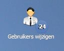
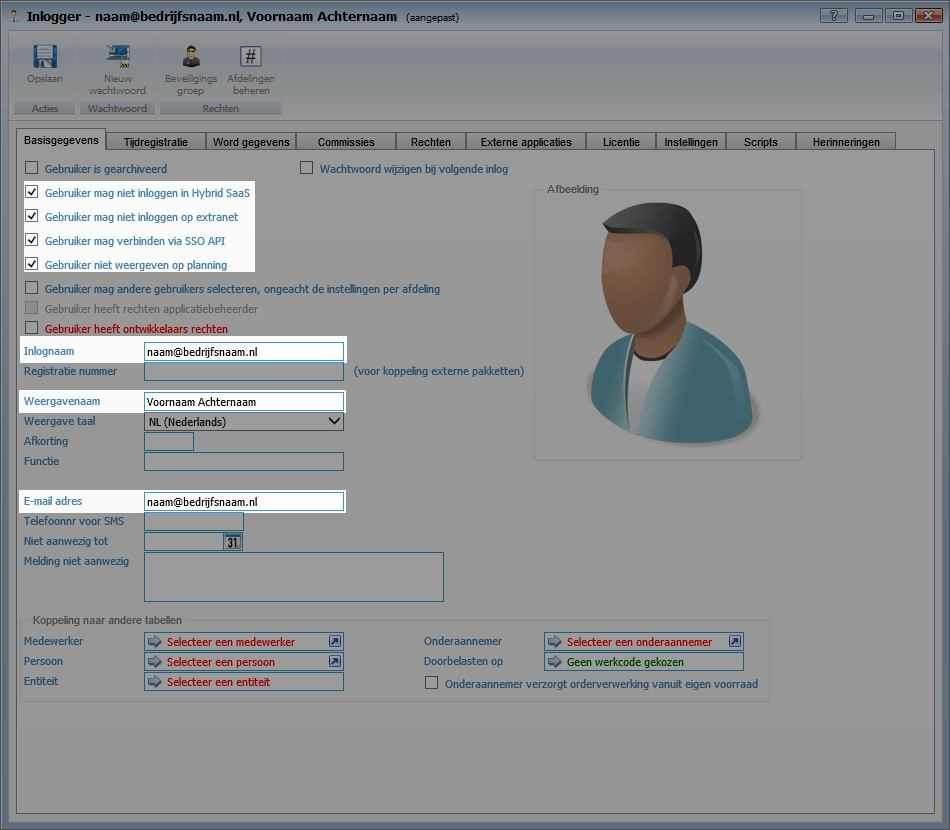
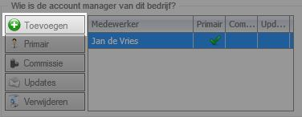

<properties>
	<page>
		<title>Gebruikers toevoegen externe portal</title>
	</page>
	<menu>
		<position>Handleiding / Onderdeel / Gebruikers </position> 
		<title>Gebruikers toevoegen externe portal</title>
	</menu>
</properties>

# Type gebruikers #

Er zijn een aantal verschillende gebruikers welke op verschillende plekken in Hybrid SaaS aangemaakt dienen te worden. Voorals nog kennen we de volgende gebruikers:
- Operations medewerkers
- Direct sales medewerkers
- Indirect sales medewerker
- Telecommanagers
- Eindgebruikers

# Gebruikers aanmaken #

De verschillende type gebruikers worden op verschillende plekken in Hybrid SaaS aangemaakt.

We gaan eerst de volgende gebruikers uitleggen:
- Operations medewerkers
- Direct sales medewerkers
- Indirect sales medewerker

Deze type gebruikers worden aangemaakt als Hybrid SaaS gebruikers

## Gebruiker toevoegen als (interne) gebruiker ##

Klik op toevoegen om een nieuwe gebruiker toe te voegen

Let op! Vink alle opties aan zoals hierboven is weergegeven.  

Gebruik voor de inlognaam het e-mailadres van de gebruiker. Het e-mailadres mag maar één keer voorkomen. Dit o.a. in verband met het opvragen van een wachtwoord. 

De procedure voor het aanmaken is voor alle bovengenoemde gebruikers hetzelfde. Het enige verschil is dat Direct sales medewerkers en Indirect sales medewerker als accountmanager aan een bedrijf gekoppeld dienen te worden. Wordt een gebruiker niet aan een bedrijf gekoppeld wordt deze automatisch als Operations medewerkers aangemerkt. Dit houdt in dat deze gebruiker alle informatie van alle relaties in de portal kan raadplegen.

## Accountmanager koppelen aan bedrijf ##

Door een gebruiker als accountmanager aan een bedrijf te koppelen zal deze enkel de bedrijven zijn waar hij/zij aan gekoppeld is. Alle andere bedrijven en informatie zal voor deze gebruikers niet zichtbaar zijn.

Voeg de gebruiker toe op de relatiekaart

## Gebruiker toevoegen als (externe) gebruiker ##

De volgende gebruikers dienen als gebruiker op de relatiekaart aangemaakt te worden:
- Telecommanagers
- Eindgebruikers

In dit record wordt vermeld welke mailservers namens dit domein mail mogen verzenden. Staat de mailserver van Hybrid SaaS niet in deze opsomming en verzendt deze toch mail met het betreffende domein als afzender, dan wordt de mail als onrechtmatig beschouwd. In de praktijk kan het voorkomen dat de e-mails niet bij de betreffende ontvanger worden afgeleverd. 

Deze gegevens dienen bij de serviceprovider van het domein, waar de e-mail van wordt verzonden, aangepast te worden. Uw systeembeheer weet hoe deze gegevens aangepast dienen te worden.

## Hybrid SaaS toestaan emails uit uw (domein)naam te sturen ##

In uw spf-record moet u de e-mailservers toevoegen (includen) die mails mogen versturen. Het volgende commando zorgt ervoor dat alle e-mailservers worden opgenomen:

**include:_spf.hybridsaas.email**

## E-mailadres instellen ##

Voor het instellen van het e-mailadres ga je naar "e-mail sjablonen" 

Vul bij "van" het e-mailadres in welke gebruik dient te worden als verzendadres.

Wanneer het e-mailadres is ingegeven wordt automatisch gecheckt of de SPF records correct zijn ingesteld. Indien deze niet correct zijn wordt hiervan een melding gegeven.

## Uw instellingen controleren ##

Op de site van [MXToolbox](http://mxtoolbox.com/SuperTool.aspx?action=spf%3ahybridsaas.email) kan je controleren hoe je SPF-records zijn insteld. 

Vul in het tekstveld het gedeelte in achter het apenstaartje (@). van het e-mailadres. Als het e-mailadres bijvoorbeeld **info@voorbeeld.bedrijf** is, kan je in het veld invoeren: **spf:voorbeeld.bedrijf** 

Na het klikken op de knop krijg je de inhoud van het spf-record van je domein te zien.

