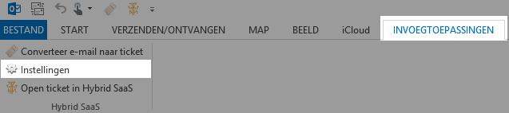
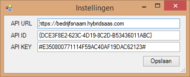
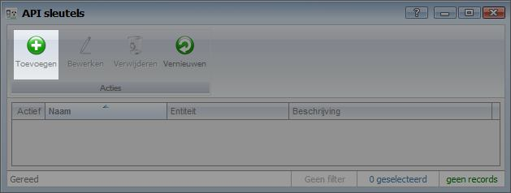
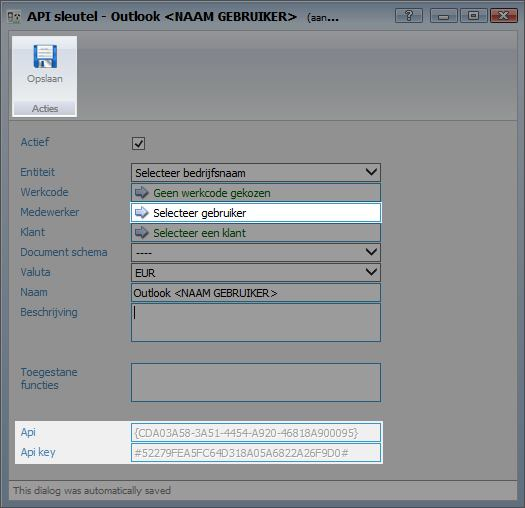

<properties>
	<page>
		<title>Outlook Add-in installeren</title>
	</page>
	<menu>
		<position>Handleiding / Onderdeel / Outlook Add-in </position> 
		<title>Outlook Add-in installeren</title>
	</menu>
</properties>

# Outlook Add-in #

Door middel van de Outlook add-in krijg je de mogelijkheid om e-mails vanuit Microsoft Outlook mailbox om te zetten in tickets. Op deze manier kan je je mailbox leeg houden en sla je e-mails netjes op bij de juiste relaties en/ of projecten.

## Downloaden van de Outlook Add-in ##

De outlook Add-in kan je [hier](http://download.hybridsaas.com/install/office/outlook/) downloaden. Of kijk op onze [website](http://hybridsaas.com/downloads)

## Add-in instellen ##

Om de add-in te activeren in je mailbox dienen er instellingen gewijzigd te worden. Indien Microsoft Outlook nog actief is dient deze eerst afgesloten en opnieuw opgestart te worden.

Afhankelijk van je Outlook versie verschijnt er boven in de taakbalk de optie "invoegtoepassingen". Klik vervolgens op "Instellingen"

Verschijnt deze niet? Kan dan op [deze](https://support.office.com/nl-nl/article/Invoegtoepassingen-in-of-uitschakelen-in-Office-programma-s-3e533d0f-a6cf-44b7-b6b4-3d9185b5e025#bm9) website hoe je deze kunt activeren.

Vul bij de gegevens in. API URL: https://**BEDRIJFSNAAM**.hybridsaas.com (vul op de plaats van "bedrijfsnaam" je bedrijfsnaam in) en geef de API ID en API KEY in.

API ID en API KEY kunnen worden aangemaakt in Hybrid SaaS. Zie de onderstaande beschrijving hoe je deze aanmaakt.

## API sleutel aanmaken ##

Zoek in Hybrid SaaS naar "API sleutels" 

Klik op toevoegen om een nieuwe sleutel aan te maken. 

Voor iedere gebruiker (medewerker) dient een aparte sleutel aangemaakt te worden.

Selecteer bij "Medewerker" de juiste gebruiker. Geef de sleutel een naam door bij "Naam" een naam in te geven.

Klik één maal op "Opslaan" zodat de API gegevens worden aangemaakt.

