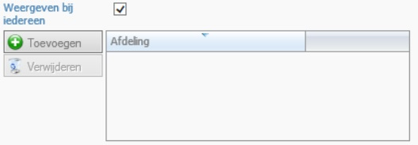
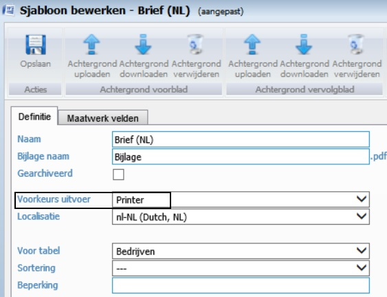
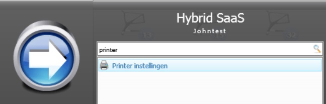
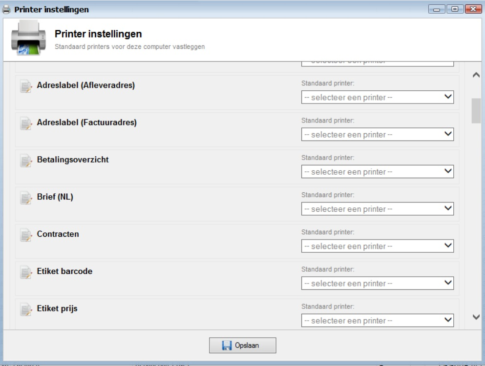
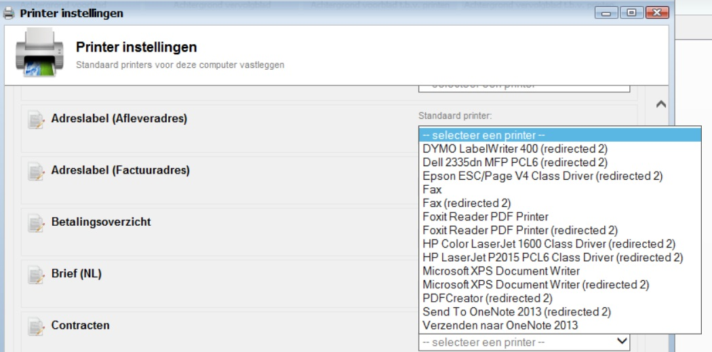
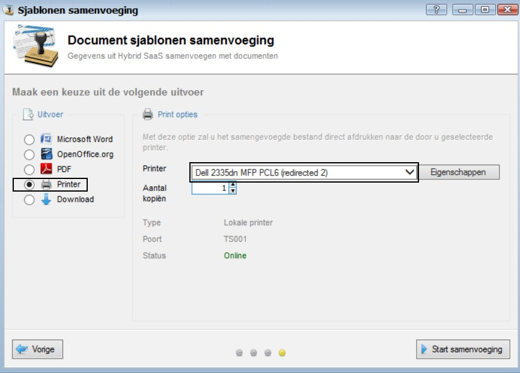

<properties>
	<page>
		<title>Printer instellingen</title>
	</page>
	<menu>
		<position>Handleiding / Onderdeel </position>
		<title>Printer instellingen</title>
	</menu>
</properties>

#Printer instellingen#

**Word-sjabloon instellingen**

Er moeten een paar instellingen in het word-sjabloon worden aangepast.
Het word-sjabloon moet gekoppeld zijn aan een afdeling of het vinkje "Weergeven bij iedereen" staat aan. Anders komt deze niet zichtbaar in de lijst met printer instellingen

Ook moet de "voorkeurs uitvoer" op **printer** worden gezet. Deze staat standaard op "Microsoft Word".

**Printer instellingen**

Als je de printer instellingen opent, dan verschijnt er een scherm met alle word sjablonen die gedefinieerd zijn. 

Zoek in de lijst met word-sjablonen het sjabloon op waar je een standaard printer aan wilt koppelen, door op het "dropdown" pijltje te klikken. 
    

Er verschijnt dan een lijst met gevonden printer in het netwerk. Selecteer de juiste printer en drup op de knop opslaan.

     

Als je nu de volgende keer een document gaat printen dan staat deze automatisch op de juiste printer.Klik op samenvoegen en het document wordt opgemaakt en naar de printer verzonden.

   

Ga naar [Home](http://hybridsaas.support/pages)   