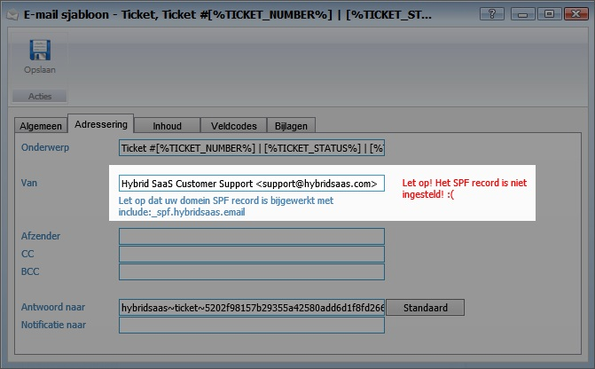

<properties>
	<page>
		<title>SPF record toevoegen aan DNS</title>
	</page>
	<menu>
		<position>Handleiding / Onderdeel / E-mail </position> 
		<title>SPF record toevoegen</title>
	</menu>
</properties>

# SPF record toevoegen #

Om er voor te zorgen dat dat e-mails, welke vanuit Hybrid SaaS worden verstuurd, niet als spam worden aangemerkt dienen de <label keyword="spf">SPF-records</label> bij de <label keyword="dns">DNS</label> van het domein toegevoegd te worden.

In dit record wordt vermeld welke mailservers namens dit domein mail mogen verzenden. Staat de mailserver van Hybrid SaaS niet in deze opsomming en verzendt deze toch mail met het betreffende domein als afzender, dan wordt de mail als onrechtmatig beschouwd. In de praktijk kan het voorkomen dat de e-mails niet bij de betreffende ontvanger worden afgeleverd. 

Deze gegevens dienen bij de serviceprovider van het domein, waar de e-mail van wordt verzonden, aangepast te worden. Uw systeembeheer weet hoe deze gegevens aangepast dienen te worden.

## Hybrid SaaS toestaan emails uit uw (domein)naam te sturen ##

In uw spf-record moet u de e-mailservers toevoegen (includen) die mails mogen versturen. Het volgende commando zorgt ervoor dat alle e-mailservers worden opgenomen:

**include:_spf.hybridsaas.email**

## E-mailadres instellen ##

Voor het instellen van het e-mailadres ga je naar "e-mail sjablonen" 

Vul bij "van" het e-mailadres in welke gebruik dient te worden als verzendadres.

Wanneer het e-mailadres is ingegeven wordt automatisch gecheckt of de SPF records correct zijn ingesteld. Indien deze niet correct zijn wordt hiervan een melding gegeven.

## Uw instellingen controleren ##

Op de site van [MXToolbox](http://mxtoolbox.com/SuperTool.aspx?action=spf%3ahybridsaas.email) kan je controleren hoe je SPF-records zijn insteld. 

Vul in het tekstveld het gedeelte in achter het apenstaartje (@). van het e-mailadres. Als het e-mailadres bijvoorbeeld **info@voorbeeld.bedrijf** is, kan je in het veld invoeren: **spf:voorbeeld.bedrijf** 

Na het klikken op de knop krijg je de inhoud van het spf-record van je domein te zien.

