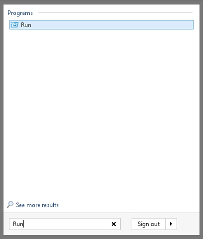
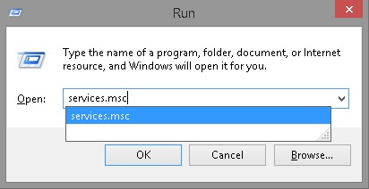

<properties>
	<page>
		<title>Bijlages uploaden werkt niet meer</title>
	</page>
	<menu>
		<position>Handleiding / Onderdeel / Bijlagen uploaden </position> 
		<title>Laad scherm blijft staan</title>
	</menu>
</properties>

# Kan geen bijlagen uploaden #

Het komt wel eens voor dat het uploaden van bijlagen niet meer goed werkt of helemaal niet meer werkt. Om het probleem te verhelpen moet de Hybrid SaaS service herstart worden.

Hybrid SaaS gebruikt lokaal op de computer een [service](https://en.wikipedia.org/wiki/Windows_service) waardoor het uploaden van bestanden mogelijk is.

**De stappen voor het herstarten van de Hybrid SaaS Service**

>Klik op start.
>Typ bij het zoeken '**Uitvoeren**' (in het engels '**Run**').

>Druk op enter en typ vervolgens '**services.msc**'.

>Druk op enter en vervolgens krijg je een scherm met services. Zoek naar '**Hybrid SaaS Service**'

Als je op de H toets drukt dan verspringt de computer naar de eerst volgende service naam met een H. 

>Als je de service hebt gevonden, klik dan op '**Herstarten**' (of in het engels '**Restart**').

