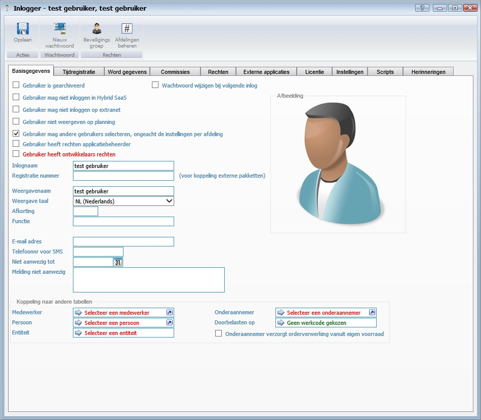

<properties>
	<page>
		<title>voorbeeldpagina</title>
		<description>voorbeeldpagina</description>
		<context></context>
	</page>
	<menu>
		<position>Handleiding / Bijdragen </position>
		<title>voorbeeldpagina</title>
		<sort>A</sort>
	</menu>
</properties>

    <properties>
    	<page>
    		<title>voorbeeldpagina</title>
    		<description>voorbeeldpagina</description>
    		<context></context>
    	</page>
    	<menu>
    		<position>Handleiding / Bijdragen </position>
    		<title>voorbeeldpagina</title>
    		<sort>A</sort>
    	</menu>
    </properties>

----------

#Woorden en zinnen benadrukkenx:

Je kan op verschillende manieren woorden of zinnen benadrukken zie hieronder van welke:

    Opsommingstekens:
    
    - Rood
    - **Vetgedrukte letters**
    - *Schuine letters*
    
    Je kan ook extra informatie blokken ingeven hier zijn 3 varianten van:
    
    
Een Tip is blauw

    
Een Info is groen

    
Een Warning is rood

Opsommingstekens:

- Rood
- **Vetgedrukte letters**
- *Schuine letters*

Je kan ook extra informatie blokken ingeven hier zijn 3 varianten van:

Een Tip is blauw

Een Info is groen

Een Warning is rood

----------

    #Voorbeeldpagina#

#Voorbeeldpagina#
Hier een algemeen verhaal over dit onderwerp

----------

    #Basisgegevens#
    
#Basisgegevens#

    Om de gegevens van een afbeelding te benadrukken gebruiken we opsommingstekens, **vetgedrukte letters** en *Schuine letters*
    
    - Gebruiker is gearchiveerd
	    - Als deze gebruiker niet meer actief is zet je hem hiermee uit
    - Gebruiker niet weergeven op planning
	    - Hiermee kan je aangeven dat de gebruiker niet weergegeven mag worden op de planning
	- Inlognaam
		- Hier kan je de gebruiker een inlognaam geven
	- Registratie nummer *voor koppeling externe pakketten*
		- Hier geef je de gebruiker een registratie nummer
		
    **Afbeelding**

	- Hier kan je een foto van de gebruiker toevoegen

	**Koppeling naar andere tabellen**

	- Medewerker
		- Hier kan je een medewerker selecteren
	- Persoon
		- Hier kan je een persoon selecteren
	- Entiteit
		- Hier kan je een entiteit selecteren

- Gebruiker is gearchiveerd
	- Als deze gebruiker niet meer actief is zet je hem hiermee uit
- Gebruiker niet weergeven op planning
	- Hiermee kan je aangeven dat de gebruiker niet weergegeven mag worden op de planning
- Inlognaam
	- Hier kan je de gebruiker een inlognaam geven
- Registratie nummer *voor koppeling externe pakketten*
	- Hier geef je de gebruiker een registratie nummer

**Afbeelding**

- Hier kan je een foto van de gebruiker toevoegen

**Koppeling naar andere tabellen**

- Medewerker
	- Hier kan je een medewerker selecteren
- Persoon
	- Hier kan je een persoon selecteren
- Entiteit
	- Hier kan je een entiteit selecteren

