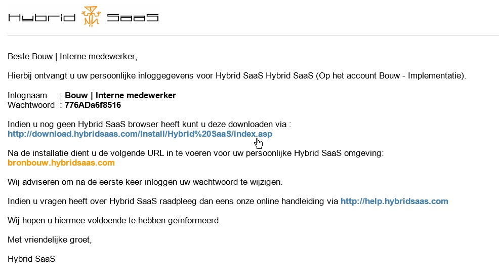

<properties>
	<page>
		<title>Wachtwoord versturen</title>
			</page>
	<menu>
		<position>Handleiding / Systeem / Inloggen</position>
		<title>Wachtwoord versturen</title>
	</menu>
</properties>

Wachtwoord versturen
====================

Als je overeen bent gekomen dat je met Hybrid SaaS gaat werken dan staan hieronder de 

 

Zodra je deze gegevens hebt ontvangen kan je starten met de implementatie van Hybrid SaaS. Als eerste moet je een werkplek installatie uitvoeren om  

