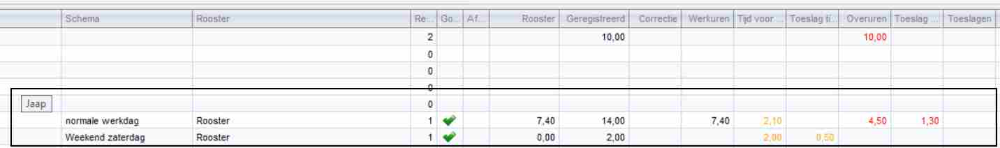
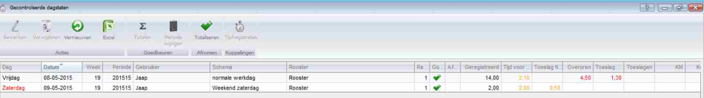
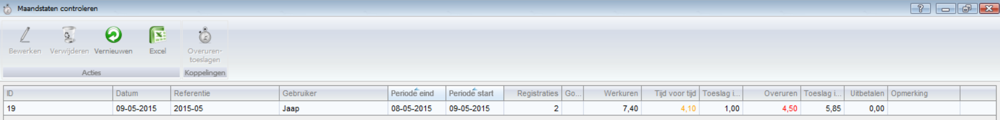
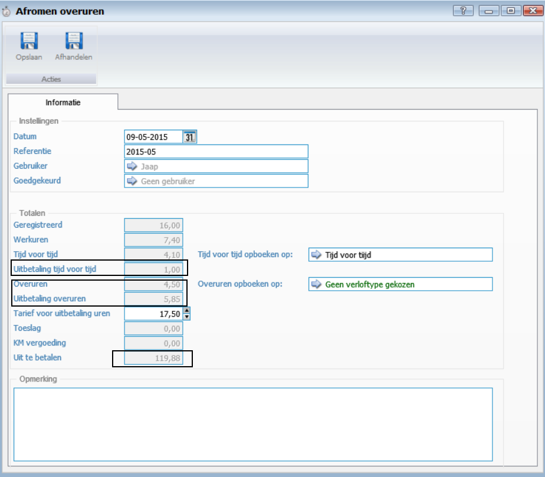

<properties>
	<page>
		<title>uitleg</title>
		<description>Uitleg</description>
	</page>
	<menu>
		<position>Uitleg</position>
		<title>Projectplanning</title>
	</menu>
</properties>

##Uitleg verschillende overuren ##

Voorbeeld met 2 registraties op vrijdag en zaterdag
 

Na dat ze goedkeuren zijn komen ze in het bakje: Gecontroleerde dagstaten, daar kan je ze totaliseren

Na het totaliseren komen ze bij het bakje: Maandstaten controleren
 

Hier in kan je regel openen door te dubbelklikken op de regel

Berekening is als volgt:

* Overuren 4,50 uur  (4,50 uur op vrijdag maal 1,30 % = 5,85 uur)
* Uitbetaling tijd voor tijd 1 uur (2 uur op zaterdag maal 0,5 uur = 1 uur)

Totaal aantal uur is 6, 85. Dit maal het uurtarief van € 17,50 geeft een uitbetaling van € 119.88

--------------

