<properties>
	<page>
		<title>uitleg</title>
		<description>Uitleg</description>
	</page>
	<menu>
		<position>Uitleg / Projectbeheer</position>
		<title>Projectplanning</title>
	</menu>
</properties>

##Project planning##

Deze planning bestaan uit een aantal onderdelen.

* Een weergave van de planning
	* Projectnaam
	* Project uren (prognose)
	* De weken, onderverdeeld in dagen (7 maanden)
	* De geplande medewerkers indien ze op een project staan

* Een weergave van de medewerkers die je kan plannen
	* Alle interne medewerkers
	* Eventuele externe medewerkers
	* 
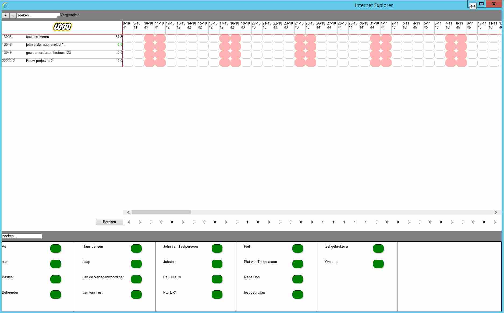

Als je de planning opent kan je nog niets wijzigen. Dit kan je pas zodra je het vinkje “Vergrendeld” uit zet. 
Dit is een verplicht handeling om te voorkomen dat je per ongeluk de planning aanpast.

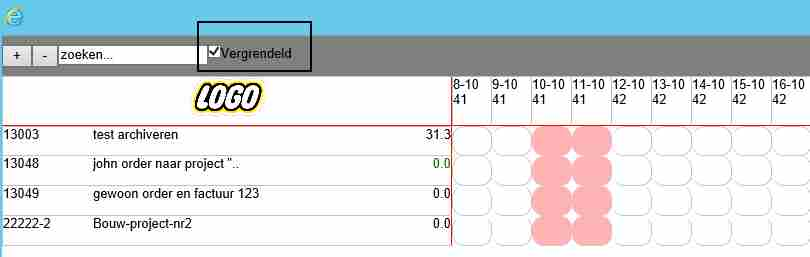

Het zoekscherm geeft je de mogelijkheid om het juiste project te zoeken.
Tik een gedeelte van de projectnaam of projectnummer in en druk op ENTER.
Als je alle project weer wilt zien maak het zoekveld leeg en druk p ENTER
Voorbeeld: zoek op “project”

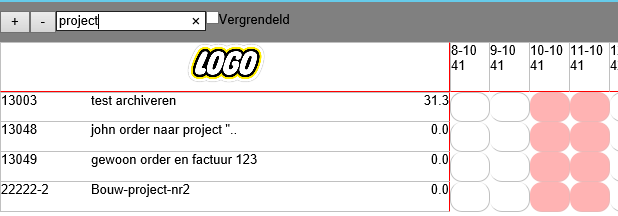

Resultaat: 2 projecten met het woord “Project” erin

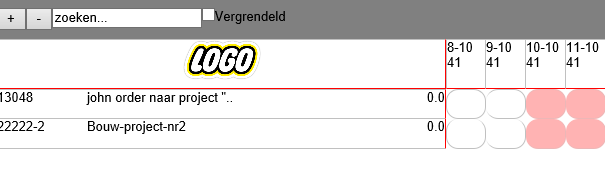

Zoeken naar de juiste medewerker:
Onder in het scherm staan alle medewerkers gesorteerd op alfabet. Omdat er vele variaties mogelijk zijn hebben we een zoek knop toegevoegd. (naam beginnend met voornaam of met achternaam of soms met bedrijfsnaam, in geval van externe medewerkers).
Tik in het zoekscherm een gedeelte van de naam en druk op ENTER. 
Je krijgt de volledige lijst weer terug door het zoekveld leeg te maken en op ENTER te drukken 

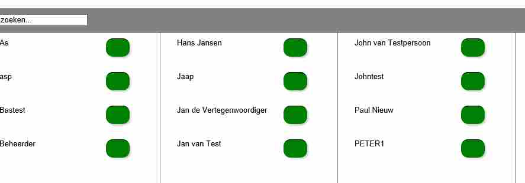

Uitleg verschillende velden

* Projectnummer
	* Dit is het nummer dat in Hybrid SaaS is aangemaakt.
	* Let wel: alleen projecten met een bepaalde fase worden hier getoond.
	* 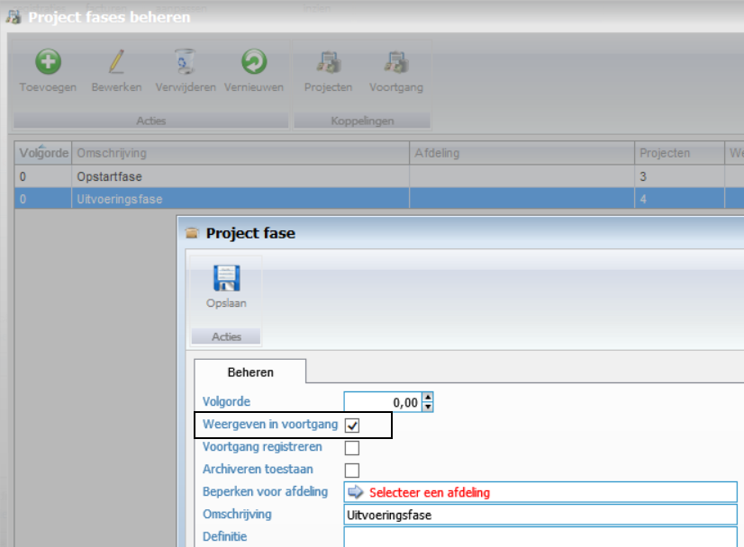
	* Project fases beheren: hier moet je het vinkje “Weergeven in voortgang” aan zetten om deze projecten in de project planning terug te zien.
* Projectnaam
	* Dit is de naam die je bij het project onder de “Beschrijving” hebt ingevoerd.
* Dagen te besteden
	* Dit is een verrekening van de geprognosticeerde uren naar dagen toe. Zodra je iemand een dag inplant wordt dit hier in mindering gebracht,
* Weeknummers
	* Omdat er in de bouw veelal met weeknummers wordt gewerkt wordt deze bovenin duidelijk weer gegeven.
* Datum velden
	* Dit is binnen de week het datum veld
* Weekenddagen
	* Dit zijn in principe dagen waarop niet gewerkt wordt, als je een medewerker voor een langere periode inplant worden hij standaard niet op deze dagen gevuld.
	
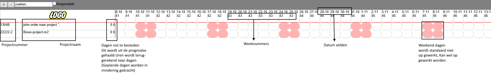

#Hoe plan ik:#

* Open project planning
* Zet vinkje “Vergrendeling” uit.
* Zoek je project (planning)
* Zoek je medewerker (jan)

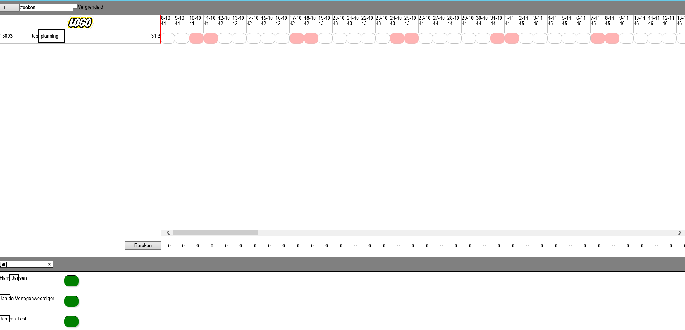
 
Sleep de medewerker naar de dag in de week van het project dat je gaat plannen
Onder het project komen nu de verschillende medewerkers zichtbaar te staan. 
Het aantal dagen is verminderd met 3 (31,3 is nu 28,3)

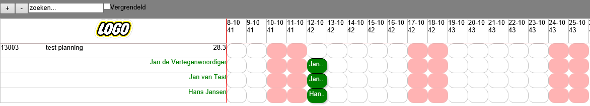

#Je kan nu de medewerker(s) op verschillende manieren door plannen:#

*keuze 1*

Ga met de muis aan de rechterkant op het blokje staan, totdat de dubbele pijl verschijnt. Houdt je muisknop vast en trek deze door tot de laatste dag waarop je deze medewerker wilt plannen. Voorbeeld vanaf 12-10 tot 26-10
De weekenddagen worden niet gevuld.

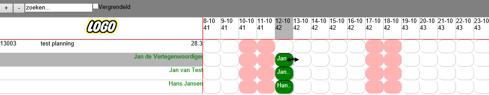

Resultaat:

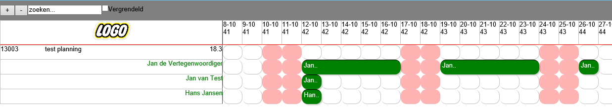

*Keuze 2*

Klik met je RECHTER muis knop het blokje aan dat wilt verlengen. 2 opties verschijnen. 
Kies voor de optie “Tot einde week” 
Invul scherm verschijnt

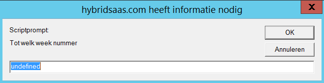

Vul hier de week in (de planning maakt altijd de hele week vol, er wordt dus altijd tot vrijdag gepland).
Voorbeeld: medewerker Jan de vertegenwoordiger plannen vanaf 12-10 tot eind week 44.
De weekenddagen worden niet gevuld.

Resultaat:

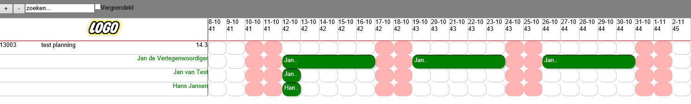

*Keuze 3*

De medewerker per dag in de planning slepen. 
Voorbeeld: Jan de Vertegenwoordiger plannen op 12-10, 13-10 en 16-10.

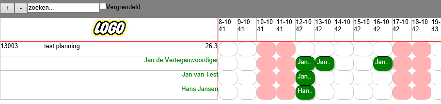
 
#Meerdere medewerkers voor langere periode inplannen.#

Plaats de medewerkers op de dag in het project dat ze gaan starten. 
Houdt de SHIFT toets vast en selecteer de medewerkers. De geselecteerde medewerker blokjes worden lichtblauw. 

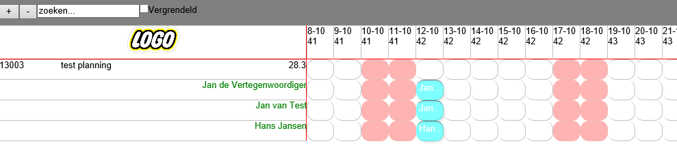
 
Gebruik nu keuze 1 en/of keuze 2 om de periode te verlengen.
Voorbeeld 3 medewerkers van 14-10 t/m 21-10
Resultaat: d.m.v. slepen

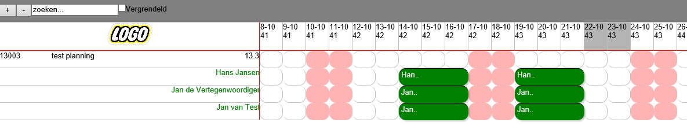
 

#Verplaatsen van geplande dagen#

Je kan individuele dagen of blokken van dagen met je muis oppakken en deze verslepen naar een ander dag. Pak het blokje op en versleep deze naar de gewenste datum.
LET OP: het is niet mogelijk een blok naar een al bestaande blok datum te verplaatsen. Het blok wordt dan op de originele plaats terug gezet.

#Verwijderen van geplande dagen#

Dit kan ook op verschillende manieren.

*Keuze 1*

Het hele blok weghalen
Rechter muis knop op het blok en dan kiezen voor “verwijderen”.

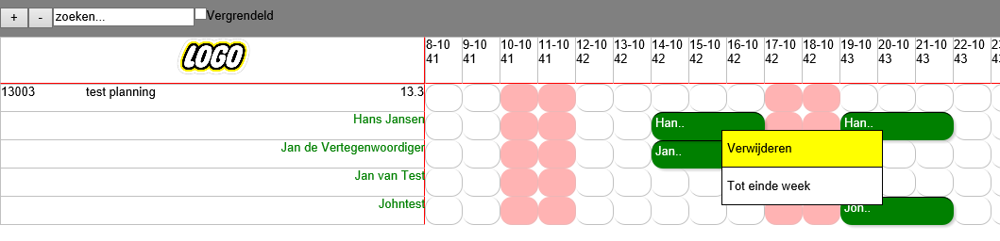
 
*Keuze 2*

Meerdere blokken verwijderen.
Eerst met de SHIFT knop de te verwijderen blokken selecteren, deze worden dan lichtblauw en dan met je rechter muis knop “Verwijderen” kiezen.

*Keuze 3*

Blokken kleiner maken 
Ga aan het eind van het blok staan en sleep deze een aantal dagen terug.
Voorbeeld 2 dagen:

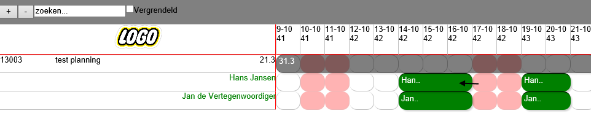

Resultaat:
 
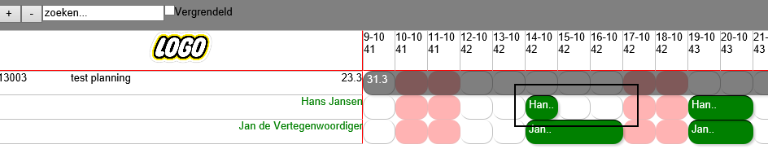

#Als je één of meerdere dagen in een geplande week wilt weghalen#

Als je binnen een blok één dag wilt verwijderen dan doe je dit NIET met je rechter muis knop, omdat je dan het hele blok weggooit.
Dit doe je door middel van de CTRL toets. Houdt de CTRL toets en sleep het blokje, de dag eruit.

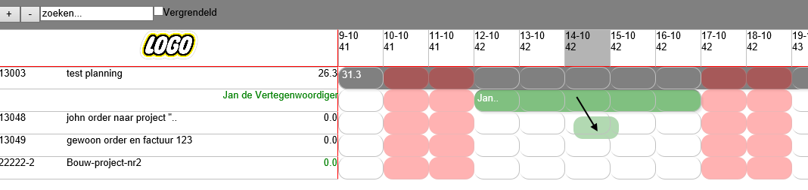 

Resultaat is dat er 2 nieuwe blokken van 2 dagen worden gevormd.

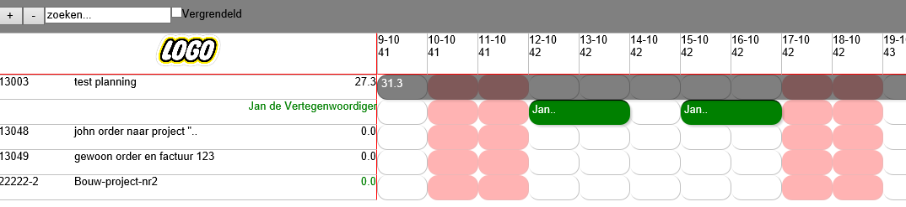

--------------

