<properties>
	<page>
		<title>Release notes versie v15.3.968 (17 maart 2015)</title>
	</page>
	<menu>
		<position>Release notes / Historie </position>
		<title> v15.3.968 (17 maart 2015) </title>
	</menu>
</properties>

Release notes versie v15.3.968 (17 maart 2015)
===================

**Ticket extranet**

Interne opmerking kan nu worden toegevoegd bij het aanmaken van een ticket 

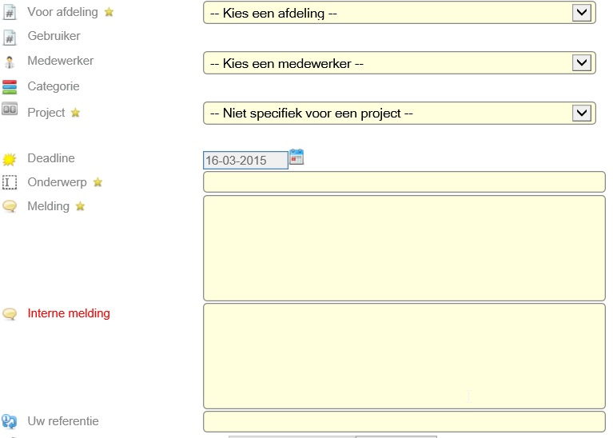

**Bedrijfsagenda**

Legenda wordt nu correct weergegeven

Als je bij de de verloftype in het veld "legenda" een waarde ingeeft dan zal deze ook zichtbaar worden als je via de bedrijfsagenda het rooster exproteerd. Als het veld niet wordt gevuld, dan wordt er een nummer ingezet, en deze wordt niet in het rooster zichtbaar.  
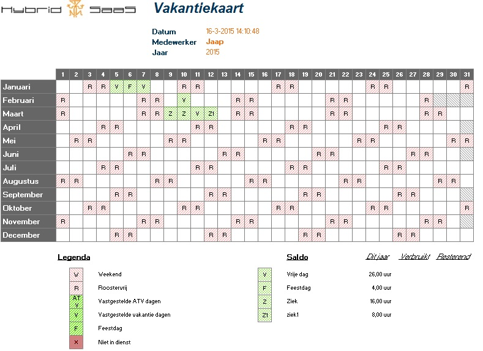  

**Word Merge** - Achter een variabel kan nu /maxlength=(int) gezet worden om tekst in te korten

Het is nu mogelijk om bepaalde tekst velden in wordsjablonen een andere maximale lengte mee te geven. Dit om zelf te kunnen bepalen hoeveel tekst je wilt laten zien.

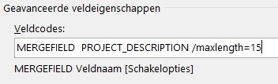

**TICKET** 

Aanmaken van nieuw ticket.
Indien ticket voor de gebruiker is die het ticket ook heeft aangemaakt, dan wordt de status op gelezen gezet.

Ticket 1500017: actie toegewezen aan een andere gebruiker, wel een envelop (ongelezen)

Ticket 1500016: actie toegewezen aan jezelf, geeft geen envelop (ongelezen)
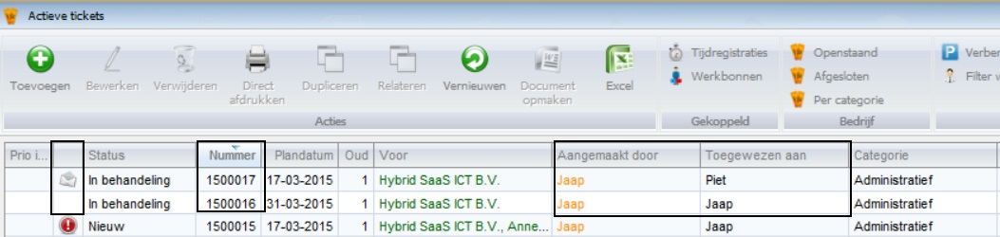

**WINST EN VERLIES** 

Verbeterde controle op dubbele en missende factuurnummers

**CONTRACTEN**

Beperking voor negatieve aantallen, huidige data wordt geconverteerd naar negatief bedrag

**WORD MERGE**

Er kan nu in de wordsjabloon gekozen worden voor een ticket nummer zonder beschrijving 

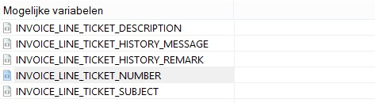

**FACTUREN**

Je kunt nu meerdere facturen crediteren in 1 keer

**ABONNEMENTEN**

Je kunt abonnementen koppelen aan contracten, 

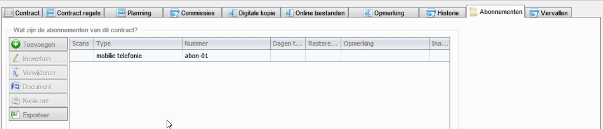

Je krijgt een signalering als je een contract afsluit waarop nog lopende abonnementen aanwezig zijn.
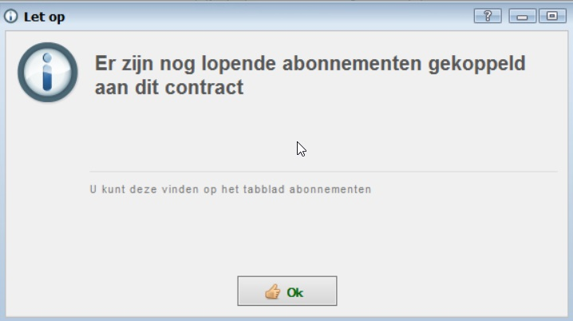

**TIJDREGISTRATIE**

Bij het maken van een nieuwe tijdregistratie opent het systeem automatisch de laatst gekozen methode

**PRODUCT**

Prijsmodel vreemde valuta berekening op basis van koers indien prijs is 0, keuze mogelijkheid afronden

**CONTRACTEN**

Je kan nu ook met terugwerkende kracht Details met terugwerkende kracht
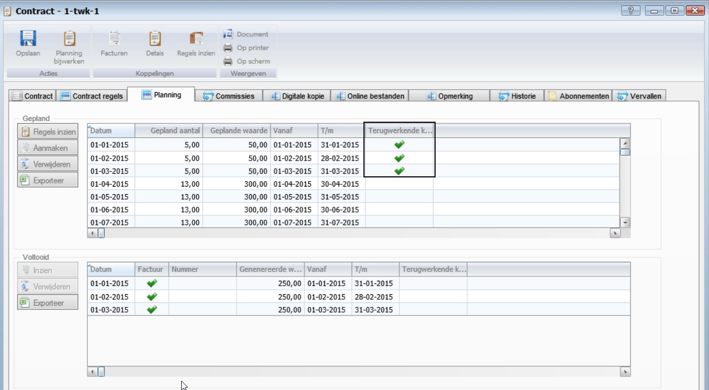

**FUNCTIE**

Pijltjes voor de horizontale scrolbalk werken nu. Ook kan je nu naast de scrollbar klikken, dan verschuift het scherm ook.

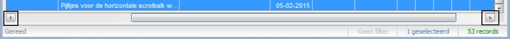

**EXTRANET**

Bij het aanmaken van een ticket onder een klant wordt je nu teruggestuurd naar de klant overzicht pagina 

**E-MAIL VERLOF**

Indien de gebruiker een manager aan zich gekoppeld heeft wordt <noreply@Hybrid SaaS.com> vervangen door de e-mail van de manager 

**SYSTEEM**

Aanpassingen aanpassingen SPF check

**INKOOPFACTUREN**

Er is een koppeling vanaf personen en medewerkers naar de inkoopfacturen

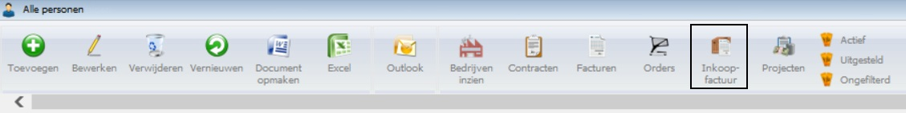

**VOORRAAD**

Het verwerken van de afgehandelde inventarisatie gaf een probleem op de boekdatum. Dit is verholpen.

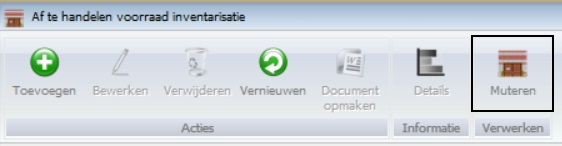

**TIJDREGISTRATIE**

Te verwerken en verwerkte registraties zijn opgesplitst in facturatie en mandagen

**PRODUCTEN**

Importeren en exporteren van repeterende kosten is toegevoegd aan de excelsheet. Met een 1 wordt het vinkje aangezet, met een 0 lijft deze leeg.

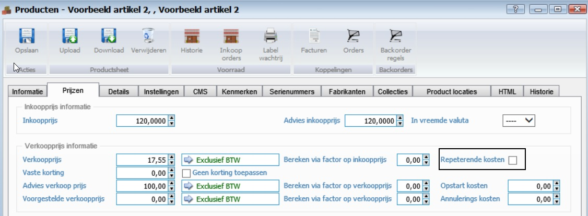

**GEBRUIKERS**

Je kunt op de gebruikerskaart aangeven welke herinneringen zij elke ochtend willen ontvangen

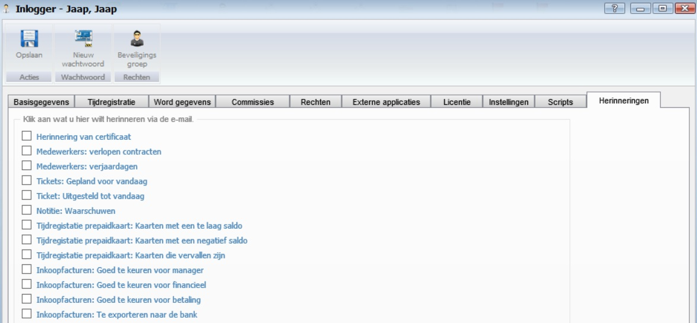

**SYSTEEM**

Als je aan het wijzigen bent in Hybrid SaaS is het nu mogelijk om tussen verschillende applicaties te switchen zonderA dat je als je terug in Hybrid SaaS komt eerst 2 keer moet klikken om verder te gaan met de wijziging.

**TICKET API**

Er was een fout bij het vergelijken van ID's. Als je een ticket toe wees aan je zelf handelde hij het af. Dit is verholpen

**TIJDREGISTRATIE**

Afromen van overuren tov HRM rooster

**TIJDREGISTRATIE - WERKBON**

Bij openen van een werkbon krijg je een melding als er registraties zijn zonder uurtarief, deze kun je ook via een menu item opvragen

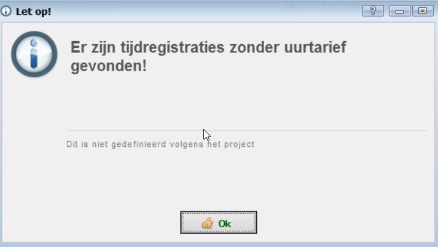

**TIJDREGISTRATIE**

Signalering geen uurtarief terwijl dit niet is ingesteld in de project / werkcode

**TICKET**

Interne opmerking mag alleen zichtbaar zijn als je bent ingelogd als een gebruiker

**TICKET**

Controle / weergave uitleg bij status wijziging aangepast

**ROOSTER**

Koppeling met tijdregistratie

**BANK**

Automatische incasso kan nu ook B2B genereren

**TIJDREGISTRATIE**

Na het handmatig factureren van een tijdregistratie kwam deze nog een keer langs bij de automatische facturatie, dit komt omdat het systeem kijkt of er nog een termijnstaat voor moet worden gemaakt, dit is aangepast. Indien er geen termijnstaat gewenst is zet het systeem meteen de vinkjes goed neer zodat de registratie niet meer in de automatische lijst te voorschijn komt

**API**

Inlezen van facturen werkt nu ook met externe referentie + factuur en afleveradressen

**PRODUCTEN - INKOOP**

Je kunt nu bij het inboeken van facturen garantiedatum en serienummer vastleggen van het product. Deze kun je later bij verkoop weer koppelen zodat je weet welke inkoop bij welke verkoop hoort (alleen inkoop gedeelte is af)

**FACTUREN**

Probleem met openstaand bedrag bij crediteren en dupliceren

**API**

Met de outlook-addin kan je nu gelijk de status toewijzen

**VOORTGANG**

Meerwerk gebruikte alleen de goedgekeurde tijdregistraties

**PRODUCTEN**

Je kunt nu serienummers bijhouden van producten, dit kan via de inkoop factuur, los op het product. Op dit moment kun je alleen vanuit het product de koppeling maken met de verkoop regel

**CONTRACTEN**

Als een detailregel gefactureerd is kun je het aantal niet meer veranderen. dit moet je doen met een nieuwe detail regel, dupliceren neemt ook de detail regels mee

**VRAGENLIJSTEN**

Extra koppelingen naar tickets

**DOCUMENTSCHEMA**

Koppeling document en email lay-out voor contracten

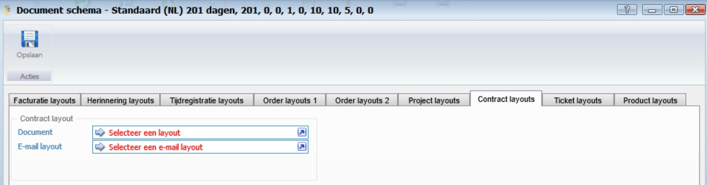

**CONTRACTEN**

Je kunt nu snel het contract op scherm weergeven of printen

**CONTRACTEN**

Op scherm weergeven vanuit dialoog

**PRODUCTEN**

Merken als menu item gemaakt

**RELATIES**

Notitie tabbladen samen in 1 tab gezet

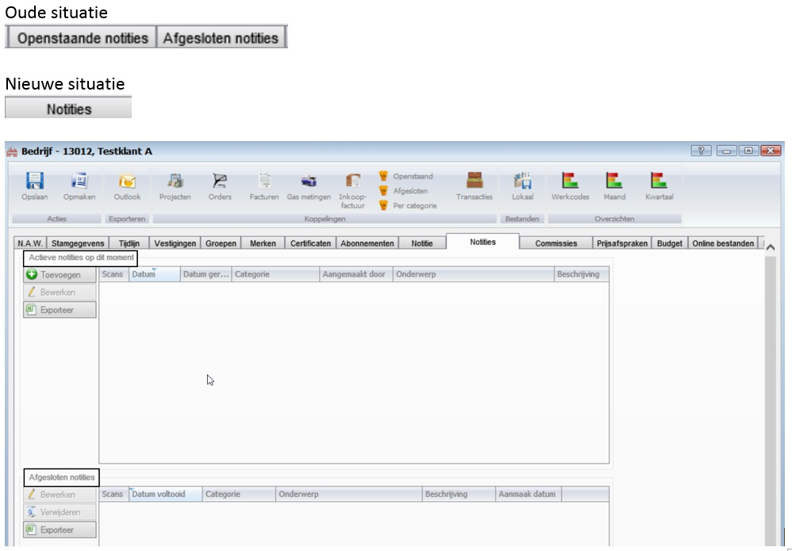

**PRODUCTEN**

Merken per relatie, vanuit het merk kun je inzien welke relaties of fabrikanten die merk voeren

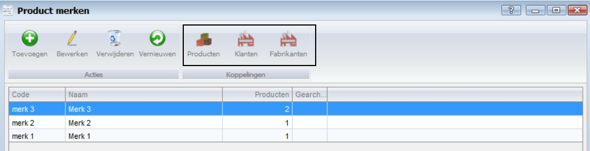

**EXRTRANET**

Bij het verzenden van een update (en bij het niet verzenden) van een ticket via klanten of project wordt je nu correct terug gestuurd

**CONTRACTEN**

de naam van het tabblad onder onder contractregels is gewijzigd naar "Variabele looptijden (Details)". Verder wordt nu ook de inhoud van de variabele looptijd meegenomen bij het dupliceren van contracten.

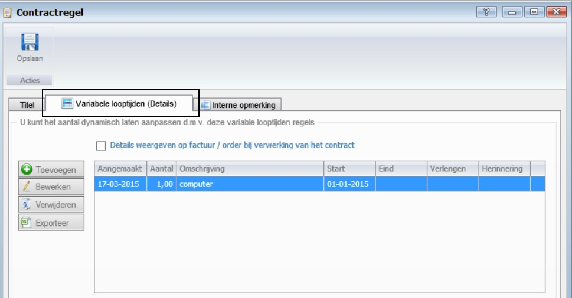

**RELATIES**

Je kunt bij de koppeling van het merk op de relatiekaart een accountmanager kiezen, deze komt ook automatisch bij het tabblad accountmanagers er bij te staan ivm commissies e.d.

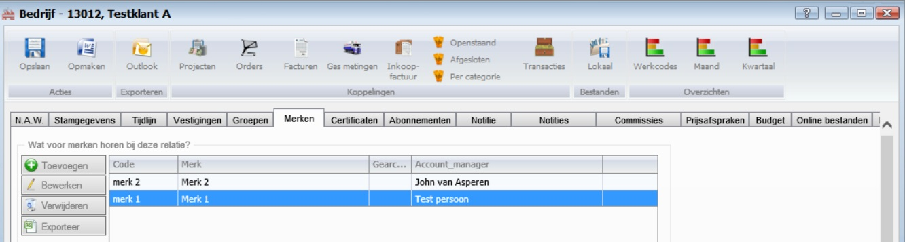

