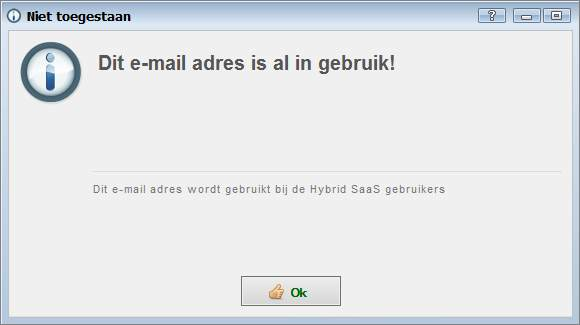
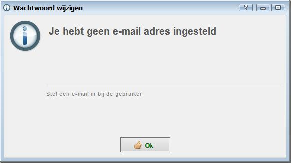
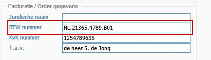
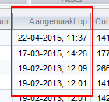

<properties>
	<page>
		<title>Versie 15.9.1909</title>
	</page>
	<menu>
		<position>Release notes</position>
		<title>Versie 15.9.1909 (11-09-2015)</title>
		<sort>98292</sort>
	</menu>
</properties>

# Versie 15.9.1909 #
Uitgebracht op 11 september 2015

## Gebruikersbeheer ##

**Check e-mailadres op gebruikerskaart**

Indien een e-mailadres reeds in gebruik is wordt hier een melding van gegeven. Een e-mail adres van een gebruiker of extranet gebruiker kan maar één keer voorkomen in de applicatie. 

Indien het wachtwoord is vergeten dient de gebruiker zijn e-mailadres in te geven. Wanneer het e-mailadres meerdere keer voorkomt in de applicatie zou dit problemen kunnen opleveren.

**Extranet gebruikers archiveren**

Het is niet meer mogelijk om een extranet gebruiker op de relatie kaart (definitief) te verwijderen. Indien een gebruiker niet meer actief is dient het vinkje aangezet te worden bij "Mag niet meer inloggen"

Op deze manier blijft de gebruiker en zijn historie bestaan, maar kan deze niet meer inloggen op het Extranet of een extern portaal.

**Check emailadres gebruiker**

Bij het opvragen van een nieuw wachtwoord op de gebruikerskaart wordt gecheckt of er een e-mailadres is ingevuld. Indien deze niet staat ingevuld wordt hiervan een melding weergegeven

## Relatiebeheer ##

**BTW-nummer notatie**

Het BTW nummer op het tabblad "stamgegevens" mag vanaf nu punten en spaties als karakters bevatten.

## Ticketsysteem ##

**BTW-nummer notatie**

In alle ticketoverzichten is en kolom opgenomen waarin de aanmaakdatum van het ticket wordt weergegeven.